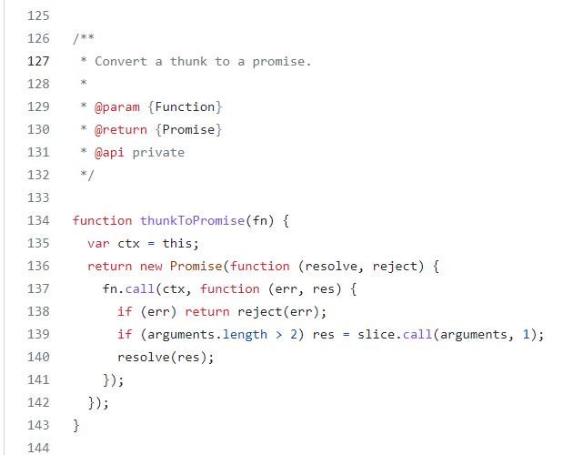

###### 求值策略
在介绍Thunk函数之前，需要先介绍一下什么叫做求值策略，即函数的参数应该什么时候求值。
```javascript
function test(num) {
 return num+1;
}
test(2+3);
```
类似上面这样将一个表达式作为参数传入函数，表达式应该什么时候计算？实际上可以分为两种情况：
- 一种是**传值调用(call by value)**，即表达式在传入函数之前就已经进行了计算，test(2+3)就相当于test(5)，js、C语言、JAVA等语言使用的是这种策略。
- 一种是**传名调用(call by name)**，即直接将表达式传入函数，只在需要的时候进行表达式的运算，Haskell(哈斯克尔)使用的是这种策略。
传值调用比较简单和便于理解，但是在没有用到的时候，先进行了计算，可能造成性能浪费。
<!-- more -->
###### 什么是Thunk函数
> 将表达式参数放到一个临时函数之中，再将这个临时函数传入函数体。这个临时函数就叫做 Thunk 函数。
> 它是"传名调用"的一种实现策略，用来替换某个表达式。

```javascript
function test(num) {
 return num+1;
}
function testValue() {
 return 2+3;
}
test(testValue());
// testValue 函数就是Thunk函数
```

###### JavaScript中的Thunk函数
在 JavaScript 语言中，Thunk 函数替换的不是表达式，而是多参数函数，将其替换成单参数的版本，且只接受回调函数作为参数。

要点：多参数函数
- 函数接受多个参数
- 函数的最后一个参数是回调函数

```javascript
function test(a, b, callback) {...}

var testThunk = Thunk(a, b);
testThunk(callback);

var Thunk = function (a, b){
  return function (callback){
    return test(a, b, callback);
  };
};
```
上面的函数经过转换器处理，它变成了一个单参数函数，只接受回调函数作为参数。这个单参数版本，就叫做 Thunk 函数。
任何函数，只要参数有回调函数，就能写成 Thunk 函数的形式。下面是一个简单的 Thunk 函数转换器。
```javascript
var toThunk = function(fn){
  return function (){
    var args = Array.prototype.slice.call(arguments);
    return function (callback){
      args.push(callback);
      return fn.apply(this, args);
    }
  };
};
```
使用上面的转换器之后，可将上述的例子修改为
```javascript
var testThunk = toThunk(test);
testThunk(a, b)(callback)
```

###### Thunkify模块
下载地址：https://github.com/tj/node-thunkify
使用举例
```javascript
var thunkify = require('thunkify');
var fs = require('fs');
var read = thunkify(fs.readFile);
read('package.json', 'utf8')(function(err, str){
  ...
});
```
*注意：thunkify中存在一个检查机制，回调函数只运行一次。*


```javascript
import thunkify from 'thunkify';

function test(a, b, callback) {
  const result = a + b;
  callback(result);
  callback(result);
  callback(result);
}

const thunkTest = thunkify(test);
thunkTest(1, 2)(console.log);
// 3
```
###### Thunk函数的用途
Thunk函数可以和Generator结合使用，Thunk 函数作为在 Generator 中要迭代的值，通过 co 来对 Generator 进行流程控制。
Generator函数中可以使用yield将程序的执行权移出，然后通过Thunk函数的回调函数，再将执行权还给Generator函数。
```javascript
import thunkify from 'thunkify';

function test(a, b, callback) {
  const result = a + b;
  callback(result);
}

const thunkTest = thunkify(test);

function* gen() {
  yield thunkTest(1, 2);
  yield thunkTest(3, 4);
}

// 使用Thunk函数处理
const genTest = gen();
const genValue = genTest.next();
genValue.value(function (data) {
  console.log(data);
  const genValue1 = genTest.next(data);
  genValue1.value(function (data1) {
    console.log(data1);
  });
});

// 修改为递归方式调用
function genFn(fn) {
  const gen = fn();
  function next(data) {
    console.log(data);
    const genValue = gen.next(data);
    if (genValue.done) return;
    genValue.value(next);
  }
  next();
}
genFn(gen);
```

###### co+Generator+Thunk
可以通过co控制Generator函数中的Thunk函数的执行流程
co地址：https://github.com/tj/co

*注意：co从4.0.0开始返回的是promise，之前返回的是thunk函数，4.0.0之前会把promise转成thunk函数*


```javascript
var co = require('co');
// 这里的thunk函数也可以自己实现
var thunkify = require('thunkify');
var request = require('request');

var get = thunkify(request.get);

function *results() {
  var a = get('http://google.com')
  var b = get('http://yahoo.com')
  var c = get('http://ign.com')
  return yield [a, b, c]
}

co(function *(){
  // 3 concurrent requests at a time
  var a = yield results;
  var b = yield results;
  console.log(a, b);

  // 6 concurrent requests
  console.log(yield [results, results]);
})()
```


```javascript
import co from 'co';
co(function* () {
  var result = yield Promise.resolve(true);
  // var result = yield Promise.reject('errorInfo');
  return result;
})
  .then(function (value) {
    console.log(`then: ${value}`);
  })
  .catch(function (err) {
    console.error(err);
  });
```

comment：
一些简单的传值调用，会在编译阶段就被优化掉。
如果将简单的表达式放到一个函数中return返回，将函数作为参数传入处理函数中，这个参数函数是否会被编译优化处理？？