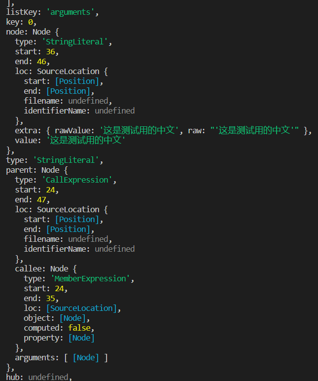

#### 抽象语法树
> 抽象语法树（Abstract Syntax Tree，AST），或简称语法树（Syntax tree），是源代码语法结构的一种抽象表示。它以树状的形式表现编程语言的语法结构，树上的每个节点都表示源代码中的一种结构。

babel的处理过程每一步都涉及抽象语法树。
[AST Explorer](https://astexplorer.net/)是一个在线转化ast的网站，可以查看源码及转化后的AST代码。


以type划分每一层级，这样的每一层结构也被叫做 节点（Node）。 一个 AST 可以由单一的节点或是成百上千个节点构成。 它们组合在一起可以描述用于静态分析的程序语法。

每一个节点都有start、end、loc这三个属性用以确定节点在源代码中的位置

#### babel的处理步骤
babel的主要处理分为三个步骤：解析（parse），转换（transform），生成（generate）

###### 解析
babel的解析是将源码转化输出为ast的过程，解析分为两步：词法分析和语法分析
- 词法分析：词法分析阶段把字符串形式的代码转换为 令牌（tokens） 流。
- 语法分析：语法分析阶段会把一个令牌流转换成 AST 的形式。 这个阶段会使用令牌中的信息把它们转换成一个 AST 的结构，这样更易于后续的操作。

###### 转换
转换步骤接收 AST 并对其进行遍历，在此过程中对节点进行添加、更新及移除等操作。 这是 Babel 或是其他编译器中最复杂的过程 同时也是插件将要介入工作的部分，后续将做详细介绍。

###### 生成
代码生成步骤把最终（经过一系列转换之后）的 AST 转换成字符串形式的代码，同时还会创建源码映射（source maps）。.
代码生成其实很简单：深度优先遍历整个 AST，然后构建可以表示转换后代码的字符串。

###### State(状态)
通过将一个访问者放入另一个访问者中以达到从访问者中消除全局状态的目的。
```javascript
const updateParamNameVisitor = {
  Identifier(path) {
    if (path.node.name === this.paramName) {
      path.node.name = "x";
    }
  }
};

const MyVisitor = {
  FunctionDeclaration(path) {
    const param = path.node.params[0];
    const paramName = param.name;
    param.name = "x";

    path.traverse(updateParamNameVisitor, { paramName });
  }
};

path.traverse(MyVisitor);
```

###### Scopes(作用域)
当编写一个转换时，必须小心作用域。得确保在改变代码的各个部分时不会破坏已经存在的代码。
在添加一个新的引用时需要确保新增加的引用名字和已有的所有引用不冲突。 或者我们仅仅想找出使用一个变量的所有引用， 我们只想在给定的作用域（Scope）中找出这些引用。

当你创建一个新的作用域时，需要给出它的路径和父作用域，之后在遍历过程中它会在该作用域内收集所有的引用(“绑定”)。
一旦引用收集完毕，你就可以在作用域（Scopes）上使用各种方法

###### Bindings（绑定）
所有引用属于特定的作用域，引用和作用域的这种关系被称作：绑定（binding）。
通过绑定的信息可以查找一个绑定的所有引用，并且知道这是什么类型的绑定(参数，定义等等)，查找它所属的作用域，或者拷贝它的标识符。 你甚至可以知道它是不是常量，如果不是，那么是哪个路径修改了它。
在很多情况下，知道一个绑定是否是常量非常有用，最有用的一种情形就是代码压缩时。

#### API

###### [Babylon](https://github.com/babel/babylon)
*Babylon has been moved into the main Babel mono-repo as [@babel/parser](https://github.com/babel/babel/tree/main/packages/babel-parser).*

Babylon 是 Babel 的解析器。最初是 从Acorn项目fork出来的。Acorn非常快，易于使用，并且针对非标准特性(以及那些未来的标准特性) 设计了一个基于插件的架构。

具体内容可查看后续章节。
###### babel-traverse
Babel Traverse（遍历）模块维护了整棵树的状态，并且负责替换、移除和添加节点。

traverse可以和parser一起使用，用于遍历和更新节点
```javascript
import * as babylon from "babylon";
import traverse from "babel-traverse";

const code = `function square(n) {
  return n * n;
}`;

const ast = babylon.parse(code);

traverse(ast, {
  enter(path) {
    if (
      path.node.type === "Identifier" &&
      path.node.name === "n"
    ) {
      path.node.name = "x";
    }
  }
});
```

具体内容可查看后续章节。

###### babel-types
Babel Types模块是一个用于 AST 节点的 Lodash 式工具库， 它包含了构造、验证以及变换 AST 节点的方法。 该工具库包含考虑周到的工具方法，对编写处理AST逻辑非常有用。
```javascript
import traverse from "babel-traverse";
import * as t from "babel-types";

traverse(ast, {
  enter(path) {
    if (t.isIdentifier(path.node, { name: "n" })) {
      path.node.name = "x";
    }
  }
});
```

