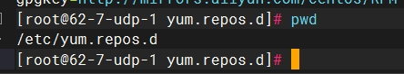
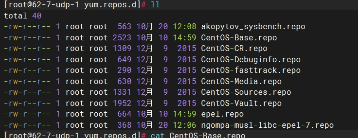
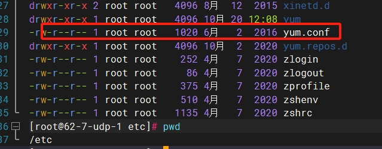

#### 软件包类型
> DEB    #适用于UBlinux和DEBlinux这两种Linux系统
> RPM    #适用于redhat、centOS以及fadora这三种Linux系统
> bz2|gz|xz  #压缩包类型，分为两种:
>> 一种解压缩后需要安装需要源码编译，如插件ntfs-3g_ntfsprogs-2017.3.23.tgz,需要编译 "configure"
>> 另一种是绿色软件，解压缩以后可以直接使用，不需要安装，如Firefox-latest-x86_64.tar.bz2

#### Yum
yum，全称“Yellow dog Updater, Modified”，是一个专门为了解决包的依赖关系而存在的软件包管理器。

网络 yum 源配置文件位于 /etc/yum.repos.d/ 目录下，文件扩展名为*.repo（只要扩展名为 *.repo 的文件都是 yum 源的配置文件）。
查看目录下的CentOS-Base.repo文件：




```sh
# 以下为一个 CentOS-Base.repo 文件的举例，缺少mirrorlist
[root@62-7-udp-1 yum.repos.d]# cat CentOS-Base.repo 
# CentOS-Base.repo
#
# The mirror system uses the connecting IP address of the client and the
# update status of each mirror to pick mirrors that are updated to and
# geographically close to the client.  You should use this for CentOS updates
# unless you are manually picking other mirrors.
#
# If the mirrorlist= does not work for you, as a fall back you can try the 
# remarked out baseurl= line instead.
#
#
 
[base]
name=CentOS-$releasever - Base - mirrors.aliyun.com
failovermethod=priority
baseurl=http://mirrors.aliyun.com/centos/$releasever/os/$basearch/
        http://mirrors.aliyuncs.com/centos/$releasever/os/$basearch/
        http://mirrors.cloud.aliyuncs.com/centos/$releasever/os/$basearch/
gpgcheck=1
gpgkey=http://mirrors.aliyun.com/centos/RPM-GPG-KEY-CentOS-7
 
#released updates 
[updates]
name=CentOS-$releasever - Updates - mirrors.aliyun.com
failovermethod=priority
baseurl=http://mirrors.aliyun.com/centos/$releasever/updates/$basearch/
        http://mirrors.aliyuncs.com/centos/$releasever/updates/$basearch/
        http://mirrors.cloud.aliyuncs.com/centos/$releasever/updates/$basearch/
gpgcheck=1
gpgkey=http://mirrors.aliyun.com/centos/RPM-GPG-KEY-CentOS-7
 
#additional packages that may be useful
[extras]
name=CentOS-$releasever - Extras - mirrors.aliyun.com
failovermethod=priority
baseurl=http://mirrors.aliyun.com/centos/$releasever/extras/$basearch/
        http://mirrors.aliyuncs.com/centos/$releasever/extras/$basearch/
        http://mirrors.cloud.aliyuncs.com/centos/$releasever/extras/$basearch/
gpgcheck=1
gpgkey=http://mirrors.aliyun.com/centos/RPM-GPG-KEY-CentOS-7
 
#additional packages that extend functionality of existing packages
[centosplus]
name=CentOS-$releasever - Plus - mirrors.aliyun.com
failovermethod=priority
baseurl=http://mirrors.aliyun.com/centos/$releasever/centosplus/$basearch/
        http://mirrors.aliyuncs.com/centos/$releasever/centosplus/$basearch/
        http://mirrors.cloud.aliyuncs.com/centos/$releasever/centosplus/$basearch/
gpgcheck=1
enabled=0
gpgkey=http://mirrors.aliyun.com/centos/RPM-GPG-KEY-CentOS-7
 
#contrib - packages by Centos Users
[contrib]
name=CentOS-$releasever - Contrib - mirrors.aliyun.com
failovermethod=priority
baseurl=http://mirrors.aliyun.com/centos/$releasever/contrib/$basearch/
        http://mirrors.aliyuncs.com/centos/$releasever/contrib/$basearch/
        http://mirrors.cloud.aliyuncs.com/centos/$releasever/contrib/$basearch/
gpgcheck=1
enabled=0
gpgkey=http://mirrors.aliyun.com/centos/RPM-GPG-KEY-CentOS-7
```
- [extras]yum的ID，必须唯一的，本地有多个yum源的时候，这里也必须是唯一的。
- name 具体的yum源名称，相当于对它的描述信息。
- mirrorlist 是镜像服务器地址列表，里面有很多的服务器地址。
- baseurl 和mirrorlist一样，都是指向yum源的地址，不同的是包含地址的多少，一帮只写一个地址，直接用baseurl。
- gpgcheck 0=取消验证，1=使用公钥检验rpm的正确性。
- gpgkey 校验的key地址，如果gpgcheck=0的话，那么gpgkey就可以不用填写。

yum通常会有一个配置文件yum.conf，一般位于 etc文件夹下

```sh
# 以下为一个yum.conf文件的举例
[root@62-7-udp-1 etc]# cat yum.conf
[main]
cachedir=/var/cache/yum/$basearch/$releasever
keepcache=0
debuglevel=2
logfile=/var/log/yum.log
exactarch=1
obsoletes=1
gpgcheck=1
plugins=1
installonly_limit=5
bugtracker_url=http://bugs.centos.org/set_project.php?project_id=23&ref=http://bugs.centos.org/bug_report_page.php?category=yum
distroverpkg=centos-release
override_install_langs=en_US.UTF-8
tsflags=nodocs


#  This is the default, if you make this bigger yum won't see if the metadata
# is newer on the remote and so you'll "gain" the bandwidth of not having to
# download the new metadata and "pay" for it by yum not having correct
# information.
#  It is esp. important, to have correct metadata, for distributions like
# Fedora which don't keep old packages around. If you don't like this checking
# interupting your command line usage, it's much better to have something
# manually check the metadata once an hour (yum-updatesd will do this).
# metadata_expire=90m

# PUT YOUR REPOS HERE OR IN separate files named file.repo
# in /etc/yum.repos.d
```
*配置说明*
- cachedir yum缓存的目录，yum在此存储下载的rpm包和数据库，一般情况下路径是/var/cache/yum/$basearch/$releasever
- keepcache 是否保留缓存内容，0=安装后删除软件包，1=安装后保留软件包
- debuglevel 除错级别，0-10，默认是2，只记录安装和删除记录。
- logfile 存放系统更新软件的日志的目录。可以根据路径去查询自己在过期做了哪些更新。
- exactarch 代表是否只升级和你安装软件包CPU体系一致的包，有1和0两个选项，1为是，0为否。
- obsoletes 这是一个update的参数，是否允许旧版本的运行，1表示允许。
- gpgcheck 是否验证GPG(GNU Private Guard)密钥，1表示验证。
- plugins 是否允许插件，1代表允许。
- installonly_limit 保存几个内核。
- pkgpolicy 包的策略，一共有两个选项，newest和last，这个的作用是如果设置了多个源，而同一个软件在不通的源中同时存在，yum应该选哪一个。如果是newest，则会安装最新的那个版本。如果是last，这回将服务器ID以字母排序，并选择最后的那个服务器上的软件。
- distroverpkg 指定一个软件包，yum会根据这个包判断发行版本，默认是RedHat-release，也可以是CentOS-release。
- tolerant 表示yum是否容忍命令行发生与软件包有关的错误，有1和0两个选项。
- retries 网络链接发生错误时的重试次数，如果设置为0，则会无限重试
- override_install_langs 这是一种覆盖rpm的_install_lang宏的方法。而不必在rpm的宏文件中更改它。默认值为nothing。
- tsflags 要传递给rpm事务集的事务标志的逗号或空格分隔的列表。这些包括'noscripts'， 'notriggers'， 'nodocs'， 'test'， 'justdb'和'nocontexts'。'repackage'也可用，但对于较新的RPM版本不起作用。您可以设置所有或其中任何一个。但是，如果您不知道它们在rpm事务集上下文中的作用，那么最好不要去管它。默认值为空列表。

*yum的repo配置文件中可用的变量*：
 - $releasever: 当前OS的发行版的主版本号，如：8，7，6
 - $arch: CPU架构，如：arch64, i586, i686，x86_64等
 - $basearch：系统基础平台；i386, x86_64
 - $contentdir：表示目录，比如：centos-8，centos-7
 - $YUM0-$YUM9:自定义变量

*yum的具体配置可查看man手册：https://man7.org/linux/man-pages/man5/yum.conf.5@@yum.html*


#### yum的常见命令
```sh
yum install [软件包名称]     # 安装软件包 
yum search [软件包名称]      # 搜索软件包
yum list [软件包名称]        # 显示指定程序包安装情况
yum list                    # 显示所有已安装及可安装的软件包
yum remove [软件包名称]      # 删除程序包
yum erase [软件包名称]       # 删除程序包
yum update                  # 内核升级或者软件更新
yum update [软件包名称]      # 更新软件包
yum check-update            # 检查可更新的程序
yum info [软件包名称]        # 显示安装包信息
yum provides "*/rz"         # 列出 rz 命令由哪个软件包提供
yum grouplist               # 查询可以用 groupinstall 安装的组名称
yum groupinstall [组名称]    # 安装程序组
yum groupremove [组名称]     # 删除程序组
yum deplist [软件包名称]     # 查看程序依赖情况

yum clean packages          # 清除缓存目录下的软件包
yum clean headers           # 清除缓存目录下的 headers
yum clean all               # 清除缓存目录下的所有缓存

yum makecache               # 建立元数据缓存
yum -y update               # 升级所有软件包和系统内核
yum -y upgrade              # 只升级软件包不升级内核

# 注意：-y 表示自动安装，不需要交互，如果不加 -y ，安装中会出现问询，需要手动处理。
# -y 下载安装

# 以下两种试了一下，并不能用于命令中，会导致命令直接报错
# -d 只下载不安装
# -N 不安装

#downloadonly可以仅下载所需软件和及其依赖包，大大解决了无网安装时找依赖包的问题
yum install [软件包名称] --downloadonly --downloaddir=/tmp/mysoftware
```

*注意*
以上命令大部分可同时安装多个软件包或查询多个命令，具体使用可查看man手册
https://man7.org/linux/man-pages/man8/yum.8@@yum.html


某些系统中的，或者是某个包
需要掌握换源这类知识。
进程守护 systemctrl
        DMP使用进程守护拉起来
ushard分库分表和读写分离写了大量日志，不用的话可以卸载

扩展数据库组件用的