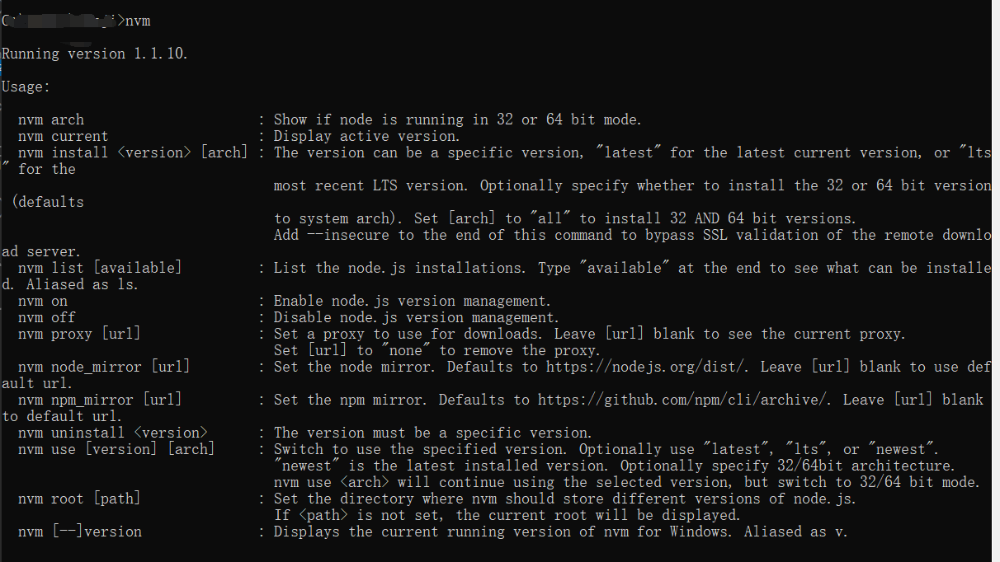

###### 前言
大家在日常开发中，偶尔会遇到因为node不兼容导致的问题，这时候怎么办？相信大家常用的解决手段是卸载当前用的node，去[官网](https://nodejs.org/zh-cn/)重新下一个新的可兼容的版本重新安装。确实，这种方法可以解决遇到的问题，但是如果兼容版本是低版本怎么办？切换一个项目，兼容版本又不兼容了怎么办？或许会有人说再卸载再换。。。。。。但是不觉得这样太繁琐了吗？下面为大家介绍一种使用版本管理工具，安装不同版本的方式，实现不用手动卸载，紧靠命令即可下载、安装、切换、卸载不同版本的node。

###### nvm--node版本管理工具
**注意：安装nvm之前一定要先将原本安装的node卸载，删除node相关文件**
1、下载nvm
[nvm下载地址](https://github.com/coreybutler/nvm-windows/releases)

github上有不同的安装包，大家可以根据自己的需要进行下载安装

2、安装nvm
*注意：安装目录不能出现中文、空格等，否则可能导致安装失败或者安装后找不到nvm等问题*

安装成功之后，使用cmd打开命令提示符，输入nvm，出现下图中的信息，表示安装成功


3、修改配置
找到nvm的安装目录，找到setting.txt文件，打开文件后，将下面的地址增加到文件中

```
node_mirror: https://npm.taobao.org/mirrors/node/
npm_mirror: https://npm.taobao.org/mirrors/npm/
```


4、使用nvm
- 安装指定版本node
```javascript
nvm install [--version]
// eg: nvm install 18.12
```
- 使用/切换指定版本node
```javascript
nvm use [--version]
// eg: nvm use 18.12
```
- 卸载指定版本node
```javascript
nvm uninstall [--version]
// eg: nvm uninstall 18.12
```
- 查看已下载及当前使用node版本
```javascript
nvm ls
```

###### 错误处理
1、安装nvm之后，查看node版本，提示拒绝访问
解决办法：卸载nvm，查看时候有nodejs文件残留，将残留文件删除

2、使用nvm use切换不同版本的node失败
解决办法：使用管理员权限运行命令提示符

3、安装nvm成功，可以正常切换不同版本node，但是在vscode的终端里查看node版本，提示node不是内部或外部命令。。。。
解决办法：em...本人遇到这个问题是因为安装nvm之前卸载node之后，把git也卸载了，不过安装git之后，重新安装nvm还是有这个问题，一段时间后重新安装nvm，安装成功了。。。。。。本人猜测是因为卸载了git导致的问题，注意：*安装nvm之前，卸载node就行了，不要卸载git*