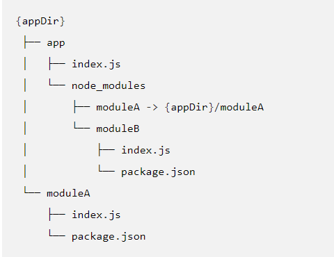

node [options] [V8 options] [script.js | -e "script" | -] [--] [arguments]

node debug [script.js | -e "script" | <host>:<port>] …

node --v8-options

执行时不带参数，会启动 [REPL]。

###### 选项
-v, --version
打印 node 的版本号。

-h, --help
打印 node 的命令行选项。 

-e, --eval "script"
把跟随的参数作为 JavaScript 来执行。 在 REPL 中预定义的模块也可以在 script 中使用。
*在windows的cmd中，使用单引号无法将参数作为javascript执行，仅双引号可正常执行，powershell和git bash中可以使用单引号和双引号*

-p, --print "script"
与 -e 相同，但会打印结果。

-c, --check
在不执行的情况下，对脚本进行语法检查。

-i, --interactive
打开 REPL，即使 stdin 看起来不像终端。

-r, --require module
在启动时预加载指定的模块。
遵循 require() 的模块解析规则。 module 可以是一个文件的路径，或一个 node 模块名称。

--inspect[=[host:]port]
在主机端口上激活检查器。默认为127.0.0.1:9229。
V8检查器集成允许Chrome DevTools和IDE等工具调试和配置Node.js实例。 这些工具通过tcp端口附加到Node.js实例，并使用[Chrome Debugging Protocol][]调试协议进行通信

--inspect-brk[=[host:]port]
在主机上激活检查器：端口并在用户脚本开始时中断，默认为127.0.0.1:9229。

--inspect-port=[host:]port
设置激活检查器时要使用的主机：端口。通过发送SIGUSR1信号激活检查器时有用。默认主机为：127.0.0.1。

--no-deprecation
静默废弃的警告。

--trace-deprecation
打印废弃的堆栈跟踪。

--throw-deprecation
抛出废弃的错误。

--pending-deprecation
发出挂起的弃用警告
Note: Pending deprecations are generally identical to a runtime deprecation with the notable exception that they are turned off by default and will not be emitted unless either the --pending-deprecation command line flag, or the NODE_PENDING_DEPRECATION=1 environment variable, is set. Pending deprecations are used to provide a kind of selective "early warning" mechanism that developers may leverage to detect deprecated API usage.
（注意：挂起的弃用通常与运行时弃用相同，但值得注意的是，它们在默认情况下被关闭，除非设置了--Pending弃用命令行标志或NODE_Pending_deprecation=1环境变量，否则不会发出。待定弃用用于提供一种选择性的“预警”机制，开发人员可以利用该机制来检测弃用的API使用情况。）

--no-warnings
静默一切进程警告（包括废弃警告）。

--expose-http2
Enable the experimental 'http2' module.（启用实验“http2”模块。）

--abort-on-uncaught-exception
Aborting instead of exiting causes a core file to be generated for post-mortem analysis using a debugger (such as lldb, gdb, and mdb)
(中止而不是退出会导致使用调试器(如lldb、gdb和mdb)生成一个用于事后分析的核心文件。)

--trace-warnings
打印进程警告的堆栈跟踪（包括废弃警告）。

--redirect-warnings=file
Write process warnings to the given file instead of printing to stderr. The file will be created if it does not exist, and will be appended to if it does. If an error occurs while attempting to write the warning to the file, the warning will be written to stderr instead.
(将进程警告写入给定文件，而不是打印到stderr。如果它不存在，则创建该文件;如果存在，则追加该文件。如果在尝试将警告写入文件时发生错误，则警告将被写入stderr。)

--trace-sync-io
每当事件循环的第一帧之后检测到同步 I/O 时，打印堆栈跟踪。

--force-async-hooks-checks
Enables runtime checks for async_hooks. These can also be enabled dynamically by enabling one of the async_hooks hooks.
(启用async_hooks的运行时检查。也可以通过启用async_hooks钩子之一来动态启用这些钩子。)

--trace-events-enabled
Enables the collection of trace event tracing information.
(启用跟踪事件跟踪信息的收集。)

--trace-event-categories
A comma separated list of categories that should be traced when trace event tracing is enabled using --trace-events-enabled.
(当使用——trace-events-enabled启用跟踪事件跟踪时，应该跟踪的类别列表，以逗号分隔。)

--zero-fill-buffers
自动用 0 填充所有新分配的 [Buffer] 和 [SlowBuffer] 实例。

--preserve-symlinks
当解析和缓存模块时，命令模块加载器保持符号连接。
默认情况下，当 Node.js 从一个被符号连接到另一块磁盘位置的路径加载一个模块时，Node.js 会解引用该连接，并使用模块的真实磁盘的实际路径，作为定位其他依赖模块的标识符和根路径。 大多数情况下，默认行为是可接受的。 但是，当使用符号连接的同行依赖，如下例子所描述的，如果 moduleA 试图引入 moduleB 作为一个同行依赖，默认行为就会抛出异常：

--preserve-symlinks 命令行标志命令 Node.js 使用模块的符号路径而不是真实路径，是符号连接的同行依赖能被找到。
注意，使用 --preserve-symlinks 会有其他方面的影响。 比如，如果符号连接的原生模块在依赖树里来自超过一个位置，它们会加载失败。 （Node.js 会将它们视为两个独立的模块，且会试图多次加载模块，造成抛出异常。）

--track-heap-objects
为堆快照追踪堆栈对象的分配。

--prof-process
处理 V8 分析器的输出，通过使用 V8 选项 --prof 生成。

--v8-options
打印 V8 命令行选项。
注意，V8 选项允许单词使用破折号（-）或下划线（_）分隔。
例如，--stack-trace-limit 等同于 --stack_trace_limit。

--tls-cipher-list=list
指定备用的默认 TLS 加密列表。 （需要 Node.js 被构建为支持加密。（默认））

--enable-fips
启动时启用符合 FIPS 标准的加密。 （需要 Node.js 使用 ./configure --openssl-fips 构建）

--force-fips
启动时强制使用符合 FIPS 标准的加密。 （无法通过脚本代码禁用。） （需要 Node.js 使用 ./configure --openssl-fips 构建）

--openssl-config=file
启动时加载 OpenSSL 配置文件。 在其他用途中，如果 Node.js 使用 ./configure --openssl-fips 构建，它可以用于启用符合 FIPS 标准的加密。

--use-openssl-ca, --use-bundled-ca
Use OpenSSL's default CA store or use bundled Mozilla CA store as supplied by current Node.js version. The default store is selectable at build-time.

Using OpenSSL store allows for external modifications of the store. For most Linux and BSD distributions, this store is maintained by the distribution maintainers and system administrators. OpenSSL CA store location is dependent on configuration of the OpenSSL library but this can be altered at runtime using environment variables.

The bundled CA store, as supplied by Node.js, is a snapshot of Mozilla CA store that is fixed at release time. It is identical on all supported platforms.

See SSL_CERT_DIR and SSL_CERT_FILE.
(使用OpenSSL的默认CA存储或使用当前Node.js版本提供的捆绑Mozilla CA存储。默认存储在构建时是可选择的。
使用OpenSSL存储允许对存储进行外部修改。对于大多数Linux和BSD发行版，这个存储区由发行版维护人员和系统管理员维护。OpenSSL CA存储位置依赖于OpenSSL库的配置，但这可以在运行时使用环境变量更改。
由Node.js提供的捆绑CA存储是发布时固定的Mozilla CA存储的快照。它在所有支持的平台上都是相同的。
请参阅SSL_CERT_DIR和SSL_CERT_FILE。)

--icu-data-dir=file
指定 ICU 数据的加载路径。 （覆盖 NODE_ICU_DATA）

-
Alias for stdin, analogous to the use of - in other command line utilities, meaning that the script will be read from stdin, and the rest of the options are passed to that script.
(stdin的别名，类似于-在其他命令行实用程序中的使用，这意味着脚本将从stdin读取，其余选项将传递给该脚本。)

--
Indicate the end of node options. Pass the rest of the arguments to the script. If no script filename or eval/print script is supplied prior to this, then the next argument will be used as a script filename.
(指示节点选项的结束。将其余参数传递给脚本。如果在此之前没有提供脚本文件名或eval/print脚本，则下一个参数将用作脚本文件名。)

###### 环境变量
NODE_DEBUG=module[,…]
以 ',' 分隔的应该打印调试信息的核心模块列表。

NODE_PATH=path[:…]
以 ':' 分隔的有模块搜索路径作前缀的目录列表。
注意，在 Windows 中，列表是用 ';' 分隔的。

NODE_DISABLE_COLORS=1
当设为 1 时，不会在 REPL 中使用颜色。

NODE_ICU_DATA=file
ICU（Intl 对象）数据的数据路径。 当使用 small-icu 编译时，扩展链接的数据。

NODE_NO_WARNINGS=1
When set to 1, process warnings are silenced.
(当设置为1时，进程警告将被静音。)

NODE_NO_HTTP2=1
When set to 1, the http2 module is suppressed.
(当设置为1时，http2模块将被抑制。)

NODE_OPTIONS=options...
A space-separated list of command line options.  options...  are interpreted as if they had been specified on the command line before the actual command line (so they can be overridden).  Node will exit with an error if an option that is not allowed in the environment is used, such as -p or a script file.
(以空格分隔的命令行选项列表。选择……将它们解释为在实际命令行之前在命令行上指定的(因此可以覆盖它们)。如果使用了环境中不允许的选项，例如-p或脚本文件，则Node将退出并报错。)
node选项如下：
- --enable-fips
- --force-fips
- --icu-data-dir
- --inspect-brk
- --inspect-port
- --inspect
- --no-deprecation
- --no-warnings
- --openssl-config
- --redirect-warnings
- --require, -r
- --throw-deprecation
- --tls-cipher-list
- --trace-deprecation
- --trace-events-categories
- --trace-events-enabled
- --trace-sync-io
- --trace-warnings
- --track-heap-objects
- --use-bundled-ca
- --use-openssl-ca
- --v8-pool-size
- --zero-fill-buffers
V8选项如下:
- --abort-on-uncaught-exception
- --max-old-space-size
- --stack-trace-limit

NODE_PENDING_DEPRECATION=1
When set to 1, emit pending deprecation warnings.

Note: Pending deprecations are generally identical to a runtime deprecation with the notable exception that they are turned off by default and will not be emitted unless either the --pending-deprecation command line flag, or the NODE_PENDING_DEPRECATION=1 environment variable, is set. Pending deprecations are used to provide a kind of selective "early warning" mechanism that developers may leverage to detect deprecated API usage.
(当设置为1时，发出挂起的弃用警告。注意:挂起的弃用通常与运行时弃用相同，有一个显著的例外:它们在默认情况下是关闭的，除非设置了--pending -deprecation命令行标志或NODE_PENDING_DEPRECATION=1环境变量，否则不会被触发。未决弃用用于提供一种选择性的“早期预警”机制，开发人员可以利用这种机制来检测弃用API的使用情况。)

NODE_PRESERVE_SYMLINKS=1
When set to 1, instructs the module loader to preserve symbolic links when resolving and caching modules.
(当设置为1时，指示模块加载器在解析和缓存模块时保留符号链接。)

NODE_REPL_HISTORY=file
用于存储持久性的 REPL 历史记录的文件的路径。 默认路径是 ~/.node_repl_history，可被该变量覆盖。 将值设为空字符串（"" 或 " "）会禁用持久性的 REPL 历史记录。

NODE_EXTRA_CA_CERTS=file
当设置了此选项时，根 CA 证书（如 VeriSign）会被 file 指定的证书扩展。 文件应该包括一个或多个可信的 PEM 格式的证书。 如果文件丢失或有缺陷，则 process.emitWarning() 会触发一个消息。
注意，当一个 TLS 或 HTTPS 的客户端或服务器的 ca 选项的属性被显式地指定时，则指定的证书不会被使用。

OPENSSL_CONF=file
Load an OpenSSL configuration file on startup. Among other uses, this can be used to enable FIPS-compliant crypto if Node.js is built with ./configure --openssl-fips.
If the [--openssl-config][] command line option is used, the environment variable is ignored.
(启动时加载OpenSSL配置文件。在其他用途中，如果Node.js使用./configure --openssl-fips构建，则可以使用它来启用符合fips的加密。如果使用[--openssl-config][]命令行选项，则忽略环境变量。)

SSL_CERT_DIR=dir
If --use-openssl-ca is enabled, this overrides and sets OpenSSL's directory containing trusted certificates.
Note: Be aware that unless the child environment is explicitly set, this environment variable will be inherited by any child processes, and if they use OpenSSL, it may cause them to trust the same CAs as node.
(如果启用了--use-openssl-ca，将覆盖并设置包含受信任证书的OpenSSL目录。注意:除非显式地设置了子环境，否则此环境变量将由任何子进程继承，并且如果它们使用OpenSSL，则可能导致它们信任与节点相同的CA。)

SSL_CERT_FILE=file
If --use-openssl-ca is enabled, this overrides and sets OpenSSL's file containing trusted certificates.
Note: Be aware that unless the child environment is explicitly set, this environment variable will be inherited by any child processes, and if they use OpenSSL, it may cause them to trust the same CAs as node.
(如果启用了--use-openssl-ca，将覆盖并设置包含受信任证书的OpenSSL文件。注意:除非显式地设置了子环境，否则此环境变量将由任何子进程继承，并且如果它们使用OpenSSL，则可能导致它们信任与节点相同的CA。)

NODE_REDIRECT_WARNINGS=file
When set, process warnings will be emitted to the given file instead of printing to stderr. The file will be created if it does not exist, and will be appended to if it does. If an error occurs while attempting to write the warning to the file, the warning will be written to stderr instead. This is equivalent to using the --redirect-warnings=file command-line flag.
(设置后，进程警告将被发送到给定的文件，而不是打印到stderr。如果它不存在，则创建该文件;如果存在，则追加该文件。如果在尝试将警告写入文件时发生错误，则警告将被写入stderr。这相当于使用--redirect-warnings=file命令行标志。)

UV_THREADPOOL_SIZE=size
Set the number of threads used in libuv's threadpool to size threads.
Asynchronous system APIs are used by Node.js whenever possible, but where they do not exist, libuv's threadpool is used to create asynchronous node APIs based on synchronous system APIs. Node.js APIs that use the threadpool are:
- all fs APIs, other than the file watcher APIs and those that are explicitly synchronous
- crypto.pbkdf2()
- crypto.randomBytes(), unless it is used without a callback
- crypto.randomFill()
- dns.lookup()
- all zlib APIs, other than those that are explicitly synchronous
Because libuv's threadpool has a fixed size, it means that if for whatever reason any of these APIs takes a long time, other (seemingly unrelated) APIs that run in libuv's threadpool will experience degraded performance. In order to mitigate this issue, one potential solution is to increase the size of libuv's threadpool by setting the 'UV_THREADPOOL_SIZE' environment variable to a value greater than 4 (its current default value). For more information, see the [libuv threadpool documentation][]. [--openssl-config]: #cli_openssl_config_file [Buffer]: buffer.html#buffer_buffer [Chrome Debugging Protocol]: https://chromedevtools.github.io/debugger-protocol-viewer [REPL]: repl.html [SlowBuffer]: buffer.html#buffer_class_slowbuffer [debugger]: debugger.html [emit_warning]: process.html#process_process_emitwarning_warning_type_code_ctor [libuv threadpool documentation]: http://docs.libuv.org/en/latest/threadpool.html

将libuv线程池中使用的线程数设置为线程大小。
node .js尽可能使用异步系统api，但在不存在异步系统api的地方，libuv的线程池用于基于同步系统api创建异步节点api。使用线程池的Node.js api有:
- 所有的fs api，除了文件监视器api和那些显式同步的api
- crypto.pbkdf2()
- crypt.randombytes()，除非它在没有回调的情况下使用
- crypto.randomFill()
- dns.lookup()
- 所有的zlib api，除了那些显式同步的
因为libuv的线程池大小是固定的，这意味着无论出于什么原因，如果这些api中的任何一个需要很长时间，在libuv的线程池中运行的其他(看似无关的)api将会经历性能下降。为了缓解这个问题，一个潜在的解决方案是通过将“UV_THREADPOOL_SIZE”环境变量设置为大于4(当前的默认值)来增加libuv线程池的大小。有关更多信息，请参阅[libuv线程池文档][]。[——openssl-config]: #cli_openssl_config_file [Buffer]: Buffer .html#buffer_buffer [Chrome调试协议]:https://chromedevtools.github.io/debugger-protocol-viewer [REPL]: REPL .html [SlowBuffer]: Buffer .html#buffer_class_slowbuffer[调试器]:debugger.html [emit_warning]: process.html#process_process_emitwarning_warning_type_code_ctor [libuv线程池文档]:http://docs.libuv.org/en/latest/threadpool.html


#### console (控制台)
console 模块提供了一个简单的调试控制台，类似于 Web 浏览器提供的 JavaScript 控制台。
该模块导出了两个特定的组件：
- 一个 Console 类，包含 console.log() 、 console.error() 和 console.warn() 等方法，可以被用于写入到任何 Node.js 流。
- 一个全局的 console 实例，可被用于写入到 process.stdout 和 process.stderr。 全局的 console 使用时无需调用 require('console')。
注意：全局的 console 对象的方法既不总是同步的（如浏览器中类似的 API），也不总是异步的（如其他 Node.js 流）。 详见 进程 I/O。

```javascript
// 使用全局的 console
console.log('你好世界');
// 打印: '你好世界'到 stdout。
console.log('你好%s', '世界');
// 打印: '你好世界'到 stdout。
console.error(new Error('错误信息'));
// 打印: [Error: 错误信息]到 stderr。
const name = '描述';
console.warn(`警告${name}`);
// 打印: '警告描述'到 stderr。

// 使用 Console 类
const out = getStreamSomehow();
const err = getStreamSomehow();
const myConsole = new console.Console(out, err);
myConsole.log('你好世界');
// 打印: '你好世界'到 out。
myConsole.log('你好%s', '世界');
// 打印: '你好世界'到 out。
myConsole.error(new Error('错误信息'));
// 打印: [Error: 错误信息]到 err。
const name = '描述';
myConsole.warn(`警告${name}`);
// 打印: '警告描述'到 err。
```

###### Console 类
Console 类可用于创建一个具有可配置的输出流的简单记录器，可以通过 require('console').Console 或 console.Console 使用：
```javascript
const { Console } = require('console');
const { Console } = console;
```
全局的 console 是一个特殊的 Console 实例，它的输出会发送到 process.stdout 和 process.stderr。 相当于调用：
```javascript
new Console(process.stdout, process.stderr);
```

console.assert(value[, message][, ...args])
一个简单的断言测试，验证 value 是否为真。 如果不为真，则抛出 AssertionError。 如果提供了 message，则使用 util.format() 格式化并作为错误信息使用。
```javascript
console.assert(true, 'does nothing');
// 通过
console.assert(false, 'Whoops %s', 'didn\'t work');
// AssertionError: Whoops didn't work
```
注意：Node.js 中的 console.assert() 方法与在浏览器中的 console.assert() 方法的实现是不一样的。
具体地说，在浏览器中，用非真的断言调用 console.assert() 会导致 message 被打印到控制台但不会中断后续代码的执行。 在 Node.js v10.0.0 之前，一个值为假的断言也将会导致一个AssertionError被抛出，使得代码执行被打断。v10.0.0 修复了此差异，所以现在console.assert()在 Node 和浏览器中执行行为相同。
可以通过扩展 Node.js 的 console 并重写 console.assert() 方法来实现与浏览器中类似的功能。
*console.assert 在不同浏览器中可能获得不同的效果*
```javascript
'use strict';

// 用一个新的不带补丁的 assert 实现来创建一个简单的 console 扩展。
const myConsole = Object.create(console, {
  assert: {
    value: function assert(assertion, message, ...args) {
      try {
        console.assert(assertion, message, ...args);
      } catch (err) {
        console.error(err.stack);
      }
    },
    configurable: true,
    enumerable: true,
    writable: true,
  },
});

module.exports = myConsole;

const console = require('./myConsole');
console.assert(false, '会打印这个消息，但不会抛出错误');
console.log('这个也会打印');
```

console.clear()
当 stdout 是一个 TTY 时，调用 console.clear() 将尝试清除 TTY。 当 stdout 不是一个TTY时，该方法什么都不做。
注意：console.clear() 的具体行为可能因操作系统和终端类型而异。 对于大多数Linux操作系统，console.clear() 与 clear shell 命令行为类似。 在Windows上，console.clear() 将只清除当前终端视图中Node.js二进制文件的输出。

console.count([label])
- label <string> 计数器的显示标签。 默认为 'default'。
维护一个指定 label 的内部计数器并且输出到 stdout 指定 label 调用 console.count() 的次数。
```javascript
> console.count()
default: 1
undefined
> console.count('default')
default: 2
undefined
> console.count('abc')
abc: 1
undefined
> console.count('xyz')
xyz: 1
undefined
> console.count('abc')
abc: 2
undefined
> console.count()
default: 3
undefined
>
```

console.countReset([label='default'])
- label <string> 计数器的显示标签。 默认为 'default'。
重置指定 label 的内部计数器。

console.debug(data[, ...args])
console.debug()函数是console.log()的别名。

console.dir(obj[, options])
在 obj 上使用 util.inspect() 并打印结果字符串到 stdout。(在控制台中显示指定对象的属性，并通过类似文件树样式的交互列表显示。)
该函数会绕过任何定义在 obj 上的自定义的 inspect() 函数。
可选的 options 对象可以传入用于改变被格式化的字符串：
- showHidden - 如果为 true，则该对象中的不可枚举属性和 symbol 属性也会显示。默认为 false。
- depth - 告诉 util.inspect() 函数当格式化对象时要递归多少次。 这对于检查较大的复杂对象很有用。 默认为 2。 设为 null 可无限递归。
- colors - 如果为 true，则输出会带有 ANSI 颜色代码。 默认为 false。 颜色是可定制的，详见定制 util.inspect() 颜色。

console.error([data][, ...args])
打印到 stderr，并带上换行符。 可以传入多个参数，第一个参数作为主要信息，其他参数作为类似于 printf(3) 中的代替值（参数都会传给 util.format()）。
如果在第一个字符串中没有找到格式化元素（如 %d），则在每个参数上调用 util.inspect() 并将结果字符串值拼在一起。 详见 [util.format()](https://www.nodeapp.cn/util.html#util_util_format_format_args)。


console.group([...label])#
...label <any>
将后续行的缩进增加两个空格。
如果提供了一个或多个 labels，则首先打印这些 labels，而不需要额外的缩进。

console.groupCollapsed()
console.group()的一个别名.

console.groupEnd()
将后续行的缩进减少两个空格。

console.info([data][, ...args])
console.info() 函数是 console.log() 的一个别名。

console.log([data][, ...args])
打印到 stdout，并带上换行符。 可以传入多个参数，第一个参数作为主要信息，其他参数作为类似于 printf(3) 中的代替值（参数都会传给 util.format()）。

console.time(label)
启动一个定时器，用以计算一个操作的持续时间。 定时器由一个唯一的 label 标识。 当调用 console.timeEnd() 时，可以使用相同的 label 来停止定时器，并以毫秒为单位将持续时间输出到 stdout。 定时器持续时间精确到亚毫秒。

console.timeEnd(label)
停止之前通过调用 console.time() 启动的定时器，并打印结果到 stdout：
```javascript
console.time('100-elements');
for (let i = 0; i < 100; i++) {}
console.timeEnd('100-elements');
// 打印 100-elements: 225.438ms
```
该方法在使用时不会将输出的时间返回到 js，它只能用于控制台调试。请勿将该方法作为普通计时器或性能数据收集器的一部分。

console.trace([message][, ...args])
打印字符串 'Trace :' 到 stderr ，并通过 util.format() 格式化消息与堆栈跟踪在代码中的当前位置。

console.warn([data][, ...args])
console.warn() 函数是 console.error() 的一个别名。