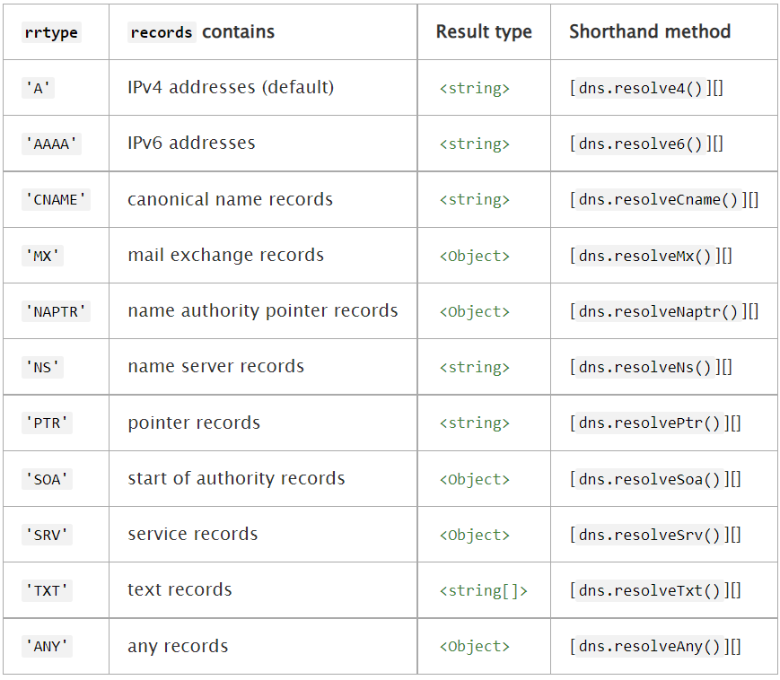

Node.js 包含一个进程外的调试工具，可以通过V8检查器与内置的调试客户端访问。 要使用它，需要以 inspect 参数启动 Node.js，并带上需要调试的脚本的路径
```javascript
node inspect test.js
```
在脚本的源代码中插入 debugger; 语句，则会在代码的那个位置启用一个断点
```javascript
const a = 1;
debugger;
const b = 2;
```
repl 命令用于运行代码。 next 命令用于步入下一行。 输入 help 可查看其他可用的命令。
按下 enter 键且不输入命令，则可重复上一个调试命令。

###### 监视器
在每个断点上，监视器列表中的每个表达式都会在当前上下文中被执行，并在断点的源代码列表之前立即显示。
输入 watch('my_expression') 开始监视一个表达式。 watchers 命令会打印已激活的监视器。 输入 unwatch('my_expression') 来移除一个监视器。

###### 命令参考手册

**步进**
- cont, c - 继续执行
- next, n - 下一步
- step, s - 跳进函数
- out, o - 跳出函数
- pause - 暂停运行代码（类似开发者工具中的暂停按钮）

**断点**
- setBreakpoint(), sb() - 在当前行设置断点
- setBreakpoint(line), sb(line) - 在指定行设置断点
- setBreakpoint('fn()'), sb(...) - 在函数体的第一条语句设置断点
- setBreakpoint('script.js', 1), sb(...) - 在 script.js 的第 1 行设置断点
- clearBreakpoint('script.js', 1), cb(...) - 清除 script.js 第 1 行的断点

也可以在一个还未被加载的文件（模块）中设置断点

**信息**
- backtrace, bt - 打印当前执行框架的回溯
- list(5) - 列出脚本源代码的 5 行上下文（前后各 5 行）
- watch(expr) - 添加表达式到监视列表
- unwatch(expr) - 从监视列表移除表达式
- watchers - 列出所有监视器和它们的值（每个断点会自动列出）
- repl - 打开调试器的 repl，用于在所调试的脚本的上下文中进行执行
- exec expr - 在所调试的脚本的上下文中执行一个表达式

**执行控制**
- run - 运行脚本（调试器开始时自动运行）
- restart - 重新启动脚本
- kill - 终止脚本

**杂项**
- scripts - 列出所有已加载的脚本
- version - 显示 V8 引擎的版本号

Node.js 的 V8 检查器集合
打开Chrome地址：chrome://inspect/#devices
运行 node --inspect-brk test.js
即可在浏览器中查看node运行结果
[相关文档地址](https://nodejs.org/zh-cn/docs/guides/debugging-getting-started/)

#### DNS(域名解析)

dns 模块包含两类函数：
1) 第一类函数，使用底层操作系统工具进行域名解析，且无需进行网络通信。 这类函数只有一个：[dns.lookup()]。
```javascript
const dns = require('dns');
dns.lookup('iana.org', (err, address, family) => {
  console.log('IP 地址: %j 地址族: IPv%s', address, family);
});
// IP 地址: "192.0.43.8" 地址族: IPv4
```
2) 第二类函数，连接到一个真实的 DNS 服务器进行域名解析，且始终使用网络进行 DNS 查询。 这类函数包含了 dns 模块中除 [dns.lookup()] 以外的所有函数。 这些函数使用与 dns.lookup() 不同的配置文件（例如 /etc/hosts）。 这类函数适合于那些不想使用底层操作系统工具进行域名解析、而是想使用网络进行 DNS 查询的开发者。
```javascript
const dns = require('dns');
dns.resolve4('archive.org', (err, addresses) => {
  if (err) throw err;
  console.log(`IP 地址: ${JSON.stringify(addresses)}`);
  addresses.forEach((a) => {
    dns.reverse(a, (err, hostnames) => {
      if (err) {
        throw err;
      }
      console.log(`IP 地址 ${a} 逆向解析到域名: ${JSON.stringify(hostnames)}`);
    });
  });
});
```

###### Class dns.Resolver
DNS请求的独立解析程序。
使用默认的设置创建一个新的解析程序。为一个解析程序设置servers使用[resolver.setServers()][dns.setServers()]，它不会影响其他的解析程序：
```javascript
const { Resolver } = require('dns');
const resolver = new Resolver();
resolver.setServers(['4.4.4.4']);
// This request will use the server at 4.4.4.4, independent of global settings.
resolver.resolve4('example.org', (err, addresses) => {
  // ...
});
```
dns模块方法：
- [resolver.getServers()][dns.getServers()]
- [resolver.setServers()][dns.setServers()]
- [resolver.resolve()][dns.resolve()]
- [resolver.resolve4()][dns.resolve4()]
- [resolver.resolve6()][dns.resolve6()]
- [resolver.resolveAny()][dns.resolveAny()]
- [resolver.resolveCname()][dns.resolveCname()]
- [resolver.resolveMx()][dns.resolveMx()]
- [resolver.resolveNaptr()][dns.resolveNaptr()]
- [resolver.resolveNs()][dns.resolveNs()]
- [resolver.resolvePtr()][dns.resolvePtr()]
- [resolver.resolveSoa()][dns.resolveSoa()]
- [resolver.resolveSrv()][dns.resolveSrv()]
- [resolver.resolveTxt()][dns.resolveTxt()]
- [resolver.reverse()][dns.reverse()]

**resolver.cancel()**
取消这个解析程序的未解决的DNS查询，相应的回调用一个ECANCELLED码调用。

**dns.getServers()**
返回一个用于当前DNS解析的IP地址的数组的字符串，格式根据[rfc5952][]。如果使用自定义端口，那么字符串将包括一个端口部分。

**dns.lookup(hostname[, options], callback)**
- hostname <string>
- options <integer> | <Object>
 - family <integer> The record family. Must be 4 or 6. IPv4 and IPv6 addresses are both returned by default.
 - hints <number> One or more [supported getaddrinfo flags][]. Multiple flags may be passed by bitwise ORing their values.
 - all <boolean> When true, the callback returns all resolved addresses in an array. Otherwise, returns a single address. Default: false
 - verbatim <boolean> When true, the callback receives IPv4 and IPv6 addresses in the order the DNS resolver returned them. When false, IPv4 addresses are placed before IPv6 addresses. Default: currently false (addresses are reordered) but this is expected to change in the not too distant future. New code should use { verbatim: true }.
- callback <Function>
 - err <Error>
 - address <string> A string representation of an IPv4 or IPv6 address.
 - family <integer> 4 or 6, denoting the family of address.
解析hostname(例如：'nodejs.org')为第一个找到的A（IPv4）或AAAA（IPv6）记录。options可以是对象或者整数。如果options没有被提供，那么IPv4 和 IPv6都是有效的。如果options是整数，只能是4或6。
另外，options可以是一个含有以下属性的对象：
- family <Number> - T地址族。如果提供，必须为整数4或6。如果没有提供，只接受IPv4和IPv6地址。
- hints: <Number> - 如果提供，它必须是一个或多个支持的getaddrinfo标识。如果没有提供，那么没有标识被传递给getaddrinfo。多个标识可以通过在逻辑上ORing它们的值，来传递给hints。支持的getaddrinfo标识请参阅下文。有关支持的标志的更多信息请查询[supported getaddrinfo flags][]章节。
- all: <Boolean> - 值为true时， 回调函数返回一个包含所有解析后地址的数组，否则只返回一个地址。默认值为false。
所有的参数都是可选的。
回调函数包含(err, address, family)参数。address是IPv4或IPv6地址字符串。family、是整数4或6，表示地址族（不一定是最初传递给查找的值）。
当all属性被设置为true时，回调函数参数变为(err, addresses)，addresses则变成一个由address 和 family 属性组成的对象数组。
发生错误时，err是一个[Error][]对象，err.code是错误码。不仅在主机名不存在时，在如没有可用的文件描述符等情况下查找失败，err.code也会被设置为'ENOENT'。
```javascript
const dns = require('dns');
const options = {
  family: 6,
  hints: dns.ADDRCONFIG | dns.V4MAPPED,
};
dns.lookup('example.com', options, (err, address, family) =>
  console.log('address: %j family: IPv%s', address, family));
// address: "::ffff:93.184.216.34" family: IPv6

// When options.all is true, the result will be an Array.
options.all = true;
dns.lookup('example.com', options, (err, addresses) =>
  console.log('addresses: %j', addresses));
// addresses: [{"address":"::ffff:93.184.216.34","family":6}]
```
以下内容可以作为hints标志传递给[dns.lookup()]:
- dns.ADDRCONFIG: 返回当前系统支持的地址类型。例如，如果当前系统至少配置了一个 IPv4 地址，则返回 IPv4地址。不考虑回环地址。
- dns.V4MAPPED: 如果指定了 IPv6 家族， 但是没有找到 IPv6 地址，将返回 IPv4 映射的 IPv6地址。在有些操作系统中不支持

dns.lookupService(address, port, callback)
- address <string>
- port <number>
- callback <Function>
 - err <Error>
 - hostname <string> e.g. example.com
 - service <string> e.g. http
将参数address和port传入操作系统底层getnameinfo服务来解析处理并返回主机名。
如果address不是有效的IP地址，会抛出TypeError。port必须是一个整数.如果不是规定的端口号，会抛出TypeError.
出错情况下，err是一个Error对象，err.code代码错误码。
```javascript
const dns = require('dns');
dns.lookupService('127.0.0.1', 22, (err, hostname, service) => {
  console.log(hostname, service);
  // DESKTOP-894BKU0 ssh
});
```
如果以 [util.promisify()][] 方式进行调用, 它将返回一个包含hostname和service属性的 Promise 对象。

dns.resolve(hostname[, rrtype], callback)
- hostname <string> 解析的主机名。
- rrtype <string> 资源记录类型. 默认: 'A'.
- callback <Function>
  - err <Error>
  - records <string[]> | <Object[]> | <Object>
使用DNS协议来解析一个主机名(e.g. 'nodejs.org')为一个资源记录的数组。回调函数的参数为(err, records)。当成功时，records将是一个资源记录的数组。它的类型和结构取决于rrtype

出错时，err是一个[Error][] object，err.code是DNS error codes的一种。

dns.resolve4(hostname[, options], callback)
- hostname <string> 需要解析的主机名。
- options <Object>
  - ttl <boolean> 记录每一条记录的存活次数 (TTL)。如果为 true， 返回的结果将会为 Object 的数组，就像 { address: '1.2.3.4', ttl: 60 } 带有 TTL 秒数的记录，而不是 string 的数组.
- callback <Function>
  - err <Error>
  - addresses <string[]> | <Object[]>
使用DNS协议解析IPv4地址主机名(A记录)。addresses参数是传递给callback函数的IPv4地址数组。（例如：['74.125.79.104', '74.125.79.105', '74.125.79.106']）

dns.resolve6(hostname[, options], callback)
*参数说明参考：dns.resolve4*

dns.resolveCname(hostname, callback)
- hostname <string>
- callback <Function>
  - err <Error>
  - addresses <string[]>
使用DNS协议解析CNAME记录主机名。addresses参数是传递给callback函数规范内有效的主机名数组（例如：['bar.example.com']）

dns.resolveMx(hostname, callback)
- hostname <string>
- callback <Function>
  - err <Error>
  - addresses <Object[]>
使用DNS协议处理邮件交换记录主机名(MX记录)。addresses参数是传递给callback函数的主机名对象数组，对象包含priority和exchange属性（例如： [{priority: 10, exchange: 'mx.example.com'}, ...]）。

dns.resolveNaptr(hostname, callback)
*参数与上面的类似*
使用DNS协议来处理基于正则表达式匹配的记录(NAPTR记录)的主机名。addresses参数是传递给callback函数的主机名对象数组，对象包含属性：
- flags
- service
- regexp
- replacement
- order
- preference

dns.resolveNs(hostname, callback)
*参数与上面的类似*
使用DNS协议处理名称服务器主机名记录(NS记录)。addresses为有效的名称服务器记录主机名数组（eg:['ns1.example.com', 'ns2.example.com']）。

dns.resolvePtr(hostname, callback)
*参数与上面的类似*
使用DNS协议处理主机名引用记录(PTR记录)。addresses参数将一个字符串数组传递给回调函数callback,其中包含回复记录。

dns.resolveSoa(hostname, callback)
*参数与上面的类似*
使用DNS协议处理主机名子域名记录(SOA记录)。addresses参数为一个对象包含以下属性：
- nsname
- hostmaster
- serial
- refresh
- retry
- expire
- minttl

dns.resolveSrv(hostname, callback)
*参数与上面的类似*
使用DNS协议来处理主机名服务记录(SRV记录)。callback函数返回的addresses参数为对象数组,每个对象包含以下属性：
- priority
- weight
- port
- name

dns.resolveTxt(hostname, callback)
*参数与上面的类似*
使用DNS协议处理文本查询主机名(TXT记录)。回调函数callback会返回records参数，它是一个文本记录与主机名一一对应的二维数组(例如：[ ['v=spf1 ip4:0.0.0.0 ', '~all' ] ]). 每个数组文本块包含一条记录。根据用例,这些可以是连接在一起或单独对待。

dns.resolveAny(hostname, callback)
- hostname <string>
- callback <Function>
  - err <Error>
  - ret <Object[]>
使用DNS协议解析所有记录(也称为ANY或 * query)。传递给回调函数的ret参数将是一个包含各种类型记录的数组。每个对象都有一个属性类型，用于指示当前记录的类型。根据类型的不同，额外的属性会出现在对象上:


dns.reverse(ip, callback)
- ip <string>
- callback <Function>
  - err <Error>
  - hostnames <string[]>
执行一个反向DNS查询返回IPv4或IPv6地址的主机名的数组。出错情况下，err是一个Error对象，err.code代码错误码。

dns.setServers(servers)
servers <string[]> array of [rfc5952][] formatted addresses
设置IP地址服务器端口在进行DNS解析时可用，servers参数是一个[rfc5952][]数组格式的地址。 如果端口是IANA默认端口(53),那么它可以被忽略。
ip地址无效将会报错。
*dns.setServers()方法不要在DNS查询过程中使用。*

**错误码**
每个DNS查询可以返回一个错误代码如下:
- dns.NODATA: DNS服务返回没有数据.
- dns.FORMERR: DNS服务器查询没有格式化.
- dns.SERVFAIL: DNS服务器返回失败。
- dns.NOTFOUND: 域名未找到。
- dns.NOIMP: DNS服务器不执行请求的操作。
- dns.REFUSED: 查询DNS服务器拒绝。
- dns.BADQUERY: 未格式化DNS查询。
- dns.BADNAME: 未格式化主机名
- dns.BADFAMILY: 没有提供地址族
- dns.BADRESP: 未格式化DNS回复
- dns.CONNREFUSED: 无法连接DNS服务器
- dns.TIMEOUT: 连接DNS服务器超时
- dns.EOF: 文件末尾
- dns.FILE: 读取文件错误
- dns.NOMEM: 内存溢出
- dns.DESTRUCTION: 通道以及销毁
- dns.BADSTR: 未格式化字符串
- dns.BADFLAGS: 指定非法标记
- dns.NONAME: 给定的主机名不是数字。
- dns.BADHINTS: 指定非法的提示标志。
- dns.NOTINITIALIZED: c-ares异步DNS请求库初始化未完成。
- dns.LOADIPHLPAPI: 加载iphlpapi.dll(Windows IP辅助API应用程序接口模块)错误
- dns.ADDRGETNETWORKPARAMS: 找不到GetNetworkParams(读取本机DNS信息)函数
- dns.CANCELLED: DNS查询取消

