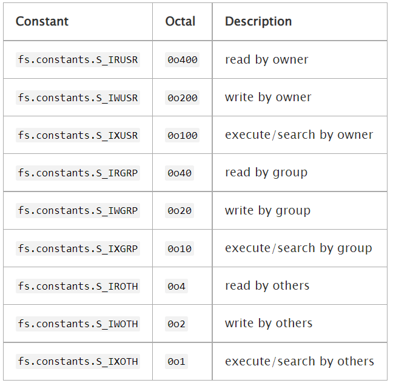
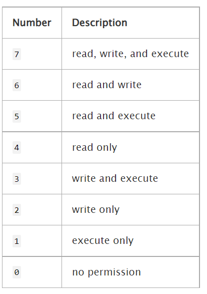
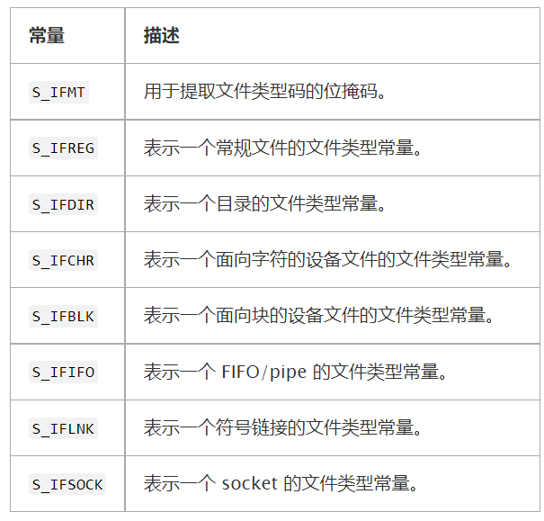
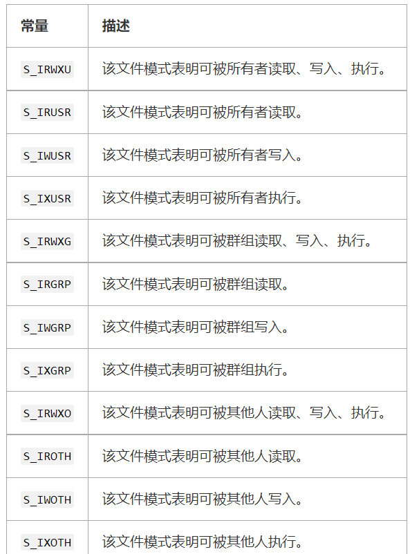

#### fs (文件系统)
通过 require('fs') 使用该模块。 
所有的方法都有异步和同步的形式。
- 异步方法的最后一个参数都是一个回调函数。
  - 传给回调函数的参数取决于具体方法，但回调函数的第一个参数都会保留给异常。
  - 如果操作成功完成，则第一个参数会是 null 或 undefined。
- 使用同步方法，任何异常都会被立即抛出。
  - 可以使用 try/catch 来处理异常，或让异常向上冒泡。
```javascript
// 异步方法
const fs = require('fs');

fs.unlink('/tmp/hello', (err) => {
  if (err) throw err;
  console.log('成功删除 /tmp/hello');
});

// 同步方法
const fs = require('fs');

fs.unlinkSync('/tmp/hello');
console.log('成功删除 /tmp/hello');
```
*注意：异步方法的执行先后顺序不能保证，正确的做法是使用回调函数进行关联*

在繁忙的进程中，建议使用异步的方法。 同步的方法会阻塞整个进程，直到完成（停止所有连接）。
可以使用文件名的相对路径。 路径是相对 process.cwd() 的。

*注意: 在 Windows 上，使用 w 选项(通过 fs.open 或 fs.writeFile) 打开已有隐藏文件将会失败，错误信息为 EPERM 。已有隐藏文件可以通过 r+ 选项打开。调用 fs.ftruncate 可以用来重置文件内容。*

###### WHATWG
对于大多数 fs 模块的函数， path 或者 filename 参数可以当作一个 WHATWG URL 对象传入。 只有 URL 对象使用被支持的 file: 协议。
```javascript
const fs = require('fs');
const { URL } = require('url');
const fileUrl = new URL('file:///tmp/hello');
fs.readFileSync(fileUrl);
```
*注意： file: URLS 必须是绝对路径。*
- 在 Windows 上， 携带主机名的 file: URLs 被转换为 UNC 路径
- 有硬盘盘符的 file: URLs 会被转换成 本地绝对路径。
- 既没有主机名，也没有盘符的 file: URLs 在转换时会抛出错误。
  - 注意： 携带盘符的 file: URLs 必须使用 : 作为盘符后的分隔符。使用其他符号会抛出错误。
- 在其他所有的平台上， 都不支持携带主机名的 file: URLs，且会抛出错误。
- 当 file: URL 包含已经编码的斜线符号会在所有平台抛出错误。
- 在 Windows 上， 携带已编码的反斜线 file: URLs 在编码时会抛出错误。

###### fs.FSWatcher 类
从 fs.watch() 返回的对象是该类型。
提供给 fs.watch() 的 listener 回调会接收返回的 FSWatcher 的 change 事件。
该对象本身可触发以下事件：
- 'change' 事件
eventType <string> fs 变化的类型
filename <string> | <Buffer> 变化的文件名（如果是相关的/可用的）
当一个被监视的目录或文件有变化时触发。 详见 fs.watch()。
filename 参数可能不会被提供，这依赖于操作系统支持。 如果提供了 filename，则若 fs.watch() 被调用时 encoding 选项被设置为 'buffer' 则它会是一个 Buffer，否则 filename 是一个字符串。
```javascript
// 例子，处理 fs.watch 监听器
fs.watch('./tmp', { encoding: 'buffer' }, (eventType, filename) => {
  if (filename) {
    console.log(filename);
    // 输出: <Buffer ...>
  }
});
```
- 'error' 事件
error <Error>
当发生错误时触发。

- watcher.close()
停止监听 fs.FSWatcher 的变化。

###### fs.ReadStream 类
ReadStream 是一个可读流。

- 'close' 事件
当 ReadStream 底层的文件描述符被关闭时触发。

- 'open' 事件
fd <integer> 被 ReadStream 使用的整数文件描述符。
当 ReadStream 的文件被打开时触发。

- readStream.bytesRead
已读取的字节数。

- readStream.path
流正在读取的文件的路径，指定在 fs.createReadStream() 的第一个参数。 如果 path 传入的是一个字符串，则 readStream.path 是一个字符串。 如果 path 传入的是一个 Buffer，则 readStream.path 是一个 Buffer。

###### fs.Stats 类
从 fs.stat()、fs.lstat() 和 fs.fstat() 及其同步版本返回的对象都是该类型。
- stats.isFile()
- stats.isDirectory()
- stats.isBlockDevice()
- stats.isCharacterDevice()
- stats.isSymbolicLink() (仅对 fs.lstat() 有效)
- stats.isFIFO()
- stats.isSocket()
对于一个普通文件，util.inspect(stats) 会返回一个类似如下的字符串：
```javascript
Stats {
  dev: 2114,
  ino: 48064969,
  mode: 33188,
  nlink: 1,
  uid: 85,
  gid: 100,
  rdev: 0,
  size: 527,
  blksize: 4096,
  blocks: 8,
  atimeMs: 1318289051000.1,
  mtimeMs: 1318289051000.1,
  ctimeMs: 1318289051000.1,
  birthtimeMs: 1318289051000.1,
  atime: Mon, 10 Oct 2011 23:24:11 GMT,
  mtime: Mon, 10 Oct 2011 23:24:11 GMT,
  ctime: Mon, 10 Oct 2011 23:24:11 GMT,
  birthtime: Mon, 10 Oct 2011 23:24:11 GMT }
```

###### Stat 时间值
stat 对象中的时间有以下语义：
- atime "访问时间" - 文件数据最近被访问的时间。 会被 mknod(2)、 utimes(2) 和 read(2) 系统调用改变。
- mtime "修改时间" - 文件数据最近被修改的时间。 会被 mknod(2)、 utimes(2) 和 write(2) 系统调用改变。
- ctime "变化时间" - 文件状态最近更改的时间（修改索引节点数据） 会被 chmod(2)、 chown(2)、 link(2)、 mknod(2)、 rename(2)、 unlink(2)、 utimes(2)、 read(2) 和 write(2) 系统调用改变。
- birthtime "创建时间" - 文件创建的时间。 当文件被创建时设定一次。 在创建时间不可用的文件系统中，该字段可能被替代为 ctime 或 1970-01-01T00:00Z（如 Unix 的纪元时间戳 0）。 注意，该值在此情况下可能会大于 atime 或 mtime。 在 Darwin 和其它的 FreeBSD 衍生系统中，如果 atime 被使用 utimes(2) 系统调用显式地设置为一个比当前 birthtime 更早的值，也会有这种情况。

###### fs.WriteStream 类
WriteStream 一个可写流。

'close' 事件
当 WriteStream 底层的文件描述符被关闭时触发。

'open' 事件
fd <integer> 被 WriteStream 使用的整数文件描述符。
当 WriteStream 的文件被打开时触发。

writeStream.bytesWritten
已写入的字节数。 不包括仍在排队等待写入的数据。

writeStream.path
流正在写入的文件的路径，指定在 fs.createWriteStream() 的第一个参数。 如果 path 传入的是一个字符串，则 writeStream.path 是一个字符串。 如果 path 传入的是一个 Buffer，则 writeStream.path 是一个 Buffer。

fs.access(path[, mode], callback)
- path <string> | <Buffer> | <URL>
- mode <integer> Default: fs.constants.F_OK
- callback <Function>
 - err <Error>
测试 path 指定的文件或目录的用户权限。 mode 是一个可选的整数，指定要执行的可访问性检查。 以下常量定义了 mode 的可能值。 可以创建由两个或更多个值的位或组成的掩码（例如 fs.constants.W_OK | fs.constants.R_OK）。
- fs.constants.F_OK - path 文件对调用进程可见。 这在确定文件是否存在时很有用，但不涉及 rwx 权限。 如果没指定 mode，则默认为该值。
- fs.constants.R_OK - path 文件可被调用进程读取。
- fs.constants.W_OK - path 文件可被调用进程写入。
- fs.constants.X_OK - path 文件可被调用进程执行。 对 Windows 系统没作用（相当于 fs.constants.F_OK）。
最后一个参数 callback 是一个回调函数，会带有一个可能的错误参数被调用。 如果可访问性检查有任何的失败，则错误参数会是一个 Error 对象。 下面的例子会检查 /etc/passwd 文件是否可以被当前进程读取和写入。
```javascript
fs.access('/etc/passwd', fs.constants.R_OK | fs.constants.W_OK, (err) => {
  console.log(err ? 'no access!' : 'can read/write');
});
```
**不建议在调用 fs.open() 、 fs.readFile() 或 fs.writeFile() 之前使用 fs.access() 检查一个文件的可访问性。 如此处理会造成紊乱情况，因为其他进程可能在两个调用之间改变该文件的状态。 作为替代，用户代码应该直接打开/读取/写入文件，当文件无法访问时再处理错误。**
```javascript
fs.open('myfile', 'r', (err, fd) => {
  if (err) {
    if (err.code === 'ENOENT') {
      console.error('myfile does not exist');
      return;
    }
    throw err;
  }
  readMyData(fd);
});
```
*通常，仅在文件不会被直接使用时才检查一个文件的可访问性，例如当它的可访问性是来自另一个进程的信号。*

fs.accessSync(path[, mode])
*参数说明同上*
如果可访问性检查有任何的失败，则错误参数会是一个 Error 对象。 否则返回 undefined。
```javascript
try {
  fs.accessSync('etc/passwd', fs.constants.R_OK | fs.constants.W_OK);
  console.log('can read/write');
} catch (err) {
  console.error('no access!');
}
```

fs.appendFile(file, data[, options], callback)
- file <string> | <Buffer> | <URL> | <number> 文件名或文件描述符
- data <string> | <Buffer>
- options <Object> | <string>
 - encoding <string> | <null> 默认为 'utf8'
 - mode <integer> 默认为 0o666
 - flag <string> 默认为 'a'
- callback <Function>
 - err <Error>
异步地追加数据到一个文件，如果文件不存在则创建文件。 data 可以是一个字符串或 Buffer。
如果 options 是一个字符串，则它指定了字符编码。
```javascript
fs.appendFile('message.txt', 'data to append', 'utf8', (err) => {
  if (err) throw err;
  console.log('The "data to append" was appended to file!');
});
```
file 可能是一个被打开用来追加数据的数字文件描述符（通过 fs.open() 或者 fs.openSync()）。这样的文件描述符将不会被自动关闭。
```javascript
fs.open('message.txt', 'a', (err, fd) => {
  if (err) throw err;
  fs.appendFile(fd, 'data to append', 'utf8', (err) => {
    fs.close(fd, (err) => {
      if (err) throw err;
    });
    if (err) throw err;
  });
});
```

fs.appendFileSync(file, data[, options])
参数说明同上
```javascript
try {
  fs.appendFileSync('message.txt', 'data to append', 'utf8');
  console.log('The "data to append" was appended to file!');
} catch (err) {
  /* Handle the error */
}

let fd;
try {
  fd = fs.openSync('message.txt', 'a');
  fs.appendFileSync(fd, 'data to append', 'utf8');
} catch (err) {
  /* Handle the error */
} finally {
  if (fd !== undefined)
    fs.closeSync(fd);
}
```

fs.chmod(path, mode, callback)
- path <string> | <Buffer> | <URL>
- mode <integer>
- callback <Function>
 - err <Error>
异步地改变文件的权限。 完成回调只有一个可能的异常参数。

###### File modes
mode 参数会在 fs.chmod() 和 fs.chmodSync()方法中用到，它是用下面的常量进行逻辑或(logical OR)操作后的数字掩码：

一个构造 mode 的更简单的方式是使用3位八进制串（比如，765）。最左侧的数字（例中的7）代表了文件所有者的权限。中间一位（例中的6）代表了组的权限。最右侧的数字（例中的5）代表其他人的权限。

例如，八进制值 0o765 表示：
- 文件所有者可以进行读、写和执行。
- 文件所属组可以读和写。
- 其他人可以对文件进行读和执行。

fs.chmodSync(path, mode)
同步地改变文件的权限。 返回 undefined。 fs.chmod()的同步版本。

fs.chown(path, uid, gid, callback)
- path <string> | <Buffer> | <URL>
- uid <integer>
- gid <integer>
- callback <Function>
 - err <Error>
异步地改变文件的所有者和群组。 完成回调只有一个可能的异常参数。

fs.chownSync(path, uid, gid)
同步地改变文件的所有者和群组。 返回 undefined。 fs.chown() 的同步版本。

fs.close(fd, callback)
fd <integer>
callback <Function>
err <Error>
异步的 close(2)。 完成回调只有一个可能的异常参数。

fs.closeSync(fd)
同步的 close(2)。返回 undefined。

fs.constants
返回一个包含常用文件系统操作的常量的对象。 具体的常量定义在 FS Constants 中描述。

fs.copyFile(src, dest[, flags], callback)
- src <string> | <Buffer> | <URL> 要被拷贝的源文件名称
- dest <string> | <Buffer> | <URL> 拷贝操作的目标文件名
- flags <number> 拷贝操作修饰符 默认: 0
- callback <Function>
异步的将 src 拷贝到 dest。Asynchronously copies src to dest. 默认情况下，如果 dest 已经存在会被覆盖。回调函数没有给出除了异常以外的参数。Node.js 不能保证拷贝操作的原子性。如果目标文件打开后出现错误，Node.js 将尝试删除它。
flags 是一个可选的整数，用于指定行为的拷贝操作。唯一支持的 flag 是 fs.constants.COPYFILE_EXCL ，如果 dest 已经存在，则会导致拷贝操作失败。
```javascript
const fs = require('fs');

// 默认情况下，destination.txt 将创建或覆盖
fs.copyFile('source.txt', 'destination.txt', (err) => {
  if (err) throw err;
  console.log('source.txt was copied to destination.txt');
});

// 如果第三个参数是数字，那么肯定是 flags，代码如下
const fs = require('fs');
const { COPYFILE_EXCL } = fs.constants;

// 使用 COPYFILE_EXCL ，如果 destination.txt 文件存在，操作将失败。
fs.copyFile('source.txt', 'destination.txt', COPYFILE_EXCL, callback);
```

fs.copyFileSync(src, dest[, flags])
参数说明同上

fs.createReadStream(path[, options])
- path <string> | <Buffer> | <URL>
- options <string> | <Object>
 - flags <string>
 - encoding <string>
 - fd <integer>
 - mode <integer>
 - autoClose <boolean>
 - start <integer>
 - end <integer>
 - highWaterMark <integer>
返回一个新建的 ReadStream 对象（详见可读流）。
不同于在一个可读流上设置的 highWaterMark 默认值（16 kb），该方法在相同参数下返回的流具有 64 kb 的默认值。
options 是一个带有以下默认值的对象或字符串：
```javascript
const defaults = {
  flags: 'r',
  encoding: null,
  fd: null,
  mode: 0o666,
  autoClose: true,
  highWaterMark: 64 * 1024
};
```
options 可以包括 start 和 end 值，使其可以从文件读取一定范围的字节而不是整个文件。 start 和 end 都是包括在内的，并且起始值是 0。 如果指定了 fd 且 start 不传或为 undefined，则 fs.createReadStream() 从当前文件位置按顺序地读取。 encoding 可以是任何可以被 Buffer 接受的值。

如果指定了 fd，则 ReadStream 会忽略 path 参数并且会使用指定的文件描述符。 这意味着不会触发 'open' 事件。 注意，fd 应该是阻塞的；非阻塞的 fd 们应该传给 net.Socket。

如果 autoClose 为 false，则文件描述符不会被关闭，即使有错误。 应用程序需要负责关闭它，并且确保没有文件描述符泄漏。 如果 autoClose 被设置为 true（默认），则在 error 或 end 时，文件描述符会被自动关闭。

mode 用于设置文件模式（权限和粘结位），但仅限创建文件时。
如果 options 是一个字符串，则它指定了字符编码。

fs.createWriteStream(path[, options])
- path <string> | <Buffer> | <URL>
- options <string> | <Object>
 - flags <string>
 - encoding <string>
 - fd <integer>
 - mode <integer>
 - autoClose <boolean>
 - start <integer>
返回一个新建的 WriteStream 对象（详见可写流）。
options 是一个带有以下默认值的对象或字符串：
```javascript
const defaults = {
  flags: 'w',
  encoding: 'utf8',
  fd: null,
  mode: 0o666,
  autoClose: true
};
```
options 也可以包括一个 start 选项，使其可以写入数据到文件某个位置。 如果是修改一个文件而不是覆盖它，则需要flags 模式为 r+ 而不是默认的 w 模式。

fs.existsSync(path)
path <string> | <Buffer> | <URL>
fs.exists() 的同步版本。 如果路径存在，则返回 true，否则返回 false。
*注意，虽然 fs.exists() 是废弃的，但 fs.existsSync() 不是。 （fs.exists() 的回调接收的参数与其他 Node.js 回调不一致，fs.existsSync() 不使用回调。）*

fs.fchmod(fd, mode, callback)
- fd <integer>
- mode <integer>
- callback <Function>
 - err <Error>
更改文件权限（文件描述符）。异步的 fchmod(2)。 完成回调只有一个可能的异常参数。

fs.fchmodSync(fd, mode)
- fd <integer>
- mode <integer>
同步的 fchmod(2)。返回 undefined。

fs.fchown(fd, uid, gid, callback)
- fd <integer>
- uid <integer>
- gid <integer>
- callback <Function>
 - err <Error>
更改给定文件描述符的所有者和组。异步的 fchown(2)。 完成回调只有一个可能的异常参数。

fs.fchownSync(fd, uid, gid)
- fd <integer>
- uid <integer>
- gid <integer>
同步的 fchown(2)。返回 undefined。

fs.fdatasync(fd, callback)
- fd <integer>
- callback <Function>
 - err <Error>
文件数据同步。异步的 fdatasync(2)。 完成回调只有一个可能的异常参数。

fs.fdatasyncSync(fd)
- fd <integer>
同步的 fdatasync(2)。返回 undefined。

fs.mkdtemp(prefix[, options], callback)
创建一个唯一的临时目录。
生成六位随机字符附加到一个要求的 prefix 后面，然后创建一个唯一的临时目录。
创建的目录路径会作为字符串传给回调的第二个参数。
可选的 options 参数可以是一个字符串并指定一个字符编码，或是一个对象且由一个 encoding 属性指定使用的字符编码。
*注意：fs.mkdtemp() 方法会直接附加六位随机选择的字符串到 prefix 字符串。 例如，指定一个目录 /tmp，如果目的是要在 /tmp 里创建一个临时目录，则 prefix 必须 以一个指定平台的路径分隔符（require('path').sep）结尾。*
```javascript
const { sep } = require('path');
fs.mkdtemp(`${tmpDir}${sep}`, (err, folder) => {
  if (err) throw err;
  console.log(folder);
  // 会输出类似于 `/tmp/abc123`。
  // 一个新的临时目录会被创建在 /tmp 目录里。
});
```

fs.watch(filename[, options][, listener])
*说明: fs.watch API 不是 100％ 跨平台一致的，且在某些情况下不可用。递归选项只支持 macOS 和 Windows。*

*可用性*
特性依赖于底层操作系统提供的一种方法来通知文件系统的变化。
- 在 Linux 系统中，使用 inotify。
- 在 BSD 系统中，使用 kqueue。
- 在 macOS 系统中，对文件使用 kqueue，对目录使用 FSEvents。
- 在 SunOS 系统（包括 Solaris 和 SmartOS）中，使用 event ports。
- 在 Windows 系统中，该特性依赖 ReadDirectoryChangesW。
- 在 Aix 系统中，该特性依赖 AHAFS 必须是启动的。

*文件名参数*
回调中提供的 filename 参数仅在 Linux、macOS、Windows、以及 AIX 系统上支持。 即使在支持的平台中，filename 也不能保证提供。 因此，不要以为 filename 参数总是在回调中提供，如果它是空的，需要有一定的后备逻辑。

fs.watchFile(filename[, options], listener)
注意：fs.watch() 比 fs.watchFile 和 fs.unwatchFile 更高效。 可能的话，应该使用 fs.watch 而不是 fs.watchFile 和 fs.unwatchFile。
注意: 当 fs.watchFile() 所监听的文件消失并重新出现时，第二个回调函数中返回的 previousstat (文件重新出现)将与第一个回调函数的 previousstat (消失)相同。
这种情况会发生在:
- 该文件被删除，然后又恢复
- 文件重命名两次，但第二次重命名与其原名称相同

fs.write(fd, buffer[, offset[, length[, position]]], callback)
注意，多次对同一文件使用 fs.write 且不等待回调，是不安全的。 对于这种情况，强烈推荐使用 fs.createWriteStream。
在 Linux 上，当文件以追加模式打开时，指定位置的写入是不起作用的。 内核会忽略位置参数，并总是将数据追加到文件的末尾。

fs.writeFile(file, data[, options], callback)
注意，多次对同一文件使用 fs.writeFile 且不等待回调，是不安全的。 对于这种情况，强烈推荐使用 fs.createWriteStream。
注意：如果 file 指定为一个文件描述符，则它不会被自动关闭。


fs 常量
以下常量由 fs.constants 输出。
注意：不是所有的常量在每一个操作系统上都是可用的。

文件访问常量：以下常量用于 fs.access()。


文件打开常量
以下常量用于 fs.open()。


文件类型常量
以下常量用于 fs.Stats 对象中用于决定一个文件的类型的 mode 属性。


文件模式常量
以下常量用于 fs.Stats 对象中用于决定一个文件访问权限的 mode 属性。



？？？
复制操作的原子性？