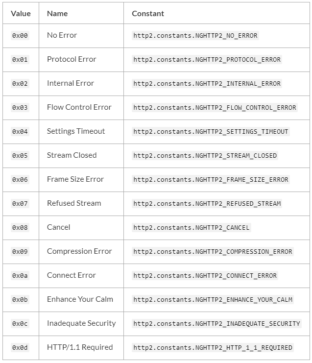

#### HTTP
要使用 HTTP 服务器与客户端，需要 require('http')。
Node.js 中的 HTTP 接口被设计成支持协议的许多特性。 比如，大块编码的消息。 这些接口不缓冲完整的请求或响应，用户能够以流的形式处理数据。
HTTP 消息头由一个对象表示，例如：
```
{ 'content-length': '123',
  'content-type': 'text/plain',
  'connection': 'keep-alive',
  'host': 'mysite.com',
  'accept': '*/*' }
```
键名是小写的，键值不能修改。

**http.Agent 类**
Agent 负责为 HTTP 客户端管理连接的持续与复用。 它为一个给定的主机与端口维护着一个等待请求的队列，且为每个请求重复使用一个单一的 socket 连接直到队列为空，此时 socket 会被销毁或被放入一个连接池中，在连接池中等待被有着相同主机与端口的请求再次使用。 是否被销毁或被放入连接池取决于 keepAlive 选项。

**http.ClientRequest 类**
该对象在 http.request() 内部被创建并返回。 它表示着一个正在处理的请求，其请求头已进入队列。 请求头仍可使用 setHeader(name, value)、getHeader(name) 和 removeHeader(name) API 进行修改。 实际的请求头会与第一个数据块一起发送或当调用 request.end() 时发送。

要获取响应，需为 'response' 事件添加一个监听器到请求对象上。 当响应头被接收到时，'response' 事件会从请求对象上被触发 。 'response' 事件被执行时带有一个参数，该参数是一个 http.IncomingMessage 实例。

在 'response' 事件期间，可以添加监听器到响应对象上，比如监听 'data' 事件。

如果没有添加 'response' 事件处理函数，则响应会被整个丢弃。 如果添加了 'response' 事件处理函数，则必须消耗完响应对象的数据，可通过调用 response.read()、或添加一个 'data' 事件处理函数、或调用 .resume() 方法。 数据被消耗完时会触发 'end' 事件。 在数据被读取完之前会消耗内存，可能会造成 'process out of memory' 错误。

注意：Node.js 不会检查 Content-Length 与已传输的请求主体的长度是否相等。

request.socket
- <net.Socket>
引用底层socket。 通常用户不想访问此属性。 特别地，由于协议解析器连接到socket的方式，socket将不会触发'readable'事件。 在response.end()之后，该属性为null。 也可以通过request.connection来访问socket。
```javascript
const http = require('http');
const options = {
  host: 'nodejs.cn',
};
const req = http.get(options);
req.end();
req.once('response', (res) => {
  const ip = req.socket.localAddress;
  const port = req.socket.localPort;
  console.log(`你的IP地址是 ${ip}，你的源端口是 ${port}。`);
  // 你的IP地址是 192.168.22.168，你的源端口是 62687。
});
```

**http.Server 类**
该类继承自 net.Server，且具有一些额外的事件：

'checkContinue' 事件
- request <http.IncomingMessage>
- response <http.ServerResponse>
每当接收到一个带有 HTTP Expect: 100-continue 请求头的请求时触发。 如果该事件未被监听，则服务器会自动响应 100 Continue。
处理该事件时，如果客户端应该继续发送请求主体，则调用 response.writeContinue()，否则生成一个适当的 HTTP 响应（例如 400 错误请求）。
*注意，当该事件被触发且处理后，'request' 事件不会被触发。*

'clientError' 事件
- exception <Error>
- socket <net.Socket>
如果客户端触发了一个 'error' 事件，则它会被传递到这里。 该事件的监听器负责关闭或销毁底层的 socket。 
默认情况下，请求异常时会立即销毁 socket。
socket 参数是发生错误的 net.Socket 对象。
```javascript
const http = require('http');

const server = http.createServer((req, res) => {
  res.end();
});
server.on('clientError', (err, socket) => {
  socket.end('HTTP/1.1 400 Bad Request\r\n\r\n');
});
server.listen(8000);
```
当 'clientError' 事件发生时，不会有 request 或 response 对象，所以发送的任何 HTTP 响应，包括响应头和内容，必须被直接写入到 socket 对象。 注意，确保响应是一个被正确格式化的 HTTP 响应消息。

'connect' 事件
- request <http.IncomingMessage> HTTP 请求，同 'request' 事件。
- socket <net.Socket> 服务器与客户端之间的网络 socket。
- head <Buffer> 流的第一个数据包，可能为空。
每当客户端发送 HTTP CONNECT 请求时触发。 *如果该事件未被监听，则发送 CONNECT 请求的客户端会关闭连接。*
当该事件被触发后，请求的 socket 上没有 'data' 事件监听器，这意味着需要绑定 'data' 事件监听器，用来处理 socket 上被发送到服务器的数据。

'upgrade' 事件
- request <http.IncomingMessage> HTTP 请求，同 'request' 事件。
- socket <net.Socket> 服务器与客户端之间的网络 socket。
- head <Buffer> 流的第一个数据包，可能为空。
每当客户端发送 HTTP upgrade 请求时触发。 如果该事件未被监听，则发送 upgrade 请求的客户端会关闭连接。
当该事件被触发后，请求的 socket 上没有 'data' 事件监听器，这意味着需要绑定 'data' 事件监听器，用来处理 socket 上被发送到服务器的数据。

server.maxHeadersCount
- <number> 默认为 2000。
限制请求头的最大数量，默认为 2000。 如果设为 0，则没有限制。

server.setTimeout([msecs][, callback])
- msecs <number> 默认为 120000 (2 分钟)。
- callback <Function>
设置 socket 的超时时间。 如果发生超时，则触发服务器对象的 'timeout' 事件，并传入 socket 作为一个参数。
*默认情况下，服务器的超时时间是 2 分钟，且超时后的 socket 会被自动销毁。 但是，如果你为服务器的 'timeout' 事件分配了一个回调函数，则超时必须被显式地处理。*
返回 server。

server.timeout
- <number> 超时时间，以毫秒为单位。默认为 120000 (2 分钟)。
socket 被认定为超时的空闲毫秒数。
*值设为 0 可禁用请求连接的超时行为。*
*注意，socket 的超时逻辑是在连接上设定的，所以改变这个值只影响服务器新建的连接，而不会影响任何已存在的连接。*

server.keepAliveTimeout
- <number> 超时毫秒. 默认为 5000 (5秒).
服务器完成最后的响应之后需要等待的额外的传入数据的活跃毫秒数, socket 才能被销毁.
如果服务器在 keep-alive 计时已激活时接收到新的数据, 他会重置常规的非活动计时, 即server.timeout.
值为 0 时禁用传入连接 keep-alive 的超时行为。 
*注意: scoket 的超时逻辑上取决于服务器连接, 所以改变这个值只影响服务器的新连接, 不影响任何已存在的连接.*

**http.ServerResponse 类**
该对象在 HTTP 服务器内部被创建。 它作为第二个参数被传入 'request' 事件。
这个类实现了（而不是继承自）可写流 接口。

'finish' 事件
*当响应已被发送时触发。 更具体地说，当响应头和响应主体的最后一部分已被交给操作系统通过网络进行传输时，触发该事件。 这并不意味着客户端已接收到任何东西。*
该事件触发后，响应对象上不再触发其他事件。

response.addTrailers(headers)
- headers <Object>
该方法会添加 HTTP 尾部响应头（一种在消息尾部的响应头）到响应。
*仅当响应使用分块编码时，尾部响应头才会被发送；否则（比如请求为 HTTP/1.0），尾部响应头会被丢弃。*
*注意，发送尾部响应头之前，需先发送 Trailer 响应头，并在值里带上尾部响应头字段的列表。*
```javascript
response.writeHead(200, { 'Content-Type': 'text/plain','Trailer': 'Content-MD5' });
response.write(fileData);
response.addTrailers({ 'Content-MD5': '7895bf4b8828b55ceaf47747b4bca667' });
response.end();
```
如果尾部响应头字段的名称或值包含无效字符，则抛出 TypeError 错误。

response.getHeader(name)
- name <string>
返回: <string>
读取一个已入队列但尚未发送到客户端的响应头。 注意，名称不区分大小写。
const contentType = response.getHeader('content-type');

response.headersSent
- <boolean>
返回一个布尔值（只读）。 如果响应头已被发送则为 true，否则为 false。

response.removeHeader(name)
- name <string>
从隐式发送的队列中移除一个响应头。

response.sendDate
- <boolean>
当为 true 时，如果响应头里没有日期响应头，则日期响应头会被自动生成并发送。默认为 true
*该属性只可在测试时被禁用，因为HTTP响应需要包含日期响应头*

response.setHeader(name, value)
- name <string>
- value <string> | <string[]>
为一个隐式的响应头设置值。 如果该响应头已存在，则值会被覆盖。 如果要发送多个名称相同的响应头，则使用字符串数组。
如果响应头字段的名称或值包含无效字符，则抛出 TypeError 错误。
response.setHeader() 设置的响应头会与 response.writeHead() 设置的响应头合并，且 response.writeHead() 的优先。
```javascript
// 返回 content-type = text/plain
const server = http.createServer((req, res) => {
  res.setHeader('Content-Type', 'text/html');
  res.setHeader('X-Foo', 'bar');
  res.writeHead(200, { 'Content-Type': 'text/plain' });
  res.end('ok');
});
```

response.statusCode
- <number>
当使用隐式的响应头时（没有显式地调用 response.writeHead()），该属性控制响应头刷新时将被发送到客户端的状态码。
response.statusCode = 404;
响应头被发送到客户端后，该属性表示被发出的状态码。

response.write(chunk[, encoding][, callback])
- chunk <string> | <Buffer>
- encoding <string>
- callback <Function>
- 返回: <boolean>
如果该方法被调用且 response.writeHead() 没有被调用，则它会切换到隐式响应头模式并刷新隐式响应头。
该方法会发送一块响应主体。 它可被多次调用，以便提供连续的响应主体片段。
请注意在http模块中，当请求是HEAD请求时，响应主体被省略。 类似地，204和304响应 _不能_ 包括消息体。
chunk 可以是一个字符串或一个 buffer。 如果 chunk 是一个字符串，则第二个参数指定如何将它编码成一个字节流。 encoding 默认为 'utf8'。 当数据块被刷新时，callback 会被调用。
注意：这是原始的 HTTP 主体，且与可能被使用的高级主体编码无关。
*response.write() 首次被调用时，会发送缓冲的响应头信息和响应主体的第一块数据到客户端。 response.write() 第二次被调用时，Node.js 能够确定数据会被接收，于是开始传输新数据。 也就是说，响应的完成取决于响应主体的第一块数据。*
如果全部数据被成功刷新到内核缓冲区，则返回 true。 如果全部或部分数据还在内存中排队，则返回 false。 当缓冲区再次空闲时，则触发 'drain' 事件。

**http.IncomingMessage 类**
IncomingMessage 对象由 http.Server 或 http.ClientRequest 创建，并作为第一个参数分别递给 'request' 和 'response' 事件。 它可以用来访问响应状态、消息头、以及数据。
它实现了 可读流 接口

message.httpVersion
- <string>
在服务器请求中，该属性返回客户端发送的 HTTP 版本。 在客户端响应中，该属性返回连接到的服务器的 HTTP 版本。 可能的值有 '1.1' 或 '1.0'。
message.httpVersionMajor 返回 HTTP 版本的第一个整数值，message.httpVersionMinor 返回 HTTP 版本的第二个整数值。

message.rawHeaders
- <Array>
接收到的原始的请求头或响应头列表。
*注意，键和值在同一个列表中。 偶数位的是键，奇数位的是对应的值。*
头信息的名称不会被转换为小写，重复的也不会被合并。
```javascript
console.log(request.rawHeaders);
//
// [ 'user-agent',
//   'this is invalid because there can be only one',
//   'User-Agent',
//   'curl/7.22.0',
//   'Host',
//   '127.0.0.1:8000',
//   'ACCEPT',
//   '*/*' ]
```

#### http2
检查是否支持HTTP2
```javascript
let http2;
try {
  http2 = require('node:http2');
} catch (err) {
  console.error('http2 support is disabled!');
}
```

服务端代码举例
```javascript
const http2 = require('node:http2');
const fs = require('node:fs');

const server = http2.createSecureServer({
  key: fs.readFileSync('localhost-privkey.pem'),
  cert: fs.readFileSync('localhost-cert.pem'),
});
server.on('error', (err) => console.error(err));

server.on('stream', (stream, headers) => {
  // stream is a Duplex
  stream.respond({
    'content-type': 'text/html; charset=utf-8',
    ':status': 200,
  });
  stream.end('<h1>Hello World</h1>');
});

server.listen(8443);

// 生成证书和键的命令
openssl req -x509 -newkey rsa:2048 -nodes -sha256 -subj '/CN=localhost' \
  -keyout localhost-privkey.pem -out localhost-cert.pem
```

客户端代码举例
```javascript
const http2 = require('node:http2');
const fs = require('node:fs');
const client = http2.connect('https://localhost:8443', {
  ca: fs.readFileSync('localhost-cert.pem'),
});
client.on('error', (err) => console.error(err));

const req = client.request({ ':path': '/' });

req.on('response', (headers, flags) => {
  for (const name in headers) {
    console.log(`${name}: ${headers[name]}`);
  }
});

req.setEncoding('utf8');
let data = '';
req.on('data', (chunk) => { data += chunk; });
req.on('end', () => {
  console.log(`\n${data}`);
  client.close();
});
req.end();
```

**Class: Http2Session**
用户代码一般不直接创建Http2Session。在服务器端，当收到一个新的http2连接时会创建HTTP2Session。在客户端，使用HTTP2.connect()方法时创建http2session。

每个Http2Session实例创建时，只与一个net.Socket或tls.TLSSocket相关联。当Socket或Http2Session某一个被销毁时，两者都将被销毁。

Event: 'frameError'
- type <integer> The frame type.
- code <integer> The error code.
- id <integer> The stream id (or 0 if the frame isn't associated with a stream).
当试图在会话上发送帧发生错误时，将触发'frameError'事件。如果无法发送的帧与特定的Http2Stream相关联，则尝试在Http2Stream上发出'frameError'事件。
如果'frameError'事件与某个流相关联，该流将在'frameError'事件发生后立即关闭并销毁。如果该事件没有与流关联，Http2Session将在'frameError'事件之后立即关闭。

Event: 'localSettings'
- settings <HTTP/2 Settings Object> A copy of the SETTINGS frame received.
localSettings事件在收到一个确认设置帧时执行
当使用http2session.settings()提交新的设置时，修改后的设置仅在localSettings事件执行后生效
```javascript
session.settings({ enablePush: false });

session.on('localSettings', (settings) => {
  /* Use the new settings */
});
```

Event: 'timeout'
在使用Http2Session.settimeout()方法设置此Http2Session的超时时间之后，如果在配置的毫秒数之后Http2Session上没有活动，则会触发'timeout'事件。它的侦听器不期望任何参数。

http2session.alpnProtocol
- <string> | <undefined>
如果Http2Session还没有连接到socket，Value将是undefined，如果Http2Session没有连接到TLSSocket, Value将是h2c，或者将返回被连接的TLSSocket自己的alpnProtocol属性的值。

http2session.destroy([error][, code])
- error <Error> 如果Http2Session由于错误而被销毁，则返回Error对象。
- code <number> HTTP/2在最终超时帧中发送的错误码。如果未指定，且error没有定义，则默认为INTERNAL_ERROR，否则默认为NO_ERROR。
立即终止Http2Session和相关的net.Socket或tls.TLSSocket。
一旦销毁，Http2Session将发出'close'事件。如果error未定义，则'error'事件将在'close'事件之前立即触发。
如果有任何剩余的与Http2Session相关联的开放Http2Streams，它们也将被销毁。

http2session.encrypted
- <boolean> | <undefined>
Value is undefined if the Http2Session session socket has not yet been connected, true if the Http2Session is connected with a TLSSocket, and false if the Http2Session is connected to any other kind of socket or stream.
如果Http2Session会话未连接socket，则为undefined;如果Http2Session与TLSSocket连接，则为true;如果Http2Session连接到任何其他类型的socket或流，则为false。

http2session.pendingSettingsAck
- <boolean>
指示Http2Session当前是否正在等待对发送的SETTINGS帧的确认。将在调用http2session.settings()方法后为true。当所有发送的设置帧被确认后，将为false。

http2session.ref()
在这个Http2Session实例的底层net.Socket上调用ref()。
与之相反的是http2session.unref()

http2session.setLocalWindowSize(windowSize)
- windowSize <number>
设置本地端点的窗口大小。windowSize是要设置的总窗口大小，而不是增量。
```javascript
const http2 = require('node:http2');

const server = http2.createServer();
const expectedWindowSize = 2 ** 20;
server.on('connect', (session) => {

  // Set local window size to be 2 ** 20
  session.setLocalWindowSize(expectedWindowSize);
});
```

http2session.state
提供有关Http2Session当前状态的杂项信息。
- <Object>
  - effectiveLocalWindowSize <number> Http2Session的当前本地(接收)流控制窗口大小。
  - effectiveRecvDataLength <number> 自上次流控制WINDOW_UPDATE以来已接收的当前字节数。
  - nextStreamID <number> 下次由此Http2Session创建新的Http2Stream时使用的数字标识符。
  - localWindowSize <number> 远端对等端在不接收WINDOW_UPDATE的情况下可以发送的字节数。
  - lastProcStreamID <number> 最近接收报头或数据帧的Http2Stream的数字id。
  - remoteWindowSize <number> Http2Session在没有接收WINDOW_UPDATE的情况下可以发送的字节数。
  - outboundQueueSize <number> 当前在此Http2Session的出站队列中的帧数。
  - deflateDynamicTableSize <number> 出站报头压缩状态表的当前大小(以字节为单位)。
  - inflateDynamicTableSize <number> 入站报头压缩状态表的当前大小(以字节为单位)。

http2session.type
- <number>
The http2session.type will be equal to http2.constants.NGHTTP2_SESSION_SERVER if this Http2Session instance is a server, and http2.constants.NGHTTP2_SESSION_CLIENT if the instance is a client.
http2session.type将等于http2.constants.NGHTTP2_SESSION_SERVER(如果这个Http2Session实例是一个服务器),等于http2.constants.NGHTTP2_SESSION_CLIENT(如果实例是客户端)。

**Class: ServerHttp2Session**
Extends: <Http2Session>

**Class: ClientHttp2Session**
Extends: <Http2Session>

Event: 'altsvc'
- alt <string>
- origin <string>
- streamId <number>
当客户端接收到altsvc帧时，就会触发'altsvc'事件。该事件由ALTSVC值、起源和流ID触发。如果在ALTSVC帧中没有提供origin, origin将是一个空字符串。
```javascript
const http2 = require('node:http2');
const client = http2.connect('https://example.org');

client.on('altsvc', (alt, origin, streamId) => {
  console.log(alt);
  console.log(origin);
  console.log(streamId);
});
```

Event: 'origin'
- origins <string[]>
当客户端接收到一个origin帧时，就会触发'origin'事件。该事件由一个源字符串数组触发。http2session.originSet将被更新以包含接收到的起源。
```javascript
const http2 = require('node:http2');
const client = http2.connect('https://example.org');

client.on('origin', (origins) => {
  for (let n = 0; n < origins.length; n++)
    console.log(origins[n]);
});
```
*'origin'事件仅在使用安全TLS连接时触发。*

**Class: Http2Stream**
Extends: <stream.Duplex>

**Http2Stream Lifecycle**
*创建*
- 服务器端创建ServerHttp2Stream时机：
  - 接收到一个新的HTTP/2报头帧，其中包含先前未使用的流ID;
  - 调用http2stream.pushStream()方法
- 客户端创建ClientHttp2Stream时机
  - 调用http2session.request()方法
在客户端，由Http2Session .request()返回的Http2Stream实例可能不会立即准备好使用，如果父Http2Session还没有完全建立。在这种情况下，在Http2Stream上调用的操作将被缓冲，直到'ready'事件被触发。用户代码很少(如果有的话)需要直接处理'ready'事件。Http2Stream的就绪状态可以通过检查Http2Stream .id的值来确定。如果该值为undefined，则流还没有准备好使用。
*销毁*
Http2Stream实例销毁时机：
- 流的RST_STREAM帧被连接的对等端接收，并且(仅对于客户端流)挂起的数据已经被读取。
- 调用http2stream.close()方法，并且(仅针对客户端流)已读取挂起的数据。
- http2stream.destroy()或http2session.destroy()方法被调用。
当Http2Stream实例被销毁时，将尝试发送一个RST_STREAM帧给连接的对等体。
当Http2Stream实例被销毁时，'close'事件将被触发。因为Http2Stream是stream.Duplex的一个实例。如果流数据当前正在流动，'end'事件也将被触发。如果调用http2stream.destroy()时传递了一个error作为第一个参数，'error'事件也可能被触发。
Http2Stream被销毁后，Http2Stream .destroyed属性将为true, Http2Stream .destroyed属性将为true。属性将指定RST_STREAM错误码。Http2Stream实例一旦被销毁就不再可用。

http2stream.priority(options)
- options <Object>
  - exclusive <boolean> 当为true且parent标识父流时，此流将成为父流的唯一直接依赖项，所有其他现有依赖项都将成为此流的依赖项。默认值:false。
  - parent <number> 指定此流所依赖的流的数字标识符。
  - weight <number> 指定一个流相对于具有相同父流的其他流的相对依赖关系。取值为1 ~ 256之间的数字。
  - silent <boolean> 当为true时，在本地改变优先级，而不向连接的对等体发送优先级帧。
更新此Http2Stream实例的优先级。

http2stream.sendTrailers(headers)
- headers <HTTP/2 Headers Object>
向连接的HTTP/2对等端发送一个尾随报头帧。此方法将导致Http2Stream立即关闭，并且只能在'wantTrailers'事件触发后调用。当发送请求或发送响应时，必须设置options.waitForTrailers选项，以便在最后的数据帧之后保持Http2Stream打开，以便可以发送trailers。
```javascript
const http2 = require('node:http2');
const server = http2.createServer();
server.on('stream', (stream) => {
  stream.respond(undefined, { waitForTrailers: true });
  stream.on('wantTrailers', () => {
    stream.sendTrailers({ xyz: 'abc' });
  });
  stream.end('Hello World');
});
```
HTTP/1规范禁止trailers包含HTTP/2伪报头字段(例如:':method'， ':path'，等等)。

**Class: ClientHttp2Stream**
Extends <Http2Stream>

Event: 'response'
- headers <HTTP/2 Headers Object>
- flags <number>
当从连接的HTTP/2服务器接收到此流的响应报头帧时，会触发'response'事件。监听器返回两个参数:一个包含接收到的HTTP/2 Headers对象的对象，以及与头部相关的标志。
```javascript
const http2 = require('node:http2');
const client = http2.connect('https://localhost');
const req = client.request({ ':path': '/' });
req.on('response', (headers, flags) => {
  console.log(headers[':status']);
});
```

**Class: ServerHttp2Stream**

http2stream.respondWithFile(path[, headers[, options]])
- path <string> | <Buffer> | <URL>
- headers <HTTP/2 Headers Object>
- options <Object>
  - statCheck <Function>
  - onError <Function> 在发送之前发生错误时调用的回调函数。
  - waitForTrailers <boolean> 当为true时，Http2Stream将在最后一个数据帧被发送后发出'wantTrailers'事件。
  - offset <number> 开始读取的偏移位置。
  - length <number> fd要发送的数据量
发送一个常规文件作为响应。该路径必须指定一个常规文件，否则将在Http2Stream对象上触发'error'事件。
当使用时，Http2Stream对象的Duplex接口将自动关闭。
可以指定options.statCheck函数，让用户代码有机会基于fs设置额外的内容标头。给定文件的统计细节:
如果在试图读取文件数据时发生错误，Http2Stream将使用RST_STREAM帧和标准INTERNAL_ERROR代码关闭。如果定义了onError回调函数，则将调用它。否则流将被破坏。
options.statCheck函数也可以通过返回false来取消发送操作。
内容长度报头字段将被自动设置。
偏移量和长度选项可用于将响应限制到特定的范围子集。
options.onError函数还可以用于处理在文件传递开始之前可能发生的所有错误。默认行为是销毁流。
如果设置了options.waitForTrailers选项，'wantTrailers'事件将在最后一块要发送的有效负载数据排队后立即触发。然后可以使用http2stream.sendTrailers()方法向对等端发送尾随报头字段。
如果设置了options.waitForTrailers, Http2Stream将不会在传输最后一个数据帧时自动关闭。用户代码必须调用Http2Stream.sendTrailers()或Http2Stream.close()来关闭Http2Stream。

**Class: Http2Server**
Extends: <net.Server>
使用http2.createServer()后创建的Http2Server实例。Http2Server类不由node:http2模块直接导出

Event: 'stream'
- stream <Http2Stream> 对流的引用
- headers <HTTP/2 Headers Object> header对象
- flags <number> 相关的数字标志
- rawHeaders <Array> 一个数组，其中包含原始标头名称和它们各自的值。
当与服务器相关的Http2Session触发'stream'事件时，就会触发'stream'事件。可以查看Http2Session的'stream'事件

server.updateSettings([settings])
- settings <HTTP/2 Settings Object>
用于更新server的设置
遇到错误的设置值抛出ERR_HTTP2_INVALID_SETTING_VALUE错误
遇到错误的设置参数抛出ERR_INVALID_ARG_TYPE错误

**Class: Http2SecureServer**

Event: 'unknownProtocol'
- socket <stream.Duplex>
'unknownProtocol'事件在连接的客户端无法协商允许的协议(即HTTP/2或HTTP/1.1)时触发。事件处理程序接收socket进行处理。如果没有为此事件注册侦听器，则连接将被终止。超时可以使用传递给http2.createSecureServer()的'unknownProtocolTimeout'选项指定。

http2.createServer([options][, onRequestHandler])
由于目前还没有已知的浏览器支持未加密的HTTP/2，因此在与浏览器客户端通信时，必须使用http2.createSecureServer()。
```javascript
const http2 = require('node:http2');

// Create an unencrypted HTTP/2 server.
// Since there are no browsers known that support
// unencrypted HTTP/2, the use of `http2.createSecureServer()`
// is necessary when communicating with browser clients.
const server = http2.createServer();

server.on('stream', (stream, headers) => {
  stream.respond({
    'content-type': 'text/html; charset=utf-8',
    ':status': 200,
  });
  stream.end('<h1>Hello World</h1>');
});

server.listen(80);
```

http2.createSecureServer(options[, onRequestHandler])
返回一个创建和管理Http2Session实例的tls服务器实例。
```
const http2 = require('node:http2');
const fs = require('node:fs');

const options = {
  key: fs.readFileSync('server-key.pem'),
  cert: fs.readFileSync('server-cert.pem'),
};

// Create a secure HTTP/2 server
const server = http2.createSecureServer(options);

server.on('stream', (stream, headers) => {
  stream.respond({
    'content-type': 'text/html; charset=utf-8',
    ':status': 200,
  });
  stream.end('<h1>Hello World</h1>');
});

server.listen(80);
```

http2.constants
Error codes for RST_STREAM and GOAWAY


http2.getDefaultSettings()
- Returns: <HTTP/2 Settings Object>
返回一个包含Http2Session实例默认设置的对象。*此方法每次调用时返回一个新的对象实例，因此返回的实例可以安全地修改以供使用。*

http2.getPackedSettings([settings])
- settings <HTTP/2 Settings Object>
- Returns: <Buffer>
返回一个Buffer实例，该实例包含HTTP/2规范中指定的给定HTTP/2设置的序列化表示。这将用于HTTP2-Settings报头字段。
与http2.getUnpackedSettings(buf)作用相反

Headers object
头文件在JavaScript对象上表示为own-properties。属性键将被序列化为小写。属性值应该是字符串(如果不是，它们将被强制转换为字符串)或字符串数组(以便每个报头字段发送多个值)。
```
const headers = {
  ':status': '200',
  'content-type': 'text-plain',
  'ABC': ['has', 'more', 'than', 'one', 'value'],
};

stream.respond(headers);
```
传递给回调函数的头对象将有一个空原型。这意味着正常的JavaScript对象方法，如object .prototype. tostring()和object .prototype. hasownproperty()将无法工作。
对于传入的报头:
- :status头转化为数字.
- 以下属性已废弃 :status, :method, :authority, :scheme, :path, :protocol, age, authorization, access-control-allow-credentials, access-control-max-age, access-control-request-method, content-encoding, content-language, content-length, content-location, content-md5, content-range, content-type, date, dnt, etag, expires, from, host, if-match, if-modified-since, if-none-match, if-range, if-unmodified-since, last-modified, location, max-forwards, proxy-authorization, range, referer,retry-after, tk, upgrade-insecure-requests, user-agent or x-content-type-options
- set-cookie总是一个数组，新值添加到数组中
- 多个cookie报头, 值使用 '; '连接，其他报头，值用', '连接

Sensitive headers
HTTP2报头可以被标记为敏感的，这意味着HTTP/2报头压缩算法永远不会索引它们。这对于低熵的报头值是有意义的，并且可能被攻击者认为是有价值的，例如Cookie或授权。要实现这一点，将头名称添加到[http2. conf]文件中。属性作为数组:
```
const headers = {
  ':status': '200',
  'content-type': 'text-plain',
  'cookie': 'some-cookie',
  'other-sensitive-header': 'very secret data',
  [http2.sensitiveHeaders]: ['cookie', 'other-sensitive-header'],
};

stream.respond(headers);
```
对于某些报头，如授权和短Cookie报头，此标志是自动设置的。
此属性也为接收的报头设置。它将包含所有标记为敏感的头文件的名称，包括自动标记为敏感的头文件。

Error handling
在使用node:http2模块时，可能会出现几种类型的错误条件:
- 当传入不正确的参数、选项或设置值时，将发生验证错误。这些将始终由同步抛出报告。
- 状态错误发生在在不正确的时间尝试操作时(例如，尝试在流关闭后向流发送数据)。这些将使用同步抛出或通过Http2Stream、Http2Session或HTTP/2 Server对象上的'error'事件报告，这取决于错误发生的时间和地点。
- HTTP/2会话异常失败时，内部错误。这些将通过Http2Session或HTTP/2 Server对象上的'error'事件报告。
- 当违反各种HTTP/2协议约束时，就会发生协议错误。这些将使用同步抛出或通过Http2Stream、Http2Session或HTTP/2 Server对象上的'error'事件报告，这取决于错误发生的时间和地点。

报头名称和值中的无效字符处理
HTTP/2实现比HTTP/1实现更严格地处理HTTP报头名称和值中的无效字符。
报头字段名是不区分大小写的，并且在线路上严格以小写字符串传输。Node.js提供的API允许头名称设置为混合大小写字符串(例如Content-Type)，但会在传输时将其转换为小写(例如Content-Type)。
报头字段名必须只包含以下一个或多个ASCII字符:a-z, a-z, 0-9， !， #， $， %， &， '， *， +， -， .， ^， _， '(反引号)，|，和~。
在HTTP报头字段名中使用无效字符将导致流关闭，并报告协议错误。
报头字段值的处理更为宽松，但不应包含换行或回车字符，并应根据HTTP规范的要求限制为US-ASCII字符。

在HTTP/2中，请求路径、主机名、协议和方法表示为特殊的头，前缀为:字符(例如:path)。这些特殊的头文件将包含在request.headers对象中。必须注意不要无意中修改这些特殊的标头，否则可能会发生错误。例如，从请求中删除所有头部将导致错误发生:

注意：:authority和主机
HTTP/2要求请求具有:authority伪报头或主机报头。直接构建HTTP/2请求时优先使用:authority，从HTTP/1转换时使用主机(例如，在代理中)。
如果:authority不存在，兼容性API回落到主机。但是，如果不使用兼容性API(或直接使用req.headers)，需要自己实现任何回退行为。

#### https
判断是否支持crypto
```
let https;
try {
  https = require('node:https');
} catch (err) {
  console.error('https support is disabled!');
}
```

**Class: https.Agent**

new Agent([options])
- options <Object> 要在代理上设置的一组可配置选项。可以具有与http.Agent(options)相同的字段。还有：
  - maxCachedSessions <number> TLS缓存的最大会话数。使用0禁用TLS会话缓存。默认值:100。
  - servername <string> 服务器名指示要发送到服务器的扩展名的值。使用空字符串"禁用发送扩展名。Default:目标服务器的主机名，除非目标服务器是使用IP地址指定的，在这种情况下，默认为''(无扩展名)。

Event: 'keylog'
- line <Buffer> ASCII文本行，NSS SSLKEYLOGFILE格式。
- tlsSocket <tls.TLSSocket> 生成的tls.TLSSocket实例
keylog事件在此代理管理的连接生成密钥材料或接收密钥材料时触发(通常在握手完成之前，但不一定)。可以存储此密钥材料以进行调试，因为它允许对捕获的TLS流量进行解密。每个socket可能会触发多次。

https.request(options[, callback])
https.request(url[, options][, callback])
- url <string> | <URL>
- options <Object> | <string> | <URL> 与http.request()选项一致, 存在如下默认值差异:
  - protocol Default: 'https:'
  - port Default: 443
  - agent Default: https.globalAgent
- callback <Function>
- Returns: <http.ClientRequest>
以下来自tls.connect()的额外属性也可以添加到options中：ca, cert, ciphers, clientCertEngine, crl, dhparam, ecdhCurve, honorCipherOrder, key, passphrase, pfx, rejectUnauthorized, secureOptions, secureProtocol, servername, sessionIdContext, highWaterMark.
options可以是一个对象、一个字符串或者一个URL对象。如果options是字符串，会自动使用new URL()解析。如果是一个URL对象，会自动转换为一个普通的options对象。
https.request()返回一个http.ClientRequest类的实例。 ClientRequest实例是一个可写流。如果需要使用POST请求上传文件，可以写入ClientRequest的对象中。

