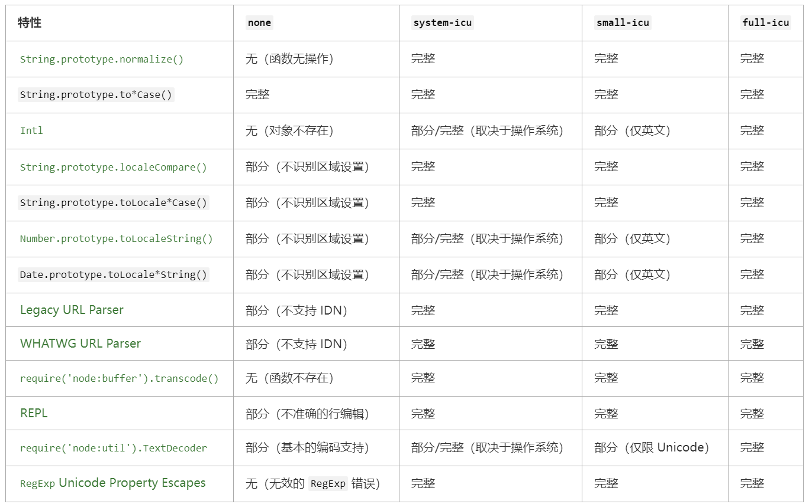

#### Inspector

inspector.console
```
require('node:inspector').console.log('a message');
```
检查器控制台与Node.js控制台没有API平等性。

inspector.url()
- Returns: <string> | <undefined>
返回活动检查器的URL，如果没有则未定义
```
node --inspect -p 'inspector.url()'
Debugger listening on ws://127.0.0.1:9229/967be145-cb64-4ab0-8aa7-c4bc4aab37b9
For help, see: https://nodejs.org/en/docs/inspector
ws://127.0.0.1:9229/967be145-cb64-4ab0-8aa7-c4bc4aab37b9

node --inspect=localhost:3000 -p 'inspector.url()'
Debugger listening on ws://localhost:3000/3bc267b0-4ecd-4106-a1ff-6d2d9fa6fe79
Debugger listening on ws://localhost:3000/3bc267b0-4ecd-4106-a1ff-6d2d9fa6fe79
For help, see: https://nodejs.org/en/docs/inspector
ws://localhost:3000/3bc267b0-4ecd-4106-a1ff-6d2d9fa6fe79

node -p 'inspector.url()'
undefined
```

inspector.waitForDebugger()
阻塞，直到客户端(现有的或以后连接的)发送Runtime.runIfWaitingForDebugger命令。
如果没有活动检查器，则会引发异常。

**Class: inspector.Session**

new inspector.Session()
创建新的inspector.session实例。在将消息分派到检查器后端之前，需要通过session.connect()连接检查器会话。

Event: 'inspectorNotification'
- <Object> 信息对象
v8检查器收到任务通知时执行
```
session.on('inspectorNotification', (message) => console.log(message.method));
// Debugger.paused
// Debugger.resumed
```

Event: <inspector-protocol-method>;
- <Object> 信息对象
当接收到方法字段设置为<inspector-protocol-method>值的检查器通知时触发。
*<inspector-protocol-method>表示某个具体方法，如下添加Debugger.paused监听事件*
```
session.on('Debugger.paused', ({ params }) => {
  console.log(params.hitBreakpoints);
});
// [ '/the/file/that/has/the/breakpoint.js:11:0' ]
```

session.connectToMainThread()
将会话连接到主线程检查器后端。如果没有在Worker线程上调用此API，则会抛出异常。

session.disconnect()
立即关闭会话。所有挂起的消息回调都将被调用并报错。需要调用Session.connect()才能再次发送消息。重新连接的会话将丢失所有检查器状态，例如启用的代理或配置的断点。

session.post(method[, params][, callback])
- method <string>
- params <Object>
- callback <Function>
向检查器后端发布消息。 callback 将在接收到响应时收到通知。 callback 是接受两个可选参数（错误和特定于消息的结果）的函数。
```
session.post('Runtime.evaluate', { expression: '2 + 2' },
             (error, { result }) => console.log(result));
// 输出：{ type: 'number', value: 4, description: '4' }
```

CPU 分析器代码示例
```
const inspector = require('node:inspector');
const fs = require('node:fs');
const session = new inspector.Session();
session.connect();

session.post('Profiler.enable', () => {
  session.post('Profiler.start', () => {
    // 在此处调用测量中的业务逻辑...

    // 一段时间之后...
    session.post('Profiler.stop', (err, { profile }) => {
      // 将分析文件写入磁盘、上传等
      if (!err) {
        fs.writeFileSync('./profile.cpuprofile', JSON.stringify(profile));
      }
    });
  });
});
```
堆分析器代码示例
```
const inspector = require('node:inspector');
const fs = require('node:fs');
const session = new inspector.Session();

const fd = fs.openSync('profile.heapsnapshot', 'w');

session.connect();

session.on('HeapProfiler.addHeapSnapshotChunk', (m) => {
  fs.writeSync(fd, m.params.chunk);
});

session.post('HeapProfiler.takeHeapSnapshot', null, (err, r) => {
  console.log('HeapProfiler.takeHeapSnapshot done:', err, r);
  session.disconnect();
  fs.closeSync(fd);
});
```

#### Internationalization

构建 Node.js 的选项
为了控制在 Node.js 中如何使用 ICU，在编译期间提供了四个 configure 选项。 [BUILDING.md](https://github.com/nodejs/node/blob/HEAD/BUILDING.md) 中记录了有关如何编译 Node.js 的其他详细信息。

--with-intl=none/--without-intl
--with-intl=system-icu
--with-intl=small-icu
--with-intl=full-icu（默认）
每个 configure 选项的可用 Node.js 和 JavaScript 特性概述：

"(不识别区域设置)" 表示该函数执行其操作就像函数的非 Locale 版本一样，如果存在的话。 比如在 none 模式下，Date.prototype.toLocaleString() 的操作和 Date.prototype.toString() 是一样的。

*禁用全部国际化特性（none）*
如果选择此选项，则 ICU 将被禁用，并且上述大多数国际化特性在生成的 node 二进制文件中将不可用。

*使用预装的 ICU 构建（system-icu）*
Node.js 可以链接到系统上已安装的 ICU。 事实上，大多数 Linux 发行版已经安装了 ICU，这个选项可以复用操作系统中其他组件使用的相同数据集。
system-icu 完全支持仅需要 ICU 库本身的功能，例如 String.prototype.normalize() 和 WHATWG 网址解析器。 另外需要 ICU 语言环境数据的特性，例如 Intl.DateTimeFormat 可能完全或部分支持，具体取决于系统上安装的 ICU 数据的完整性。

*嵌入 ICU 数据的有界集（small-icu）*
此选项静态地生成针对 ICU 库的二进制链接，并在 node 可执行文件中包含 ICU 数据的子集（通常只有英文区域设置）。
small-icu 完全支持仅需要 ICU 库本身的功能，例如 String.prototype.normalize() 和 WHATWG 网址解析器。 另外需要 ICU 语言环境数据的特性，比如 Intl.DateTimeFormat，一般只适用于英文语言环境：
```
const january = new Date(9e8);
const english = new Intl.DateTimeFormat('en', { month: 'long' });
const spanish = new Intl.DateTimeFormat('es', { month: 'long' });
console.log(english.format(january));
// 打印 "January"
console.log(spanish.format(january));
// 在 small-icu 上打印 "M01" 或 "January"，具体取决于用户的默认语言环境
// 应该打印 "enero"
```
此模式提供了特性和二进制大小之间的平衡。
如果使用 small-icu 选项，则仍然可以在运行时提供额外的语言环境数据，以便 JS 方法适用于所有 ICU 语言环境。 假设数据文件存储在 /some/directory，它可以通过以下任一方式提供给 ICU：
- NODE_ICU_DATA 环境变量：env NODE_ICU_DATA=/some/directory node
- --icu-data-dir 命令行参数：node --icu-data-dir=/some/directory
（如果两者都指定，则 --icu-data-dir 命令行参数优先。）
ICU 能够自动查找和加载多种数据格式，但数据必须适合 ICU 版本，并且文件命名正确。 数据文件最常见的名称是 icudt6X[bl].dat，其中 6X 表示预期的 ICU 版本，而 b 或 l 表示系统的字节序。 
full-icu npm 模块通过检测运行中的 node 可执行文件的 ICU 版本并下载相应的数据文件，可以大大简化 ICU 数据安装。 通过 npm i full-icu 安装模块后，数据文件将在 ./node_modules/full-icu 可用。 然后可以将此路径传给 NODE_ICU_DATA 或 --icu-data-dir，如上所示以启用完整的 Intl 支持。

*嵌入整个 ICU（full-icu）*
此选项使生成的二进制链接与 ICU 静态地关联并包含全套 ICU 数据。 以这种方式创建的二进制文件没有进一步的外部依赖项并支持所有语言环境，但可能相当大。 如果没有传入 --with-intl 标志，则这是默认行为。 官方的二进制文件也是以这种模式构建的。

**检测国际化支持**
要验证是否启用了 ICU（system-icu、small-icu 或 full-icu），只需检查 Intl 是否存在就足够了：
```
const hasICU = typeof Intl === 'object';
```
或者，检查 process.versions.icu，一个仅在启用 ICU 时定义的属性，也可以工作：
```
const hasICU = typeof process.versions.icu === 'string';
```
要检查对非英语语言环境（即 full-icu 或 system-icu）的支持，Intl.DateTimeFormat 可能是一个很好的区分因素：
```
const hasFullICU = (() => {
  try {
    const january = new Date(9e8);
    const spanish = new Intl.DateTimeFormat('es', { month: 'long' });
    return spanish.format(january) === 'enero';
  } catch (err) {
    return false;
  }
})();
```
有关 Intl 支持的更详细的测试，以下资源可能会有所帮助：
- [btest402](https://github.com/srl295/btest402): 一般用于检查是否正确地构建了支持 Intl 的 Node.js。
- [Test262](https://github.com/tc39/test262/tree/HEAD/test/intl402): ECMAScript 的官方一致性测试套件包括一个专门针对 ECMA-402 的部分。

#### module

**Module 对象**

module.builtinModules
- <string[]>
Node.js 提供的所有模块的名称列表。 可用于验证模块是否由第三方维护。

module.createRequire(filename)
- filename <string> | <URL> 用于构造 require 函数的文件名。 必须是文件网址对象、文件网址字符串、或绝对路径字符串。
- 返回: <require> require 函数
```
import { createRequire } from 'node:module';
const require = createRequire(import.meta.url);

// sibling-module.js 是 CommonJS 模块。
const siblingModule = require('./sibling-module');
```

module.isBuiltin(moduleName)
- moduleName <string> 模块名称
返回: <boolean> 如果模块是内置的，则返回 true，否则返回 false

module.syncBuiltinESMExports()
module.syncBuiltinESMExports() 方法更新内置的 ES 模块的所有实时绑定，以匹配 CommonJS 导出的属性。 它不会在 ES 模块中添加或删除导出的名称。
```
const fs = require('node:fs');
const assert = require('node:assert');
const { syncBuiltinESMExports } = require('node:module');

fs.readFile = newAPI;

delete fs.readFileSync;

function newAPI() {
  // ...
}

fs.newAPI = newAPI;

syncBuiltinESMExports();

import('node:fs').then((esmFS) => {
  // 它将现有的 readFile 属性与新值同步
  assert.strictEqual(esmFS.readFile, newAPI);
  // readFileSync 已从所需的 fs 中删除
  assert.strictEqual('readFileSync' in fs, false);
  // syncBuiltinESMExports() 不会从 esmFS 中删除 readFileSync
  assert.strictEqual('readFileSync' in esmFS, true);
  // syncBuiltinESMExports() 不添加名称
  assert.strictEqual(esmFS.newAPI, undefined);
});
```

**Source Map V3 的支持**
与源映射缓存交互的助手。 当启用源映射解析并且在模块的页脚中找到源映射包含指令时，则会填充此缓存。
要启用源映射解析，则 Node.js 必须使用标志 --enable-source-maps 运行、或者通过设置 NODE_V8_COVERAGE=dir 启用代码覆盖率。

module.findSourceMap(path)
- path <string>
- 返回: <module.SourceMap>
path 是文件的解析路径，应为其获取相应的源映射。

**module.SourceMap 类**

new SourceMap(payload)
- payload <Object>
创建新的 sourceMap 实例。
payload 是键匹配 Source map v3 格式的对象：
- file: <string>
- version: <number>
- sources: <string[]>
- sourcesContent: <string[]>
- names: <string[]>
- mappings: <string>
- sourceRoot: <string>

sourceMap.payload
- 返回: <Object>
用于构造 SourceMap 实例的有效负载的获取器。

sourceMap.findEntry(lineNumber, columnNumber)
- lineNumber <number>
- columnNumber <number>
- 返回: <Object>
给定生成的源文件中的行号和列号，返回表示原始文件中位置的对象。 返回的对象包含以下键：
- generatedLine: <number>
- generatedColumn: <number>
- originalSource: <string>
- originalLine: <number>
- originalColumn: <number>
- name: <string>

