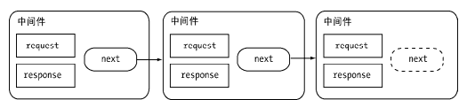

#### 为什么要异步 I/O 
- 用户体验
  - 
- 资源分配
  - 

*异步I/O与非阻塞I/O*
操作系统内核对于I/O只有两种方式：阻塞与非阻塞。在调用阻塞I/O时，应用程序需要等待I/O完成才返回结果

阻塞I/O的一个特点是调用之后一定要等到系统内核层面完成所有操作后，调用才结束。以读取磁盘上的一段文件为例，系统内核在完成磁盘寻道、读取数据、复制数据到内存中之后，这个调用才结束。

阻塞I/O造成CPU等待I/O，浪费等待时间，CPU的处理能力不能得到充分利用。为了提高性能，内核提供了非阻塞I/O。非阻塞I/O跟阻塞I/O的差别为调用之后会立即返回


*操作系统对计算机进行了抽象，将所有输入输出设备抽象为文件。内核在进行文件I/O操作时，通过文件描述符进行管理，而文件描述符类似于应用程序与系统内核之间的凭证。应用程序如果需要进行I/O调用，需要先打开文件描述符，然后再根据文件描述符去实现文件的数据读写。此处非阻塞I/O与阻塞I/O的区别在于阻塞I/O完成整个获取数据的过程，而非阻塞I/O则不带数据直接返回，要获取数据，还需要通过文件描述符再次读取*

阻塞I/O造成CPU等待浪费，非阻塞带来的麻烦却是需要轮询去确认是否完全完成数据获取，它会让CPU处理状态判断，是对CPU资源的浪费
现存的轮询技术主要有以下这些：
- read。它是最原始、性能最低的一种，通过重复调用来检查I/O的状态来完成完整数据的读取。在得到最终数据前，CPU一直耗用在等待上。

- select。它是在read的基础上改进的一种方案，通过对文件描述符上的事件状态来进行判断

*select轮询具有一个较弱的限制，那就是由于它采用一个1024长度的数组来存储状态，所以它最多可以同时检查1024个文件描述符*
- poll。该方案较select有所改进，采用链表的方式避免数组长度的限制，其次它能避免不需要的检查。但是当文件描述符较多的时候，它的性能还是十分低下的。

- epoll。该方案是Linux下效率最高的I/O事件通知机制，在进入轮询的时候如果没有检查到I/O事件，将会进行休眠，直到事件发生将它唤醒。它是真实利用了事件通知、执行回调的方式，而不是遍历查询，所以不会浪费CPU，执行效率较高

- kqueue。该方案的实现方式与epoll类似，不过它仅在FreeBSD系统下存在

###### Node 的异步 I/O
1. 事件循环
   进程启动时，Node便会创建一个类似于while(true)的循环，每执行一次循环体的过程我们称为Tick。每个Tick的过程就是查看是否有事件待处理，如果有，就取出事件及其相关的回调函数。如果存在关联的回调函数，就执行它们。然后进入下个循环，如果不再有事件处理，就退出进程
2. 观察者
   每个事件循环中有一个或者多个观察者，而判断是否有事件要处理的过程就是向这些观察者询问是否有要处理的事件
3. 请求对象
   请求对象是异步I/O过程中的重要中间产物，所有的状态都保存在这个对象中，包括送入线程池等待执行以及I/O操作完毕后的回调处理


*事件循环、观察者、请求对象、I/O线程池这四者共同构成了Node异步I/O模型的基本要素。*
Windows下主要通过IOCP来向系统内核发送I/O调用和从内核获取已完成的I/O操作，配以事
件循环，以此完成异步I/O的过程。
Linux下通过epoll实现这个过程
FreeBSD下通过kqueue实现
Solaris下通过Event ports实现

不同的是线程池在Windows下由内核（IOCP）直接提供，*nix系列下由libuv自行实现

###### 非 I/O 的异步 API 
- 定时器
调用setTimeout()或者setInterval()创建的定时器会被插入到定时器观察者内部的一个红黑树中。每次Tick执行时，会从该红黑树中迭代取出定时器对象，检查是否超过定时时间，如果超过，就形成一个事件，它的回调函数将立即执行。

定时器的问题在于，它并非精确的（在容忍范围内）。尽管事件循环十分快，但是如果某一次循环占用的时间较多，那么下次循环时，它也许已经超时很久了。譬如通过setTimeout()设定一个任务在10毫秒后执行，但是在9毫秒后，有一个任务占用了5毫秒的CPU时间片，再次轮到定时器执行时，时间就已经过期4毫秒


- process.nextTick()
```javascript
process.nextTick = function(callback) { 
 // on the way out, don't bother. 
 // it won't get fired anyway 
 if (process._exiting) return; 
 if (tickDepth >= process.maxTickDepth) 
 maxTickWarn(); 
 var tock = { callback: callback }; 
 if (process.domain) tock.domain = process.domain; 
 nextTickQueue.push(tock); 
 if (nextTickQueue.length) { 
 process._needTickCallback(); 
 } 
}; 
```
每次调用process.nextTick()方法，只会将回调函数放入队列中，在下一轮Tick时取出执行。定时器中采用红黑树的操作时间复杂度为O(lg(n))，nextTick()的时间复杂度为O(1)。相较之下，process.nextTick()更高效
- setImmediate()
process.nextTick()中的回调函数执行的优先级要高于setImmediate()。这里的原因在于事件循环对观察者的检查是有先后顺序的，process.nextTick()属于idle观察者，setImmediate()属于check观察者。在每一个轮循环检查中，idle观察者先于I/O观察者，I/O观察者先于check观察者。

process.nextTick()的回调函数保存在一个数组中，setImmediate()的结果则是保存在链表中。在行为上，process.nextTick()在每轮循环中会将数组中的回调函数全部执行完，而setImmediate()在每轮循环中执行链表中的一个回调函数。
```javascript
// 加入两个nextTick()的回调函数
process.nextTick(function () { 
 console.log('nextTick延迟执行1'); 
}); 
process.nextTick(function () { 
 console.log('nextTick延迟执行2'); 
}); 
// 加入两个setImmediate()的回调函数
setImmediate(function () { 
 console.log('setImmediate延迟执行1'); 
 // 进入下次循环
 process.nextTick(function () { 
 console.log('强势插入'); 
 }); 
}); 
setImmediate(function () { 
 console.log('setImmediate延迟执行2'); 
}); 
console.log('正常执行'); 
// 其执行结果如下：
// 正常执行
// nextTick延迟执行1 
// nextTick延迟执行2 
// setImmediate延迟执行1 
// 强势插入
// setImmediate延迟执行2 
```

#### 异步编程

- 高阶函数:高阶函数则是可以把函数作为参数，或是将函数作为返回值的函数
- 偏函数用法: 偏函数用法是指创建一个调用另外一个部分——参数或变量已经预置的函数——的函数的用法。

###### 异步编程的优势与难点
- 优势
非阻塞I/O可以使CPU与I/O并不相互依赖等待，让资源得到更好的利用。
对于网络应用而言，并行带来的想象空间更大，延展而开的是分布式和云
- 难点
  - 异常处理
  - 函数嵌套过深
  - 阻塞代码
  - 多线程编程
  - 异步转同步

###### 异步编程解决方案
- 事件发布/订阅模式。
  - Node自身提供的events模块（http://nodejs.org/docs/latest/api/events.html）是发布/订阅模式的一个简单实现，Node中部分模块都继承自它，这个模块比前端浏览器中的大量DOM事件简单，不存在事件冒泡，也不存在preventDefault()、stopPropagation()和stopImmediatePropagation()等控制事件传递的方法。它具有 addListener/on() 、 once() 、 removeListener() 、removeAllListeners()和emit()等基本的事件监听模式的方法实现
  - 如果对一个事件添加了超过10个侦听器，将会得到一条警告。这一处设计与Node自身单线程运行有关，设计者认为侦听器太多可能导致内存泄漏，所以存在这样一条警告。调用emitter.setMaxListeners(0)；可以将这个限制去掉。另一方面，由于事件发布会引起一系列侦听器执行，如果事件相关的侦听器过多，可能存在过多占用CPU的情景。 为了处理异常，EventEmitter对象对error事件进行了特殊对待。如果运行期间的错误触发了error事件，EventEmitter会检查是否有对error事件添加过侦听器。如果添加了，这个错误将会交由该侦听器处理，否则这个错误将会作为异常抛出。如果外部没有捕获这个异常，将会引起线程退出。一个健壮的EventEmitter实例应该对error事件做处理
  - 继承events模块
  - 利用事件队列解决雪崩问题
  - 多异步之间的协作方案
```javascript
var count = 0; 
var results = {}; 
var done = function (key, value) { 
 results[key] = value; 
 count++; 
 if (count === 3) { 
 // 渲染页面
 render(results); 
 } 
}; 
fs.readFile(template_path, "utf8", function (err, template) { 
 done("template", template); 
}); 
db.query(sql, function (err, data) { 
 done("data", data); 
}); 
l10n.get(function (err, resources) { 
 done("resources", resources); 
});
```
   - EventProxy的原理
```javascript
// Trigger an event, firing all bound callbacks. Callbacks are passed the 
// same arguments as `trigger` is, apart from the event name. 
// Listening for `"all"` passes the true event name as the first argument 
trigger : function(eventName) { 
 var list, calls, ev, callback, args; 
 var both = 2; 
 if (!(calls = this._callbacks)) return this;
 while (both--) { 
 ev = both ? eventName : 'all'; 
 if (list = calls[ev]) { 
 for (var i = 0, l = list.length; i < l; i++) { 
 if (!(callback = list[i])) { 
 list.splice(i, 1); i--; l--; 
 } else { 
 args = both ? Array.prototype.slice.call(arguments, 1) : arguments; 
 callback[0].apply(callback[1] || this, args); 
 } 
 } 
 } 
 } 
 return this; 
}
```
   - EventProxy的异常处理
- Promise/Deferred模式。
  -  Promises/A 
     -  Promise/Deferred模式其实包含两部分，即Promise和Deferred。这里暂且不提两者的区别是什么，先看看Promises/A的行为吧。Promises/A提议对单个异步操作做出了这样的抽象定义，具体如下所示。
        - Promise操作只会处在3种状态的一种：未完成态、完成态和失败态。
        - Promise的状态只会出现从未完成态向完成态或失败态转化，不能逆反。完成态和失败态不能互相转化。
        - Promise的状态一旦转化，将不能被更改
      - 在API的定义上，Promises/A提议是比较简单的。一个Promise对象只要具备then()方法即可。但是对于then()方法，有以下简单的要求。
        - 接受完成态、错误态的回调方法。在操作完成或出现错误时，将会调用对应方法
        - 可选地支持progress事件回调作为第三个方法。
        - then()方法只接受function对象，其余对象将被忽略。
        - then()方法继续返回Promise对象，以实现链式调用
        - 
  - Promise中的多异步协作
```javascript
Deferred.prototype.all = function (promises) { 
var count = promises.length; 
 var that = this; 
 var results = []; 
 promises.forEach(function (promise, i) { 
 promise.then(function (data) { 
 count--; 
 results[i] = data; 
 if (count === 0) { 
 that.resolve(results); 
 } 
 }, function (err) { 
 that.reject(err); 
 }); 
 }); 
 return this.promise; 
}; 
```
        - 支持序列执行的Promise
```javascript
promise() 
 .then(obj.api1) 
 .then(obj.api2) 
 .then(obj.api3) 
 .then(obj.api4) 
 .then(function (value4) { 
 // Do something with value4 
 }, function (error) { 
 // Handle any error from step1 through step4 
 }) 
 .done(); 
尝试改造一下代码以实现链式调用，具体如下所示：
var Deferred = function () { 
 this.promise = new Promise(); 
}; 
// 完成态
Deferred.prototype.resolve = function (obj) { 
 var promise = this.promise; 
 var handler; 
 while ((handler = promise.queue.shift())) { 
 if (handler && handler.fulfilled) { 
 var ret = handler.fulfilled(obj); 
 if (ret && ret.isPromise) { 
 ret.queue = promise.queue; 
 this.promise = ret; 
 return; 
 } 
 } 
 } 
}; 
// 失败态
Deferred.prototype.reject = function (err) { 
 var promise = this.promise; 
 var handler; 
 while ((handler = promise.queue.shift())) { 
 if (handler && handler.error) { 
 var ret = handler.error(err); 
 if (ret && ret.isPromise) { 
 ret.queue = promise.queue; 
 this.promise = ret;
 return; 
 } 
 } 
 } 
}; 
// 生成回调函数
Deferred.prototype.callback = function () { 
 var that = this; 
 return function (err, file) { 
 if (err) { 
 return that.reject(err); 
 } 
 that.resolve(file); 
 }; 
}; 
var Promise = function () { 
 // 队列用于存储待执行的回调函数
 this.queue = []; 
 this.isPromise = true; 
}; 
Promise.prototype.then = function (fulfilledHandler, errorHandler, progressHandler) { 
 var handler = {}; 
 if (typeof fulfilledHandler === 'function') { 
 handler.fulfilled = fulfilledHandler; 
 } 
 if (typeof errorHandler === 'function') { 
 handler.error = errorHandler; 
 } 
 this.queue.push(handler); 
 return this; 
};
```
        - 将API Promise化
- 流程控制库
  - 尾触发与Next
    - 需要手工调用才能持续执行后续调用的，我们将此类方法叫做尾触发，常见的关键词是next。事实上，尾触发目前应用最多的地方是Connect的中间件
    - 
    - 尽管中间件这种尾触发模式并不要求每个中间方法都是异步的，但是如果每个步骤都采用异步来完成，实际上只是串行化的处理，没办法通过并行的异步调用来提升业务的处理效率。流式处理可以将一些串行的逻辑扁平化，但是并行逻辑处理还是需要搭配事件或者Promise完成的，这样业务在纵向和横向都能够各自清晰
  - async
    - 异步的串行执行
```javascript
async.series([ 
 function (callback) { 
 fs.readFile('file1.txt', 'utf-8', callback); 
 }, 
 function (callback) { 
 fs.readFile('file2.txt', 'utf-8', callback); 
 } 
], function (err, results) { 
 // results => [file1.txt, file2.txt] 
}); 
这段代码等价于：
fs.readFile('file1.txt', 'utf-8', function (err, content) { 
 if (err) { 
 return callback(err); 
 } 
 fs.readFile('file2.txt ', 'utf-8', function (err, data) { 
 if (err) { 
 return callback(err); 
 } 
 callback(null, [content, data]); 
 }); 
}); 

```
    - 异步的并行执行
```javascript
async.parallel([ 
 function (callback) { 
 fs.readFile('file1.txt', 'utf-8', callback); 
 }, 
 function (callback) { 
 fs.readFile('file2.txt', 'utf-8', callback); 
 } 
], function (err, results) { 
 // results => [file1.txt, file2.txt] 
}); 
```
    - 异步调用的依赖处理
      - series()适合无依赖的异步串行执行，但当前一个的结果是后一个调用的输入时，series()方法就无法满足需求了。所幸，这种典型场景的需求，async提供了waterfall()方法来满足
```javascript
async.waterfall([ 
 function (callback) { 
 fs.readFile('file1.txt', 'utf-8', function (err, content) { 
 callback(err, content); 
 }); 
 }, 
 function (arg1, callback) { 
 // arg1 => file2.txt 
 fs.readFile(arg1, 'utf-8', function (err, content) { 
 callback(err, content); 
 }); 
 }, 
 function(arg1, callback){ 
 // arg1 => file3.txt 
 fs.readFile(arg1, 'utf-8', function (err, content) { 
 callback(err, content); 
 }); 
 } 
], function (err, result) { 
 // result => file4.txt 
});
```
    - 自动依赖处理
      - async提供了一个强大的方法auto()实现复杂业务处理。
  - Step
```javascript
Step( 
 function readFile1() { 
 fs.readFile('file1.txt', 'utf-8', this); 
 }, 
 function readFile2(err, content) { 
 fs.readFile('file2.txt', 'utf-8', this); 
 }, 
 function done(err, content) { 
 console.log(content); 
 } 
);
```
    - Step用到了this关键字。事实上，它是Step内部的一个next()方法，将异步调用的结果传递给下一个任务作为参数，并调用执行。
    - 并行任务执行
      - this具有一个parallel()方法，它告诉Step，需要等所有任务完成时才进行下一个任务
      - 使用parallel()的时候需要小心的是，如果异步方法的结果传回的是多个参数，Step将只会取前两个参数
    - 结果分组: group()
  - wind
    - 异步任务定义
    - $await()与任务模型
    - 异步方法转换辅助函数
      - Wind.Async.Binding.fromCallback
      - Wind.Async.Binding.fromStandard

###### 异步并发控制
- bagpipe的解决方案
  - 通过一个队列来控制并发量。
  - 如果当前活跃（指调用发起但未执行回调）的异步调用量小于限定值，从队列中取出执行。
  - 如果活跃调用达到限定值，调用暂时存放在队列中。
  - 每个异步调用结束时，从队列中取出新的异步调用执行。
```javascript
var Bagpipe = require('bagpipe'); 
// 设定最大并发数为10
var bagpipe = new Bagpipe(10); 
for (var i = 0; i < 100; i++) { 
 bagpipe.push(async, function () { 
 // 异步回调执行
 }); 
} 
bagpipe.on('full', function (length) { 
 console.warn('底层系统处理不能及时完成，队列拥堵，目前队列长度为:' + length); 
}); 
```
      - 拒绝模式
      - 超时控制

   - async的解决方案：async也提供了一个方法用于处理异步调用的限制：parallelLimit()
     - parallelLimit()与parallel()类似，但多了一个用于限制并发数量的参数，使得任务只能同时并发一定数量，而不是无限制并发。
     - parallelLimit()方法的缺陷在于无法动态地增加并行任务。为此，async提供了queue()方法来满足该需求，这对于遍历文件目录等操作十分有效