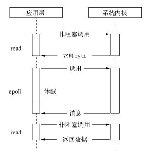
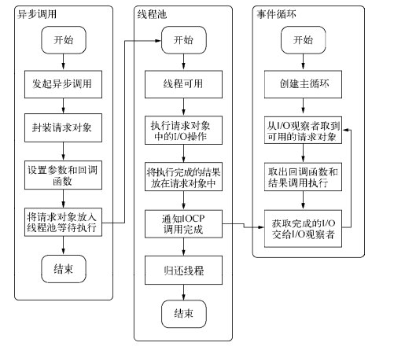

#### 为什么要异步 I/O 
- 用户体验
  - 
- 资源分配
  - 

*异步I/O与非阻塞I/O*
操作系统内核对于I/O只有两种方式：阻塞与非阻塞。在调用阻塞I/O时，应用程序需要等待I/O完成才返回结果

阻塞I/O的一个特点是调用之后一定要等到系统内核层面完成所有操作后，调用才结束。以读取磁盘上的一段文件为例，系统内核在完成磁盘寻道、读取数据、复制数据到内存中之后，这个调用才结束。

阻塞I/O造成CPU等待I/O，浪费等待时间，CPU的处理能力不能得到充分利用。为了提高性能，内核提供了非阻塞I/O。非阻塞I/O跟阻塞I/O的差别为调用之后会立即返回

*操作系统对计算机进行了抽象，将所有输入输出设备抽象为文件。内核在进行文件I/O操作时，通过文件描述符进行管理，而文件描述符类似于应用程序与系统内核之间的凭证。应用程序如果需要进行I/O调用，需要先打开文件描述符，然后再根据文件描述符去实现文件的数据读写。此处非阻塞I/O与阻塞I/O的区别在于阻塞I/O完成整个获取数据的过程，而非阻塞I/O则不带数据直接返回，要获取数据，还需要通过文件描述符再次读取*

阻塞I/O造成CPU等待浪费，非阻塞带来的麻烦却是需要轮询去确认是否完全完成数据获取，它会让CPU处理状态判断，是对CPU资源的浪费
现存的轮询技术主要有以下这些：
- read。它是最原始、性能最低的一种，通过重复调用来检查I/O的状态来完成完整数据的读取。在得到最终数据前，CPU一直耗用在等待上。

- select。它是在read的基础上改进的一种方案，通过对文件描述符上的事件状态来进行判断

*select轮询具有一个较弱的限制，那就是由于它采用一个1024长度的数组来存储状态，所以它最多可以同时检查1024个文件描述符*
- poll。该方案较select有所改进，采用链表的方式避免数组长度的限制，其次它能避免不需要的检查。但是当文件描述符较多的时候，它的性能还是十分低下的。

- epoll。该方案是Linux下效率最高的I/O事件通知机制，在进入轮询的时候如果没有检查到I/O事件，将会进行休眠，直到事件发生将它唤醒。它是真实利用了事件通知、执行回调的方式，而不是遍历查询，所以不会浪费CPU，执行效率较高

- kqueue。该方案的实现方式与epoll类似，不过它仅在FreeBSD系统下存在

###### Node 的异步 I/O
1. 事件循环
   进程启动时，Node便会创建一个类似于while(true)的循环，每执行一次循环体的过程我们称为Tick。每个Tick的过程就是查看是否有事件待处理，如果有，就取出事件及其相关的回调函数。如果存在关联的回调函数，就执行它们。然后进入下个循环，如果不再有事件处理，就退出进程
2. 观察者
   每个事件循环中有一个或者多个观察者，而判断是否有事件要处理的过程就是向这些观察者询问是否有要处理的事件
3. 请求对象
   请求对象是异步I/O过程中的重要中间产物，所有的状态都保存在这个对象中，包括送入线程池等待执行以及I/O操作完毕后的回调处理

*事件循环、观察者、请求对象、I/O线程池这四者共同构成了Node异步I/O模型的基本要素。*
Windows下主要通过IOCP来向系统内核发送I/O调用和从内核获取已完成的I/O操作，配以事
件循环，以此完成异步I/O的过程。
Linux下通过epoll实现这个过程
FreeBSD下通过kqueue实现
Solaris下通过Event ports实现

不同的是线程池在Windows下由内核（IOCP）直接提供，*nix系列下由libuv自行实现

###### 非 I/O 的异步 API 
