#### 内存控制
- V8 的对象分配
  - 在V8中，所有的JavaScript对象都是通过堆来进行分配的。
  - V8为何要限制堆的大小，表层原因为V8最初为浏览器而设计，不太可能遇到用大量内存的场景。对于网页来说，V8的限制值已经绰绰有余。深层原因是V8的垃圾回收机制的限制
  - Node在启动时可以传递--max-old-space-size或--max-new-space-size来调整内存限制的大小

- V8 的垃圾回收机制
  - V8主要的垃圾回收算法
    - V8的垃圾回收策略主要基于分代式垃圾回收机制。
    - V8的内存分代在V8中，主要将内存分为新生代和老生代两代。新生代中的对象为存活时间较短的对象，老生代中的对象为存活时间较长或常驻内存的对象
    - V8堆的整体大小就是新生代所用内存空间加上老生代的内存空间。前面提及的--max-old-space-size命令行参数可以用于设置老生代内存空间的最大值，-max-new-space-size命令行参数则用于设置新生代内存空间的大小的。比较遗憾的是，这两个最大值需要在启动时就指定。这意味着V8使用的内存没有办法根据使用情况自动扩充，当内存分配过程中超过极限值时，就会引起进程出错
    - 在默认设置下，如果一直分配内存，在64位系统和32位系统下会分别只能使用约1.4 GB和约0.7 GB的大小
    - 新生代内存的最大值在64位系统和32位系统上分别为32 MB和16 MB
  - Scavenge算法
    - 在分代的基础上，新生代中的对象主要通过Scavenge算法进行垃圾回收。在Scavenge的具体实现中，主要采用了Cheney算法
    - Cheney算法是一种采用复制的方式实现的垃圾回收算法。它将堆内存一分为二，每一部分空间称为semispace。在这两个semispace空间中，只有一个处于使用中，另一个处于闲置状态。处于使用状态的semispace空间称为From空间，处于闲置状态的空间称为To空间。当我们分配对象时，先是在From空间中进行分配。当开始进行垃圾回收时，会检查From空间中的存活对象，这些存活对象将被复制到To空间中，而非存活对象占用的空间将会被释放。完成复制后，From空间和To空间的角色发生对换。简而言之，在垃圾回收的过程中，就是通过将存活对象在两个semispace空间之间进行复制。
    - 在单纯的Scavenge过程中，From空间中的存活对象会被复制到To空间中去，然后对From空间和To空间进行角色对换（又称翻转）。但在分代式垃圾回收的前提下，From空间中的存活对象在复制到To空间之前需要进行检查。在一定条件下，需要将存活周期长的对象移动到老生代中，也就是完成对象晋升。对象晋升的条件主要有两个，一个是对象是否经历过Scavenge回收，一个是To空间的内存占用比超过限制。
    - 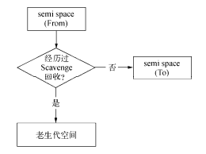
    - 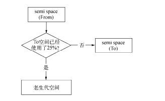
  - Mark-Sweep & Mark-Compact
    - V8在老生代中主要采用了Mark-Sweep和Mark-Compact相结合的方式进行垃圾回收。Mark-Sweep是标记清除的意思，它分为标记和清除两个阶段。与Scavenge相比，Mark-Sweep并不将内存空间划分为两半，所以不存在浪费一半空间的行为。与Scavenge复制活着的对象不同，Mark-Sweep在标记阶段遍历堆中的所有对象，并标记活着的对象，在随后的清除阶段中，只清除没有被标记的对象
    - Mark-Sweep最大的问题是在进行一次标记清除回收后，内存空间会出现不连续的状态
    - Mark-Compact被提出来。Mark-Compact是标记整理的意思，是在Mark-Sweep的基础上演变而来的。它们的差别在于对象在标记为死亡后，在整理的过程中，将活着的对象往一端移动，移动完成后，直接清理掉边界外的内存
    - 
    - 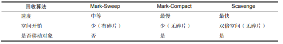
    - V8主要使用Mark-Sweep，在空间不足以对从新生代中晋升过来的对象进行分配时才使用Mark-Compact
  - Incremental Marking
    - 垃圾回收的3种基本算法都需要将应用逻辑暂停下来，待执行完垃圾回收后再恢复执行应用逻辑，这种行为被称为“全停顿”（stop-the-world）。在V8的分代式垃圾回收中，一次小垃圾回收只收集新生代，由于新生代默认配置得较小，且其中存活对象通常较少，所以即便它是全停顿的影响也不大。但V8的老生代通常配置得较大，且存活对象较多，全堆垃圾回收（full 垃圾回收）的标记、清理、整理等动作造成的停顿就会比较可怕，需要设法改善。
    - 为了降低全堆垃圾回收带来的停顿时间，V8先从标记阶段入手，将原本要一口气停顿完成的动作改为增量标记（incremental marking），也就是拆分为许多小“步进”，每做完一“步进”就让JavaScript应用逻辑执行一小会儿，垃圾回收与应用逻辑交替执行直到标记阶段完成
    - 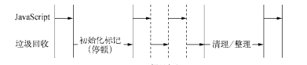
  - 查看垃圾回收日志
    - 查看垃圾回收日志的方式主要是在启动时添加--trace_gc参数
    - 通过在Node启动时使用--prof参数，可以得到V8执行时的性能分析数据，其中包含了垃圾回收执行时占用的时间
###### 高效使用内存
- 作用域
  - 标识符查找
  - 作用域链
  - 变量的主动释放
- 闭包
  - 实现外部作用域访问内部作用域中变量的方法叫做闭包（closure）
- 内存指标: process.memoryUsage()可以查看内存使用情况。除此之外，os模块中的totalmem()和freemem()方法也可以查看内存使用情况
  - 查看内存使用情况
    - 查看进程的内存占用
```javascript
$ node 
> process.memoryUsage() 
{ rss: 13852672, 
 heapTotal: 6131200, 
 heapUsed: 2757120 } 
```
    - rss是resident set size的缩写，即进程的常驻内存部分。进程的内存总共有几部分，一部分是rss，其余部分在交换区（swap）或者文件系统（filesystem）中。除了rss外，heapTotal和heapUsed对应的是V8的堆内存信息。heapTotal是堆中总共申请的内存量，heapUsed表示目前堆中使用中的内存量。这3个值的单位都是字节
  - 2. 查看系统的内存占用
    - 与process.memoryUsage()不同的是，os模块中的totalmem()和freemem()这两个方法用于查看操作系统的内存使用情况，它们分别返回系统的总内存和闲置内存，以字节为单位

- 堆外内存: 将那些不是通过V8分配的内存称为堆外内存
  - Buffer对象并非通过V8分配
```
var useMem = function () { 
 var size = 200 * 1024 * 1024; 
 var buffer = new Buffer(size); 
 for (var i = 0; i < size; i++) { 
 buffer[i] = 0; 
 } 
 return buffer; 
}; 
```
###### 内存泄漏
Node对内存泄漏十分敏感，一旦线上应用有成千上万的流量，那怕是一个字节的内存泄漏也会造成堆积，垃圾回收过程中将会耗费更多时间进行对象扫描，应用响应缓慢，直到进程内存溢出，应用崩溃

造成内存泄漏的原因
  - 缓存。
    - 在Node中，缓存并非物美价廉。一旦一个对象被当做缓存来使用，那就意味着它将会常驻在老生代中。缓存中存储的键越多，长期存活的对象也就越多，这将导致垃圾回收在进行扫描和整理时，对这些对象做无用功
    - 用对象的键值对来缓存东西，与严格意义上的缓存有着区别，严格意义的缓存有着完善的过期策略，而普通对象的键值对并没有
  - 解决手段：限定缓存对象的大小，加上完善的过期策略以防止内存无限制增长
    - 缓存限制策略
      - 记录键在数组中，一旦超过数量，就以先进先出的方式进行淘汰
      - LRU算法的缓存，地址为https://github.com/isaacs/node-lru-cache
    - 缓存的解决方案
      - 采用进程外的缓存，进程自身不存储状态
        - (1) 将缓存转移到外部，减少常驻内存的对象的数量，让垃圾回收更高效。
        - (2) 进程之间可以共享缓存
        - Redis：https://github.com/mranney/node_redis。
        - Memcached：https://github.com/3rd-Eden/node-memcached。
  - 队列消费不及时。
    - 监控队列的长度，一旦堆积，应当通过监控系统产生报警并通知相关人员。
    - 任意异步调用都应该包含超时机制，一旦在限定的时间内未完成响应，通过回调函数传递超时异常，使得任意异步调用的回调都具备可控的响应时间，给消费速度一个下限值
  - 作用域未释放

###### 内存泄漏排查
常见工具：
- v8-profiler
- node-heapdump
```
var leakArray = []; 
var leak = function () { 
 leakArray.push("leak" + Math.random()); 
}; 
http.createServer(function (req, res) { 
 leak(); 
 res.writeHead(200, {'Content-Type': 'text/plain'}); 
 res.end('Hello World\n'); 
}).listen(1337); 
console.log('Server running at http://127.0.0.1:1337/'); 
```
- node-mtrace
- dtrace
- node-memwatch
```
var memwatch = require('memwatch'); 
memwatch.on('leak', function (info) { 
 console.log('leak:'); 
 console.log(info); 
}); 
memwatch.on('stats', function (stats) { 
 console.log('stats:') 
 console.log(stats); 
}); 
var http = require('http'); 
var leakArray = []; 
var leak = function () { 
 leakArray.push("leak" + Math.random()); 
}; 
http.createServer(function (req, res) { 
 leak(); 
 res.writeHead(200, {'Content-Type': 'text/plain'}); 
 res.end('Hello World\n'); 
}).listen(1337); 
console.log('Server running at http://127.0.0.1:1337/'); 
```
  - stats事件
    - 每次进行全堆垃圾回收时，将会触发一次stats事件
```
stats: 
{ num_full_gc: 4, // 第几次全堆垃圾回收
 num_inc_gc: 23, // 第几次增量垃圾回收
 heap_compactions: 4, // 第几次对老生代进行整理
 usage_trend: 0, // 使用趋势
 estimated_base: 7152944, // 预估基数
 current_base: 7152944, // 当前基数
 min: 6720776, // 最小
 max: 7152944 } // 最大
在这些数据中，num_full_gc和num_inc_gc比较直观地反应了垃圾回收的情况
```
  - leak事件
    - 如果经过连续5次垃圾回收后，内存仍然没有被释放，这意味着有内存泄漏的产生，node-memwatch会出发一个leak事件
  - 堆内存比较
```
var memwatch = require('memwatch'); 
var leakArray = []; 
var leak = function () { 
 leakArray.push("leak" + Math.random()); 
}; 
// Take first snapshot 
var hd = new memwatch.HeapDiff(); 
for (var i = 0; i < 10000; i++) { 
 leak(); 
} 
// Take the second snapshot and compute the diff 
var diff = hd.end(); 
console.log(JSON.stringify(diff, null, 2));
```

###### 大内存应用
stream模块用于处理大文件。stream模块是Node的原生模块，直接引用即可。stream继承自EventEmitter，具备基本的自定义事件功能，同时抽象出标准的事件和方法。它分可读和可写两种

由于V8的内存限制，我们无法通过fs.readFile()和fs.writeFile()直接进行大文件的操作，而改用fs.createReadStream()和fs.createWriteStream()方法通过流的方式实现对大文件的操作
```
var reader = fs.createReadStream('in.txt'); 
var writer = fs.createWriteStream('out.txt'); 
reader.pipe(writer); 
```

#### 理解Buffer
Buffer是一个像Array的对象，但它主要用于操作字节

- 模块结构
  - Buffer是一个典型的JavaScript与C++结合的模块，它将性能相关部分用C++实现，将非性能相关的部分用JavaScript实现
  - 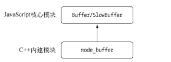
  - 由于Buffer太过常见，Node在进程启动时就已经加载了它，并将其放在全局对象（global）上。所以在使用Buffer时，无须通过require()即可直接使用
- Buffer对象
  - Buffer对象类似于数组，它的元素为16进制的两位数，即0到255的数值
  - 给元素的赋值如果小于0，就将该值逐次加256，直到得到一个0到255之间的整数。如果得到的数值大于255，就逐次减256，直到得到0~255区间内的数值。如果是小数，舍弃小数部分，只保留整数部分
```
buf[20] = -100; 
console.log(buf[20]); // 156 
buf[21] = 300; 
console.log(buf[21]); // 44 
buf[22] = 3.1415; 
console.log(buf[22]); // 3 
```
- Buffer内存分配
  - Buffer对象的内存分配不是在V8的堆内存中，而是在Node的C++层面实现内存的申请的
  - 此Node在内存的使用上应用的是在C++层面申请内存、在JavaScript中分配内存的策略
  - 为了高效地使用申请来的内存，Node采用了slab分配机制,一种动态内存管理机制
    - full：完全分配状态。
    - partial：部分分配状态。
    - empty：没有被分配状态。
  - Node以8 KB为界限来区分Buffer是大对象还是小对象,这个8 KB的值也就是每个slab的大小值，在JavaScript层面，以它作为单位单元进行内存的分配
    - 分配小Buffer对象
      - 如果指定Buffer的大小少于8 KB，Node会按照小对象的方式进行分配。Buffer的分配过程中主要使用一个局部变量pool作为中间处理对象，处于分配状态的slab单元都指向它
      - 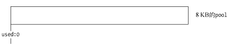
      - 当再次创建一个Buffer对象时，构造过程中将会判断这个slab的剩余空间是否足够。如果足够，使用剩余空间，并更新slab的分配状态
      - 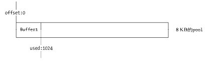
      - 如果slab剩余的空间不够，将会构造新的slab，原slab中剩余的空间会造成浪费
      - 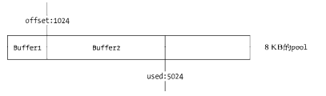
      - 注意的事项是，由于同一个slab可能分配给多个Buffer对象使用，只有这些小Buffer对象在作用域释放并都可以回收时，slab的8 KB空间才会被回收。尽管创建了1个字节的Buffer对象，但是如果不释放它，实际可能是8 KB的内存没有释放
    - 分配大Buffer对象
      - 如果需要超过8 KB的Buffer对象，将会直接分配一个SlowBuffer对象作为slab单元，这个slab单元将会被这个大Buffer对象独占

###### Buffer 的转换
Buffer对象可以与字符串之间相互转换,目前支持的字符串编码类型有如下这几种:
- ASCII
- UTF-8
- UTF-16LE/UCS-2
- Base64
- Binary
- Hex

- 字符串转Buffer
  - 字符串转Buffer对象主要是通过构造函数完成的：new Buffer(str, [encoding]);
  - 通过构造函数转换的Buffer对象，存储的只能是一种编码类型。encoding参数不传递时，默认按UTF-8编码进行转码和存储
  - 需要小心的是，每种编码所用的字节长度不同，将Buffer反转回字符串时需要谨慎处理
- Buffer转字符串
  - 实现Buffer向字符串的转换也十分简单，Buffer对象的toString()可以将Buffer对象转换为字符串，代码如下：buf.toString([encoding], [start], [end]) 
  - 可以设置encoding（默认为UTF-8）、start、end这3个参数实现整体或局部的转换。如果Buffer对象由多种编码写入，就需要在局部指定不同的编码，才能转换回正常的编码。
- Buffer不支持的编码类型
  - Buffer提供了一个isEncoding()函数来判断编码是否支持转换：Buffer.isEncoding(encoding)
  - 在中国常用的GBK、GB2312和BIG-5编码都不在支持的行列中
  - 对于不支持的编码类型，可以借助Node生态圈中的模块完成转换。iconv和iconv-lite两个模块可以支持更多的编码类型转换，包括Windows 125系列、ISO-8859系列、IBM/DOS代码页系列、Macintosh系列、KOI8系列，以及Latin1、US-ASCII，也支持宽字节编码GBK和GB2312

###### Buffer 的拼接
```
var fs = require('fs'); 
var rs = fs.createReadStream('test.md'); 
var data = ''; 
rs.on("data", function (chunk){ 
 data += chunk; 
}); 
rs.on("end", function () { 
 console.log(data); 
}); 
```
- 原因在于文件可读流在读取时会逐个读取Buffer
- setEncoding()与string_decoder()
  - setEncoding该方法的作用是让data事件中传递的不再是一个Buffer对象，而是编码后的字符串
  - string_decoder目前只能处理UTF-8、Base64和UCS-2/UTF-16LE这3种编码。通过setEncoding()的方式不可否认能解决大部分的乱码问题，但并不能从根本上解决该问题。
- 正确拼接Buffer
```
var chunks = []; 
var size = 0; 
res.on('data', function (chunk) { 
 chunks.push(chunk); 
 size += chunk.length; 
}); 
res.on('end', function () { 
   var buf = Buffer.concat(chunks, size); 
 var str = iconv.decode(buf, 'utf8'); 
 console.log(str); 
});
```
  - 正确的拼接方式是用一个数组来存储接收到的所有Buffer片段并记录下所有片段的总长度，然后调用Buffer.concat()方法生成一个合并的Buffer对象
  - Buffer.concat()方法封装的从小Buffer对象向大Buffer对象的复制过程：
```
Buffer.concat = function(list, length) { 
 if (!Array.isArray(list)) { 
 throw new Error('Usage: Buffer.concat(list, [length])'); 
 } 
 if (list.length === 0) { 
 return new Buffer(0); 
 } else if (list.length === 1) { 
 return list[0]; 
 } 
 if (typeof length !== 'number') { 
 length = 0; 
 for (var i = 0; i < list.length; i++) { 
 var buf = list[i]; 
 length += buf.length; 
 } 
 } 
 var buffer = new Buffer(length); 
 var pos = 0; 
 for (var i = 0; i < list.length; i++) { 
 var buf = list[i]; 
 buf.copy(buffer, pos); 
 pos += buf.length; 
 } 
 return buffer; 
}; 
```
###### Buffer 与性能
通过预先转换静态内容为Buffer对象，可以有效地减少CPU的重复使用，节省服务器资源。在Node构建的Web应用中，可以选择将页面中的动态内容和静态内容分离，静态内容部分可以通过预先转换为Buffer的方式，使性能得到提升。由于文件自身是二进制数据，所以在不需要改变内容的场景下，尽量只读取Buffer，然后直接传输，不做额外的转换，避免损耗
- 文件读取
  - 在文件的读取时，有一个highWaterMark设置对性能的影响至关重要
    - highWaterMark的大小对性能有两个影响的点
      - highWaterMark设置对Buffer内存的分配和使用有一定影响。
      - highWaterMark设置过小，可能导致系统调用次数过多。
    - highWaterMark值的大小与读取速度的关系：该值越大，读取速度越快。

#### 网络编程
Node提供了net、dgram、http、https这4个模块，分别用于处理TCP、UDP、HTTP、HTTPS，适用于服务器端和客户端

- 构建 TCP 服务
  - TCP
    - TCP全名为传输控制协议，在OSI模型（由七层组成，分别为物理层、数据链结层、网络层、传输层、会话层、表示层、应用层）中属于传输层协议。许多应用层协议基于TCP构建，典型的是HTTP、SMTP、IMAP等协议
    - 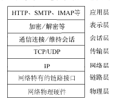
    - TCP是面向连接的协议，其显著的特征是在传输之前需要3次握手形成会话
    - 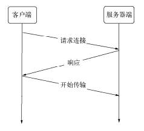
  - 创建TCP服务器端
```
var net = require('net'); 
var server = net.createServer(function (socket) { 
 // 新的连接
 socket.on('data', function (data) { 
 socket.write("你好"); 
 }); 
 socket.on('end', function () { 
 console.log('连接断开'); 
 }); 
 socket.write("欢迎光临《深入浅出Node.js》示例：\n"); 
}); 
server.listen(8124, function () { 
 console.log('server bound'); 
});
```
  - TCP服务的事件
    - 服务器事件
      - listening：在调用server.listen()绑定端口或者Domain Socket后触发，简洁写法为server.listen(port,listeningListener)，通过listen()方法的第二个参数传入。
      - connection：每个客户端套接字连接到服务器端时触发，简洁写法为通过net.createServer()，最后一个参数传递。
      - close：当服务器关闭时触发，在调用server.close()后，服务器将停止接受新的套接字连接，但保持当前存在的连接，等待所有连接都断开后，会触发该事件。
      - error：当服务器发生异常时，将会触发该事件。比如侦听一个使用中的端口，将会触发一个异常，如果不侦听error事件，服务器将会抛出异常
    - 连接事件
      - data：当一端调用write()发送数据时，另一端会触发data事件，事件传递的数据即是write()发送的数据。
      - end：当连接中的任意一端发送了FIN数据时，将会触发该事件。
      - connect：该事件用于客户端，当套接字与服务器端连接成功时会被触发。
      - drain：当任意一端调用write()发送数据时，当前这端会触发该事件。
      - error：当异常发生时，触发该事件。
      - close：当套接字完全关闭时，触发该事件。
      - timeout：当一定时间后连接不再活跃时，该事件将会被触发，通知用户当前该连接已经被闲置了
    - TCP针对网络中的小数据包有一定的优化策略：Nagle算法。如果每次只发送一个字节的内容而不优化，网络中将充满只有极少数有效数据的数据包，将十分浪费网络资源。Nagle算法针对这种情况，要求缓冲区的数据达到一定数量或者一定时间后才将其发出，所以小数据包将会被Nagle算法合并，以此来优化网络。这种优化虽然使网络带宽被有效地使用，但是数据有可能被延迟发送。
    - 在Node中，由于TCP默认启用了Nagle算法，可以调用socket.setNoDelay(true)去掉Nagle算法，使得write()可以立即发送数据到网络中
    - 另一个需要注意的是，尽管在网络的一端调用write()会触发另一端的data事件，但是并不意味着每次write()都会触发一次data事件，在关闭掉Nagle算法后，另一端可能会将接收到的多个小数据包合并，然后只触发一次data事件
###### 构建 UDP 服务
UDP又称用户数据包协议，与TCP一样同属于网络传输层。UDP与TCP最大的不同是UDP不是面向连接的。TCP中连接一旦建立，所有的会话都基于连接完成，客户端如果要与另一个TCP服务通信，需要另创建一个套接字来完成连接。但在UDP中，一个套接字可以与多个UDP服务通信，它虽然提供面向事务的简单不可靠信息传输服务，在网络差的情况下存在丢包严重的问题，但是由于它无须连接，资源消耗低，处理快速且灵活，所以常常应用在那种偶尔丢一两个数据包也不会产生重大影响的场景，比如音频、视频等。UDP目前应用很广泛，DNS服务即是基于它实现的。
- 创建UDP套接字
  - 创建UDP套接字十分简单，UDP套接字一旦创建，既可以作为客户端发送数据，也可以作为服务器端接收数据。
  - var dgram = require('dgram'); var socket = dgram.createSocket("udp4");
- 创建UDP服务器端
  - 若想让UDP套接字接收网络消息，只要调用dgram.bind(port, [address])方法对网卡和端口进行绑定即可
```
var dgram = require("dgram"); 
var server = dgram.createSocket("udp4"); 
server.on("message", function (msg, rinfo) { 
 console.log("server got: " + msg + " from " + 
 rinfo.address + ":" + rinfo.port); 
}); 
server.on("listening", function () { 
 var address = server.address();
 console.log("server listening " + 
 address.address + ":" + address.port); 
}); 
server.bind(41234);
```
- 创建UDP客户端
```
var dgram = require('dgram'); 
var message = new Buffer("深入浅出Node.js"); 
var client = dgram.createSocket("udp4"); 
client.send(message, 0, message.length, 41234, "localhost", function(err, bytes) { 
 client.close(); 
}); 

socket.send(buf, offset, length, port, address, [callback])
// 参数分别为要发送的Buffer、Buffer的偏移、Buffer的长度、目标端口、目标地址、发送完成后的回调
```
- UDP套接字事件
  - UDP套接字相对TCP套接字使用起来更简单，它只是一个EventEmitter的实例，而非Stream的实例。它具备如下自定义事件
    - message：当UDP套接字侦听网卡端口后，接收到消息时触发该事件，触发携带的数据为消息Buffer对象和一个远程地址信息。
    - listening：当UDP套接字开始侦听时触发该事件。
    - close：调用close()方法时触发该事件，并不再触发message事件。如需再次触发message事件，重新绑定即可。
    - error：当异常发生时触发该事件，如果不侦听，异常将直接抛出，使进程退出。

###### 构建 HTTP 服务
- HTTP
  - 初识HTTP
    - HTTP的全称是超文本传输协议，英文写作HyperText Transfer Protocol
    - HTTP构建在TCP之上，属于应用层协议。在HTTP的两端是服务器和浏览器，即著名的B/S模式，如今精彩纷呈的Web即是HTTP的应用。
    - HTTP得以发展是W3C和IETF两个组织合作的结果，他们最终发布了一系列RFC标准，目前最知名的HTTP标准为RFC 2616。
  -  HTTP报文
```
$ curl -v http://127.0.0.1:1337 
* About to connect() to 127.0.0.1 port 1337 (#0) 
* Trying 127.0.0.1... 
* connected 
* Connected to 127.0.0.1 (127.0.0.1) port 1337 (#0) 
> GET / HTTP/1.1 
> User-Agent: curl/7.24.0 (x86_64-apple-darwin12.0) libcurl/7.24.0 OpenSSL/0.9.8r zlib/1.2.5 
> Host: 127.0.0.1:1337 
> Accept: */* 
> 
< HTTP/1.1 200 OK 
< Content-Type: text/plain 
< Date: Sat, 06 Apr 2013 08:01:44 GMT 
< Connection: keep-alive 
< Transfer-Encoding: chunked 
< 
Hello World
* Connection #0 to host 127.0.0.1 left intact 
* Closing connection #0
```
    - HTTP服务只做两件事情：处理HTTP请求和发送HTTP响应
  - http模块
    - 在Node中，HTTP服务继承自TCP服务器（net模块），它能够与多个客户端保持连接，由于其采用事件驱动的形式，并不为每一个连接创建额外的线程或进程，保持很低的内存占用，所以能实现高并发。HTTP服务与TCP服务模型有区别的地方在于，在开启keepalive后，一个TCP会话可以用于多次请求和响应。TCP服务以connection为单位进行服务，HTTP服务以request为单位进行服务。
    - 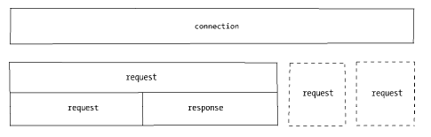
    - http模块将连接所用套接字的读写抽象为ServerRequest和ServerResponse对象，它们分别对应请求和响应操作。在请求产生的过程中，http模块拿到连接中传来的数据，调用二进制模块http_parser进行解析，在解析完请求报文的报头后，触发request事件，调用用户的业务逻辑
    - 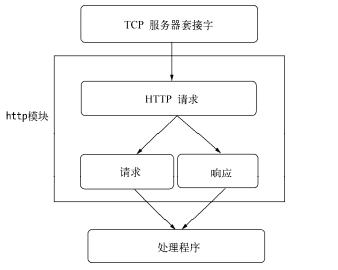
      - HTTP服务的事件
        - connection事件：在开始HTTP请求和响应前，客户端与服务器端需要建立底层的TCP连接，这个连接可能因为开启了keep-alive，可以在多次请求响应之间使用；当这个连接建立时，服务器触发一次connection事件。
        - request事件：建立TCP连接后，http模块底层将在数据流中抽象出HTTP请求和HTTP响应，当请求数据发送到服务器端，在解析出HTTP请求头后，将会触发该事件；在res.end()后，TCP连接可能将用于下一次请求响应。
        - close事件：与TCP服务器的行为一致，调用server.close()方法停止接受新的连接，当已有的连接都断开时，触发该事件；可以给server.close()传递一个回调函数来快速注册该事件。
        - checkContinue事件：某些客户端在发送较大的数据时，并不会将数据直接发送，而是先发送一个头部带Expect: 100-continue的请求到服务器，服务器将会触发checkContinue事件；如果没有为服务器监听这个事件，服务器将会自动响应客户端100 Continue的状态码，表示接受数据上传；如果不接受数据的较多时，响应客户端400 Bad Request拒绝客户端继续发送数据即可。需要注意的是，当该事件发生时不会触发request事件，两个事件之间互斥。当客户端收到100 Continue后重新发起请求时，才会触发request事件。
        - connect事件：当客户端发起CONNECT请求时触发，而发起CONNECT请求通常在HTTP代理时出现；如果不监听该事件，发起该请求的连接将会关闭
        - upgrade事件：当客户端要求升级连接的协议时，需要和服务器端协商，客户端会在请求头中带上Upgrade字段，服务器端会在接收到这样的请求时触发该事件。这在后文的WebSocket部分有详细流程的介绍。如果不监听该事件，发起该请求的连接将会关闭。
        - clientError事件：连接的客户端触发error事件时，这个错误会传递到服务器端，此时触发该事件
###### HTTP客户端
http模块提供了一个底层API：http.request(options, connect)，用于构造HTTP客户端
```
var options = { 
 hostname: '127.0.0.1', 
 port: 1334, 
 path: '/', 
 method: 'GET' 
}; 
var req = http.request(options, function(res) { 
 console.log('STATUS: ' + res.statusCode); 
 console.log('HEADERS: ' + JSON.stringify(res.headers)); 
 res.setEncoding('utf8'); 
 res.on('data', function (chunk) { 
 console.log(chunk); 
 }); 
}); 
req.end();
```
HTTP请求头中的选项有:
- host：服务器的域名或IP地址，默认为localhost。
- hostname：服务器名称。
- port：服务器端口，默认为80。
- localAddress：建立网络连接的本地网卡。
- socketPath：Domain套接字路径。
- method：HTTP请求方法，默认为GET。
- path：请求路径，默认为/。
- headers：请求头对象。
- auth：Basic认证，这个值将被计算成请求头中的Authorization部分。


- HTTP响应
  - HTTP客户端的响应对象与服务器端较为类似，在ClientRequest对象中，它的事件叫做response。ClientRequest在解析响应报文时，一解析完响应头就触发response事件，同时传递一个响应对象以供操作ClientResponse。
```
function(res) { 
 console.log('STATUS: ' + res.statusCode); 
 console.log('HEADERS: ' + JSON.stringify(res.headers)); 
 res.setEncoding('utf8'); 
 res.on('data', function (chunk) { 
 console.log(chunk); 
 }); 
}
```
- HTTP 代理
  - http提供的ClientRequest对象也是基于TCP层实现的，在keepalive的情况下，一个底层会话连接可以多次用于请求。为了重用TCP连接，http模块包含一个默认的客户端代理对象http.globalAgent。它对每个服务器端（host + port）创建的连接进行了管理，默认情况下，通过ClientRequest对象对同一个服务器端发起的HTTP请求最多可以创建5个连接
  - 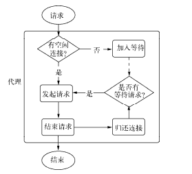
  - 调用HTTP客户端同时对一个服务器发起10次HTTP请求时，其实质只有5个请求处于并发状态，后续的请求需要等待某个请求完成服务后才真正发出。这与浏览器对同一个域名有下载连接数的限制是相同的行为
  - 如果你在服务器端通过ClientRequest调用网络中的其他HTTP服务，记得关注代理对象对网络请求的限制。一旦请求量过大，连接限制将会限制服务性能。如需要改变，可以在options中传递agent选项。默认情况下，请求会采用全局的代理对象，默认连接数限制的为5
```
var agent = new http.Agent({ 
 maxSockets: 10 
}); 
var options = { 
 hostname: '127.0.0.1', 
 port: 1334, 
 path: '/', 
 method: 'GET', 
 agent: agent 
}; 
```
  - 可以设置agent选项为false值，以脱离连接池的管理，使得请求不受并发的限制
- HTTP客户端事件
  - response：与服务器端的request事件对应的客户端在请求发出后得到服务器端响应时，会触发该事件。
  - socket：当底层连接池中建立的连接分配给当前请求对象时，触发该事件。
  - connect：当客户端向服务器端发起CONNECT请求时，如果服务器端响应了200状态码，客户端将会触发该事件。
  - upgrade：客户端向服务器端发起Upgrade请求时，如果服务器端响应了101 Switching Protocols状态，客户端将会触发该事件。
  - continue：客户端向服务器端发起Expect: 100-continue头信息，以试图发送较大数据量，如果服务器端响应100 Continue状态，客户端将触发该事件

###### 构建 WebSocket 服务
- WebSocket客户端基于事件的编程模型与Node中自定义事件相差无几。
- WebSocket实现了客户端与服务器端之间的长连接，而Node事件驱动的方式十分擅长与大量的客户端保持高并发连接。

websocket与http相比的优点：
- 客户端与服务器端只建立一个TCP连接，可以使用更少的连接。
- WebSocket服务器端可以推送数据到客户端，这远比HTTP请求响应模式更灵活、更高效。
- 有更轻量级的协议头，减少数据传送量。

```
var socket = new WebSocket('ws://127.0.0.1:12010/updates'); 
socket.onopen = function () { 
 setInterval(function() { 
 if (socket.bufferedAmount == 0) 
 socket.send(getUpdateData()); 
 }, 50); 
}; 
socket.onmessage = function (event) { 
 // TODO：event.data 
};
```

在WebSocket之前，网页客户端与服务器端进行通信最高效的是Comet技术。实现Comet技术的细节是采用长轮询（long-polling）或iframe流。长轮询的原理是客户端向服务器端发起请求，服务器端只在超时或有数据响应时断开连接（res.end()）；客户端在收到数据或者超时后重新发起请求。这个请求行为拖着长长的尾巴，是故用Comet（彗星）来命名它

- WebSocket握手
```
GET /chat HTTP/1.1 
Host: server.example.com 
Upgrade: websocket 
Connection: Upgrade 
Sec-WebSocket-Key: dGhlIHNhbXBsZSBub25jZQ== 
Sec-WebSocket-Protocol: chat, superchat 
Sec-WebSocket-Version: 13 
```
  - Upgrade/Connection两个字段表示请求服务器端升级协议为WebSocket。其中Sec-WebSocket-Key用于安全校验
  - Sec-WebSocket-Key的值是随机生成的Base64编码的字符串。服务器端接收到之后将其与字符串258EAFA5-E914-47DA-95CA-C5AB0DC85B11相连，形成字符串dGhlIHNhbXBsZSBub25jZQ==258EAFA5-E914-47DA-95CA-C5AB0DC85B11，然后通过sha1安全散列算法计算出结果后，再进行Base64编码，最后返回给客户端
  - 服务器端在处理完请求后，响应如下报文：
```
HTTP/1.1 101 Switching Protocols 
Upgrade: websocket 
Connection: Upgrade 
Sec-WebSocket-Accept: s3pPLMBiTxaQ9kYGzzhZRbK+xOo= 
Sec-WebSocket-Protocol: chat
```

###### WebSocket数据传输
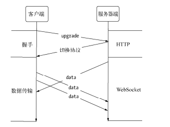
```
WebSocket.prototype.setSocket = function (socket) { 
 this.socket = socket; 
 this.socket.on('data', this.receiver); 
}; 

WebSocket.prototype.send = function (data) { 
 this._send(data); 
}; 
```
  - 为了安全考虑，客户端需要对发送的数据帧进行掩码处理，服务器一旦收到无掩码帧（比如中间拦截破坏），连接将关闭。而服务器发送到客户端的数据帧则无须做掩码处理，同样，如果客户端收到带掩码的数据帧，连接也将关闭
  - 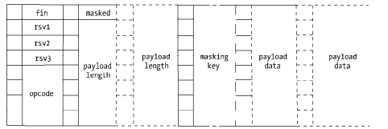
  - fin：如果这个数据帧是最后一帧，这个fin位为1，其余情况为0。当一个数据没有被分为多帧时，它既是第一帧也是最后一帧。
  - rsv1、rsv2、rsv3：各为1位长，3个标识用于扩展，当有已协商的扩展时，这些值可能为1，其余情况为0。
  - opcode：长为4位的操作码，可以用来表示0到15的值，用于解释当前数据帧。0表示附加数据帧，1表示文本数据帧，2表示二进制数据帧，8表示发送一个连接关闭的数据帧，9表示ping数据帧，10表示pong数据帧，其余值暂时没有定义。ping数据帧和pong数据帧用于心跳检测，当一端发送ping数据帧时，另一端必须发送pong数据帧作为响应，告知对方这一端仍然处于响应状态。
  - masked：表示是否进行掩码处理，长度为1。客户端发送给服务器端时为1，服务器端发送给客户端时为0。
  - payload length：一个7、7+16或7+64位长的数据位，标识数据的长度，如果值在0~125之间，那么该值就是数据的真实长度；如果值是126，则后面16位的值是数据的真实长度；如果值是127，则后面64位的值是数据的真实长度。
  - masking key：当masked为1时存在，是一个32位长的数据位，用于解密数据。
  - payload data：我们的目标数据，位数为8的倍数。

node与websocket共性
- 基于事件的编程接口。
- 基于JavaScript，以封装良好的WebSocket实现，API与客户端可以高度相似。

###### 网络服务与安全
Node在网络安全上提供了3个模块，分别为crypto、tls、https。其中crypto主要用于加密解密，，tls模块提供了与net模块类似的功能，区别在于它建立在TLS/SSL加密的TCP连接上。对于https而言，它完全与http模块接口一致，区别也仅在于它建立于安全的连接之上
  - TLS/SSL
    - 密钥
      - TLS/SSL是一个公钥/私钥的结构，它是一个非对称的结构，每个服务器端和客户端都有自己的公私钥。公钥用来加密要传输的数据，私钥用来解密接收到的数据。公钥和私钥是配对的，通过公钥加密的数据，只有通过私钥才能解密，所以在建立安全传输之前，客户端和服务器端之间需要互换公钥
      - 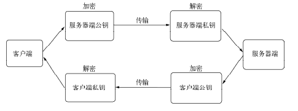
      - Node在底层采用的是openssl实现TLS/SSL的，为此要生成公钥和私钥可以通过openssl完成。
```
# 私钥
// 生成服务器端私钥
$ openssl genrsa -out server.key 1024 
// 生成客户端私钥
$ openssl genrsa -out client.key 1024

#公钥
$ openssl rsa -in server.key -pubout -out server.pem 
$ openssl rsa -in client.key -pubout -out client.pem 
```
      - 传递公私钥中可能存在中间人攻击，为了解决这个问题，TLS/SSL引入了数字证书来进行认证。与直接用公钥不同，数字证书中包含了服务器的名称和主机名、服务器的公钥、签名颁发机构的名称、来自签名颁发机构的签名
    - 数字证书
      - CA（Certificate Authority，数字证书认证中心）。CA的作用是为站点颁发证书，且这个证书中具有CA通过自己的公钥和私钥实现的签名
      - 通过CA机构颁发证书通常是一个烦琐的过程，需要付出一定的精力和费用。对于中小型企业而言，多半是采用自签名证书来构建安全网络的。所谓自签名证书，就是自己扮演CA机构，给自己的服务器端颁发签名证书
```
$ openssl genrsa -out ca.key 1024 
$ openssl req -new -key ca.key -out ca.csr 
$ openssl x509 -req -in ca.csr -signkey ca.key -out ca.crt
```
      - 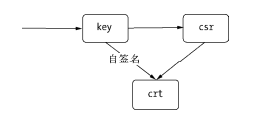
      - 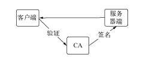

###### TLS服务
- 创建服务器端
```
var tls = require('tls'); 
var fs = require('fs'); 
var options = { 
 key: fs.readFileSync('./keys/server.key'), 
 cert: fs.readFileSync('./keys/server.crt'), 
 requestCert: true, 
 ca: [ fs.readFileSync('./keys/ca.crt') ] 
}; 
var server = tls.createServer(options, function (stream) { 
 console.log('server connected', stream.authorized ? 'authorized' : 'unauthorized'); 
 stream.write("welcome!\n"); 
 stream.setEncoding('utf8'); 
 stream.pipe(stream); 
}); 
server.listen(8000, function() {
  console.log('server bound'); 
}); 

# 通过下面的命令可以测试证书是否正常
$ openssl s_client -connect 127.0.0.1:8000
```
- TLS客户端
```
// 创建私钥
$ openssl genrsa -out client.key 1024 
// 生成CSR 
$ openssl req -new -key client.key -out client.csr 
// 生成签名证书
$ openssl x509 -req -CA ca.crt -CAkey ca.key -CAcreateserial -in client.csr -out client.crt

var tls = require('tls'); 
var fs = require('fs'); 
var options = { 
 key: fs.readFileSync('./keys/client.key'), 
 cert: fs.readFileSync('./keys/client.crt'), 
 ca: [ fs.readFileSync('./keys/ca.crt') ] 
}; 
var stream = tls.connect(8000, options, function () { 
 console.log('client connected', stream.authorized ? 'authorized' : 'unauthorized'); 
 process.stdin.pipe(stream); 
}); 
stream.setEncoding('utf8'); 
stream.on('data', function(data) { 
 console.log(data); 
}); 
stream.on('end', function() { 
 server.close(); 
}); 
```

###### HTTPS服务
- 创建HTTPS服务
```
var https = require('https'); 
var fs = require('fs'); 
var options = { 
 key: fs.readFileSync('./keys/server.key'), 
 cert: fs.readFileSync('./keys/server.crt') 
}; 
https.createServer(options, function (req, res) { 
 res.writeHead(200); 
 res.end("hello world\n"); 
}).listen(8000);

$ curl https://localhost:8000/ 
curl: (60) SSL certificate problem, verify that the CA cert is OK. Details: 
error:14090086:SSL routines:SSL3_GET_SERVER_CERTIFICATE:certificate verify failed 
More details here: http://curl.haxx.se/docs/sslcerts.html 
curl performs SSL certificate verification by default, using a "bundle" 
 of Certificate Authority (CA) public keys (CA certs). If the default 
 bundle file isn't adequate, you can specify an alternate file 
 using the --cacert option. 
If this HTTPS server uses a certificate signed by a CA represented in 
 the bundle, the certificate verification probably failed due to a 
 problem with the certificate (it might be expired, or the name might 
 not match the domain name in the URL). 
If you'd like to turn off curl's verification of the certificate, use 
 the -k (or --insecure) option.
```
由于是自签名的证书，curl工具无法验证服务器端证书是否正确，所以出现了上述的抛错，解决方案：
  - 一种是加-k选项，让curl工具忽略掉证书的验证，这样的结果是数据依然会通过公钥加密传输，但是无法保证对方是可靠的，会存在中间人攻击的潜在风险
  - 一种解决的方式是给curl设置--cacert选项，告知CA证书使之完成对服务器证书的验证
```
$ curl -k https://localhost:8000/ 
hello world

$ curl --cacert keys/ca.crt https://localhost:8000/ 
hello world 
```
- HTTPS客户端
```
var https = require('https'); 
var fs = require('fs'); 
var options = { 
 hostname: 'localhost', 
 port: 8000, 
 path: '/', 
 method: 'GET', 
 key: fs.readFileSync('./keys/client.key'), 
 cert: fs.readFileSync('./keys/client.crt'), 
 ca: [fs.readFileSync('./keys/ca.crt')] 
}; 
options.agent = new https.Agent(options); 
var req = https.request(options, function(res) { 
 res.setEncoding('utf-8'); 
 res.on('data', function(d) { 
 console.log(d); 
 }); 
}); 
req.end(); 
req.on('error', function(e) { 
 console.log(e); 
}); 
```
如果不设置ca选项，将会得到如下异常: [Error: UNABLE_TO_VERIFY_LEAF_SIGNATURE] 
解决该异常的方案是添加选项属性rejectUnauthorized为false，它的效果与curl工具加-k一样，都会在数据传输过程中会加密，但是无法保证服务器端的证书不是伪造的


??? 当客户端调用send()发送数据时，服务器端触发onmessage()；当服务器端调用send()发送数
据时，客户端的onmessage()触发。当我们调用send()发送一条数据时，协议可能将这个数据封装
为一帧或多帧数据，然后逐帧发送