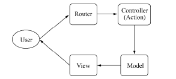
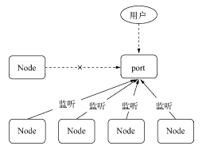
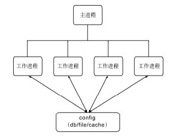

#### 构建Web应用

###### cookie
告知客户端的方式是通过响应报文实现的，响应的Cookie值在Set-Cookie字段中。它的格式与请求中的格式不太相同，规范中对它的定义如下所示：
Set-Cookie: name=value; Path=/; Expires=Sun, 23-Apr-23 09:01:35 GMT; Domain=.domain.com; 
其中name=value是必须包含的部分，其余部分皆是可选参数。这些可选参数将会影响浏览器在后续将Cookie发送给服务器端的行为。以下为主要的几个选项:
- path表示这个Cookie影响到的路径，当前访问的路径不满足该匹配时，浏览器则不发送这个Cookie。
- Expires和Max-Age是用来告知浏览器这个Cookie何时过期的，如果不设置该选项，在关闭浏览器时会丢失掉这个Cookie。如果设置了过期时间，浏览器将会把Cookie内容写入到磁盘中并保存，下次打开浏览器依旧有效。Expires的值是一个UTC格式的时间字符串，告知浏览器此Cookie何时将过期，Max-Age则告知浏览器此Cookie多久后过期。前者一般而言不存在问题，但是如果服务器端的时间和客户端的时间不能匹配，这种时间设置就会存在偏差。为此，Max-Age告知浏览器这条Cookie多久之后过期，而不是一个具体的时间点。
- HttpOnly告知浏览器不允许通过脚本document.cookie去更改这个Cookie值，事实上，设置HttpOnly之后，这个值在document.cookie中不可见。但是在HTTP请求的过程中，依然会发送这个Cookie到服务器端。
- Secure。当Secure值为true时，在HTTP中是无效的，在HTTPS中才有效，表示创建的Cookie只能在HTTPS连接中被浏览器传递到服务器端进行会话验证，如果是HTTP连接则不会传递该信息，所以很难被窃听到

在YSlow的性能优化规则:
- 减小Cookie的大小
- 为静态组件使用不同的域名
- 减少DNS查询

###### Session
Session的数据只保留在服务器端，客户端无法修改，这样数据的安全性得到一定的保障，数据也无须在协议中每次都被传递

常见的两种实现方式:
- 基于Cookie来实现用户和数据的映射
一旦服务器端启用了Session，它将约定一个键值作为Session的口令，这个值可以随意约定，比如Connect默认采用connect_uid，Tomcat会采用jsessionid等。一旦服务器检查到用户请求Cookie中没有携带该值，它就会为之生成一个值，这个值是唯一且不重复的值，并设定超时时间
```
var sessions = {}; 
var key = 'session_id'; 
var EXPIRES = 20 * 60 * 1000; 
var generate = function () { 
 var session = {}; 
 session.id = (new Date()).getTime() + Math.random(); 
 session.cookie = { 
 expire: (new Date()).getTime() + EXPIRES 
 }; 
 sessions[session.id] = session; 
 return session; 
}; 
```
- 通过查询字符串来实现浏览器端和服务器端数据的对应

采用高速缓存的理由有以下几条:
- Node与缓存服务保持长连接，而非频繁的短连接，握手导致的延迟只影响初始化。
- 高速缓存直接在内存中进行数据存储和访问。
- 缓存服务通常与Node进程运行在相同的机器上或者相同的机房里，网络速度受到的影响较小。

###### 缓存
关于缓存的规则：
- 添加Expires 或Cache-Control 到报文头中。
- 配置 ETags。
- 让Ajax 可缓存


时间戳有一些缺陷存在:
- 文件的时间戳改动但内容并不一定改动。
- 时间戳只能精确到秒级别，更新频繁的内容将无法生效

ETag的全称是Entity Tag，由服务器端生成，服务器端可以决定它的生成规则。如果根据文件内容生成散列值，那么条件请求将不会受到时间戳改动造成的带宽浪费。
ETag的请求和响应是If-None-Match/ETag
```
var handle = function (req, res) { 
 fs.readFile(filename, function(err, file) { 
 var hash = getHash(file); 
 var noneMatch = req.headers['if-none-match']; 
 if (hash === noneMatch) { 
 res.writeHead(304, "Not Modified"); 
 res.end(); 
 } else { 
 res.setHeader("ETag", hash); 
 res.writeHead(200, "Ok"); 
 res.end(file); 
 } 
 }); 
}; 
```

HTTP1.0时，在服务器端设置Expires可以告知浏览器要缓存文件内容，如下代码所示:
```
var handle = function (req, res) { 
 fs.readFile(filename, function(err, file) { 
 var expires = new Date(); 
 expires.setTime(expires.getTime() + 10 * 365 * 24 * 60 * 60 * 1000); 
 res.setHeader("Expires", expires.toUTCString()); 
 res.writeHead(200, "Ok"); 
 res.end(file); 
 }); 
}; 
```
Expires是一个GMT格式的时间字符串。浏览器在接到这个过期值后，只要本地还存在这个缓存文件，在到期时间之前它都不会再发起请求

Expires的缺陷在于浏览器与服务器之间的时间可能不一致，这可能会带来一些问题，比如文件提前过期，或者到期后并没有被删除。在这种情况下，Cache-Control以更丰富的形式，实现相同的功能，如下所示：
```
var handle = function (req, res) { 
 fs.readFile(filename, function(err, file) { 
 res.setHeader("Cache-Control", "max-age=" + 10 * 365 * 24 * 60 * 60 * 1000); 
 res.writeHead(200, "Ok"); 
 res.end(file); 
 }); 
};
```
Cache-Control能够避免浏览器端与服务器端时间不同步带来的不一致性问题，只要进行类似倒计时的方式计算过期时间即可。除此之外，Cache-Control的值还能设置public、private、no-cache、no-store等能够更精细地控制缓存的选项

由于在HTTP1.0时还不支持max-age，如今的服务器端在模块的支持下多半同时对Expires和Cache-Control进行支持。在浏览器中如果两个值同时存在，且被同时支持时，max-age会覆盖Expires。

一般的更新机制有如下两种:
- 每次发布，路径中跟随Web应用的版本号：http://url.com/?v=20130501。
- 每次发布，路径中跟随该文件内容的hash值：http://url.com/?hash=afadfadwe

###### Basic认证
一般只有在HTTPS的情况下才会使用。不过Basic认证的支持范围十分广泛，几乎所有的浏览器都支持它

###### 数据上传
如果请求中还带有内容部分（如POST请求，它具有报头和内容），内容部分需要用户自行接收和解析。
通过报头的Transfer-Encoding或Content-Length即可判断请求中是否带有内容，如下所示：
```
var hasBody = function(req) { 
 return 'transfer-encoding' in req.headers || 'content-length' in req.headers; 
}; 
```
在HTTP_Parser解析报头结束后，报文内容部分会通过data事件触发，我们只需以流的方式处理即可，如下所示：
```
function (req, res) { 
 if (hasBody(req)) { 
 var buffers = []; 
 req.on('data', function (chunk) { 
 buffers.push(chunk); 
 }); 
 req.on('end', function () { 
 req.rawBody = Buffer.concat(buffers).toString(); 
 handle(req, res); 
 }); 
 } else { 
 handle(req, res); 
 } 
} 
```
将接收到的Buffer列表转化为一个Buffer对象后，再转换为没有乱码的字符串，暂时挂置在req.rawBody处

获取数据
```
var handle = function (req, res) { 
 if (req.headers['content-type'] === 'application/x-www-form-urlencoded') { 
 req.body = querystring.parse(req.rawBody); 
 } 
 todo(req, res); 
}; 


var mime = function (req) { 
 var str = req.headers['content-type'] || ''; 
 return str.split(';')[0]; 
};

var handle = function (req, res) { 
 if (mime(req) === 'application/json') { 
 try { 
 req.body = JSON.parse(req.rawBody); 
 } catch (e) { 
 // 异常内容，响应Bad request 
 res.writeHead(400); 
 res.end('Invalid JSON'); 
 return; 
 } 
 } 
 todo(req, res); 
}; 
```

解析XML文件稍微复杂一点，建议使用支持XML文件到JSON对象转换的库，这里以xml2js模块为例，如下所示：
```
var xml2js = require('xml2js'); 
var handle = function (req, res) { 
 if (mime(req) === 'application/xml') { 
 xml2js.parseString(req.rawBody, function (err, xml) { 
 if (err) { 
 // 异常内容，响应Bad request 
 res.writeHead(400); 
 res.end('Invalid XML'); 
 return; 
 } 
 req.body = xml; 
 todo(req, res); 
 }); 
 } 
};
```

*附件上传*

```
function (req, res) { 
 if (hasBody(req)) { 
 var done = function () { 
 handle(req, res); 
 }; 
 if (mime(req) === 'application/json') { 
 parseJSON(req, done); 
 } else if (mime(req) === 'application/xml') { 
 parseXML(req, done); 
 } else if (mime(req) === 'multipart/form-data') { 
 parseMultipart(req, done); 
 } 
 } else { 
 handle(req, res); 
 } 
} 
```

formidable基于流式处理解析报文，将接收到的文件写入到系统的临时文件夹中，并返回对应的路径，如下所示：
```
var formidable = require('formidable'); 
function (req, res) { 
 if (hasBody(req)) { 
 if (mime(req) === 'multipart/form-data') { 
 var form = new formidable.IncomingForm(); 
 form.parse(req, function(err, fields, files) { 
 req.body = fields; 
 req.files = files; 
 handle(req, res); 
 }); 
 } 
 } else { 
 handle(req, res); 
 } 
} 
```

###### 数据上传与安全
内存限制
主要有两个方案。
- 限制上传内容的大小，一旦超过限制，停止接收数据，并响应400状态码。
- 通过流式解析，将数据流导向到磁盘中，Node只保留文件路径等小数据

```
var bytes = 1024; 
function (req, res) { 
 var received = 0, 
 var len = req.headers['content-length'] ? parseInt(req.headers['content-length'], 10) : null; 
 // 如果内容超过长度限制，返回请求实体过长的状态码
 if (len && len > bytes) { 
 res.writeHead(413); 
 res.end(); 
 return; 
 }
  // limit 
 req.on('data', function (chunk) { 
 received += chunk.length; 
 if (received > bytes) { 
 // 停止接收数据，触发end() 
 req.destroy(); 
 } 
 }); 
 handle(req, res); 
}; 
```

CSRF 
CSRF的全称是Cross-Site Request Forgery，中文意思为跨站请求伪造。

解决CSRF攻击的方案有添加随机值的方式，如下所示：
```
var generateRandom = function(len) { 
 return crypto.randomBytes(Math.ceil(len * 3 / 4)) 
 .toString('base64') 
 .slice(0, len); 
};
```

###### 路由解析
文件路径型
- 静态文件
- 动态文件

MVC
MVC模型的主要思想是将业务逻辑按职责分离，主要分为以下几种。
- 控制器（Controller），一组行为的集合。
- 模型（Model），数据相关的操作和封装。
- 视图（View），视图的渲染。


这是目前最为经典的分层模式，大致而言，它的工作模式如下说明。
- 路由解析，根据URL寻找到对应的控制器和行为。
- 行为调用相关的模型，进行数据操作。
- 数据操作结束后，调用视图和相关数据进行页面渲染，输出到客户端。

如何根据URL做路由映射，这里有两个分支实现。
一种方式是通过手工关联映射
一种是自然关联映射
前者会有一个对应的路由文件来将URL映射到对应的控制器，后者没有这样的文件

手工映射除了需要手工配置路由外较为原始外，它对URL的要求十分灵活，几乎没有格式上的限制。
- 正则匹配
- 参数解析

自然映射这种路由方式在PHP的MVC框架CodeIgniter中应用十分广泛，设计十分简洁，在Node中实现它也十分容易。与手工映射相比，如果URL变动，它的文件也需要发生变动，手工映射只需要改动路由映射即可。

*RESTful*
REST的全称是Representational State Transfer，中文含义为表现层状态转化。符合REST规范的设计，我们称为RESTful设计。它的设计哲学主要将服务器端提供的内容实体看作一个资源，并表现在URL上

RESTful与MVC设计并不冲突，而且是更好的改进。相比MVC，RESTful只是将HTTP请求方法也加入了路由的过程，以及在URL路径上体现得更资源化

###### 中间件


*异常处理*
```
var handle = function (req, res, stack) { 
 var next = function (err) { 
 if (err) { 
 return handle500(err, req, res, stack); 
 } 
 // 从stack数组中取出中间件并执行
 var middleware = stack.shift(); 
 if (middleware) { 
 // 传入next()函数自身，使中间件能够执行结束后递归
 try { 
 middleware(req, res, next); 
 } catch (ex) { 
 next(err); 
 } 
 } 
 }; 
 // 启动执行
 next(); 
}; 
```

*中间件与性能*
编写高效的中间件
- 使用高效的方法。必要时通过jsperf.com测试基准性能。
- 缓存需要重复计算的结果（需要控制缓存用量）。
- 避免不必要的计算。比如HTTP报文体的解析，对于GET方法完全不需要。

合理使用路由

###### 页面渲染
*内容响应*
- MIME: 浏览器正是通过不同的Content-Type的值来决定采用不同的渲染方式，这个值我们简称为MIME值
MIME的全称是Multipurpose Internet Mail Extensions，从名字可以看出，它最早用于电子邮件，后来也应用到浏览器中。不同的文件类型具有不同的MIME值，如JSON文件的值为application/json、XML文件的值为application/xml、PDF文件的值为application/pdf。
为了方便获知文件的MIME值，社区有专有的mime模块可以用判段文件类型。它的调用十分简单，如下所示：
```
var mime = require('mime'); 
mime.lookup('/path/to/file.txt'); // => 'text/plain' 
mime.lookup('file.txt'); // => 'text/plain' 
mime.lookup('.TXT'); // => 'text/plain' 
mime.lookup('htm'); // => 'text/html' 
```
除了MIME值外，Content-Type的值中还可以包含一些参数，如字符集。示例如下：
Content-Type: text/javascript; charset=utf-8 
- 附件下载
Content-Disposition字段影响的行为是客户端会根据它的值判断是应该将报文数据当做即时浏览的内容，还是可下载的附件。当内容只需即时查看时，它的值为inline，当数据可以存为附件时，它的值为attachment。另外，Content-Disposition字段还能通过参数指定保存时应该使用的文件名
- 响应JSON
- 响应跳转

*视图渲染*
集成文件系统
```
var cache = {}; 
var VIEW_FOLDER = '/path/to/wwwroot/views'; 
res.render = function (viewname, data) { 
 if (!cache[viewname]) { 
 var text; 
 try { 
 text = fs.readFileSync(path.join(VIEW_FOLDER, viewname), 'utf8'); 
 } catch (e) { 
  res.writeHead(500, {'Content-Type': 'text/html'}); 
 res.end('模板文件错误'); 
 return; 
 } 
 cache[viewname] = complie(text); 
 } 
 var complied = cache[viewname]; 
 res.writeHead(200, {'Content-Type': 'text/html'}); 
 var html = complied(data); 
 res.end(html); 
};
```

**Bigpipe**
Bigpipe的解决思路则是将页面分割成多个部分（pagelet），先向用户输出没有数据的布局（框架），将每个部分逐步输出到前端，再最终渲染填充框架，完成整个网页的渲染。

Bigpipe是一个需要前后端配合实现的优化技术，这个技术有几个重要的点。
- 页面布局框架（无数据的）。
- 后端持续性的数据输出。
- 前端渲染

```
var cache = {}; 
var layout = 'layout.html'; 
app.get('/profile', function (req, res) { 
 if (!cache[layout]) { 
 cache[layout] = fs.readFileSync(path.join(VIEW_FOLDER, layout), 'utf8'); 
 } 
 res.writeHead(200, {'Content-Type': 'text/html'}); 
 res.write(render(complie(cache[layout]))); 
 // TODO 
}); 


app.get('/profile', function (req, res) { 
 if (!cache[layout]) { 
 cache[layout] = fs.readFileSync(path.join(VIEW_FOLDER, layout), 'utf8'); 
 } 
 res.writeHead(200, {'Content-Type': 'text/html'}); 
 res.write(render(complie(cache[layout]))); 
 ep.all('users', 'articles', function () { 
 res.end(); 
 }); 
 ep.fail(function (err) { 
 res.end(); 
 }); 
 db.getData('sql1', function (err, data) { 
 data = err ? {} : data; 
 res.write('<script>bigpipe.set("articles", ' + JSON.stringify(data) + ');</script>'; 
 }); 
 db.getData('sql2', function (err, data) { 
 data = err ? {} : data; 
 res.write('<script>bigpipe.set("copyright", ' + JSON.stringify(data) + ');</script>'; 
 }); 
});


var Bigpipe = function () { 
 this.callbacks = {}; 
}; 
Bigpipe.prototype.ready = function (key, callback) { 
 if (!this.callbacks[key]) { 
 this.callbacks[key] = []; 
 } 
 this.callbacks[key].push(callback); 
}; 
Bigpipe.prototype.set = function (key, data) { 
 var callbacks = this.callbacks[key] || []; 
 for (var i = 0; i < callbacks.length; i++) { 
 callbacks[i].call(this, data); 
 } 
};
```
Bigpipe将网页布局和数据渲染分离，使得用户在视觉上觉得网页提前渲染好了，其随着数据输出的过程逐步渲染页面，使得用户能够感知到页面是活的。这远比一开始给出空白页面，然后在某个时候突然渲染好带给用户的体验更好

#### 玩转进程

###### 服务模型的变迁
*石器时代：同步*
最早的服务器，其执行模型是同步的，它的服务模式是一次只为一个请求服务，所有请求都得按次序等待服务。这意味除了当前的请求被处理外，其余请求都处于耽误的状态。
它的处理能力相当低下，假设每次响应服务耗用的时间稳定为N秒，这类服务的QPS为1/N

*青铜时代：复制进程*
为了解决同步架构的并发问题，一个简单的改进是通过进程的复制同时服务更多的请求和用户。这样每个连接都需要一个进程来服务，即100个连接需要启动100个进程来进行服务，这是非常昂贵的代价。在进程复制的过程中，需要复制进程内部的状态，对于每个连接都进行这样的复制的话，相同的状态将会在内存中存在很多份，造成浪费。并且这个过程由于要复制较多的数据，启动是较为缓慢的。
为了解决启动缓慢的问题，预复制（prefork）被引入服务模型中，即预先复制一定数量的进程。同时将进程复用，避免进程创建、销毁带来的开销。但是这个模型并不具备伸缩性，一旦并发请求过高，内存使用随着进程数的增长将会被耗尽
假设通过进行复制和预复制的方式搭建的服务器有资源的限制，且进程数上限为M，那这类服务的QPS为M/N

*白银时代：多线程*
为了解决进程复制中的浪费问题，多线程被引入服务模型，让一个线程服务一个请求。线程相对进程的开销要小许多，并且线程之间可以共享数据，内存浪费的问题可以得到解决，并且利用线程池可以减少创建和销毁线程的开销。但是多线程所面临的并发问题只能说比多进程略好，因为每个线程都拥有自己独立的堆栈，这个堆栈都需要占用一定的内存空间。另外，由于一个CPU核心在一个时刻只能做一件事情，操作系统只能通过将CPU切分为时间片的方法，让线程可以较为均匀地使用CPU资源，但是操作系统内核在切换线程的同时也要切换线程的上下文，当线程数量过多时，时间将会被耗用在上下文切换中。所以在大并发量时，多线程结构还是无法做到强大的伸缩性。
如果忽略掉多线程上下文切换的开销，假设线程所占用的资源为进程的1/L，受资源上限的影响，它的QPS则为M * L/N。

*黄金时代：事件驱动*
基于事件的服务模型存在的两个问题：CPU的利用率和进程的健壮性

###### 多进程架构
面对单进程单线程对多核使用不足的问题，前人的经验是启动多进程即可。理想状态下每个进程各自利用一个CPU，以此实现多核CPU的利用。所幸，Node提供了child_process模块，并且也提供了child_process.fork()函数供我们实现进程的复制。
```
// worker.js
var http = require('http'); 
http.createServer(function (req, res) { 
 res.writeHead(200, {'Content-Type': 'text/plain'}); 
 res.end('Hello World\n'); 
}).listen(Math.round((1 + Math.random()) * 1000), '127.0.0.1'); 

var fork = require('child_process').fork; 
var cpus = require('os').cpus(); 
for (var i = 0; i < cpus.length; i++) { 
 fork('./worker.js'); 
} 
```

Master-Worker模式，又称主从模式。进程分为两种：主进程和工作进程。这是典型的分布式架构中用于并行处理业务的模式，具备较好的可伸缩性和稳定性。主进程不负责具体的业务处理，而是负责调度或管理工作进程，它是趋向于稳定的。工作进程负责具体的业务处理，因为业务的多种多样，甚至一项业务由多人开发完成，所以工作进程的稳定性值得开发者关注。

*通过fork()复制的进程都是一个独立的进程，这个进程中有着独立而全新的V8实例。它需要至少30毫秒的启动时间和至少10 MB的内存。尽管Node提供了fork()供我们复制进程使每个CPU内核都使用上，但是依然要切记fork()进程是昂贵的*

*创建子进程*
child_process模块给予Node可以随意创建子进程（child_process）的能力。它提供了4个方法用于创建子进程。
- spawn()：启动一个子进程来执行命令。
- exec()：启动一个子进程来执行命令，与spawn()不同的是其接口不同，它有一个回调函
数获知子进程的状况。
- execFile()：启动一个子进程来执行可执行文件。
- fork()：与spawn()类似，不同点在于它创建Node的子进程只需指定要执行的JavaScript文
件模块即可。
spawn()与exec()、execFile()不同的是，后两者创建时可以指定timeout属性设置超时时间，一旦创建的进程运行超过设定的时间将会被杀死。
exec()与execFile()不同的是，exec()适合执行已有的命令，execFile()适合执行文件

```
var cp = require('child_process'); 
cp.spawn('node', ['worker.js']); 
cp.exec('node worker.js', function (err, stdout, stderr) { 
 // some code 
}); 
cp.execFile('worker.js', function (err, stdout, stderr) { 
 // some code 
}); 
cp.fork('./worker.js');
```


*进程间通信*
通过fork()或者其他API，创建子进程之后，为了实现父子进程之间的通信，父进程与子进程之间将会创建IPC通道。通过IPC通道，父子进程之间才能通过message和send()传递消息
- 进程间通信原理
IPC的全称是Inter-Process Communication，即进程间通信。进程间通信的目的是为了让不同的进程能够互相访问资源并进行协调工作。实现进程间通信的技术有很多，如命名管道、匿名管道、socket、信号量、共享内存、消息队列、Domain Socket等。Node中实现IPC通道的是管道（pipe）技术

父进程在实际创建子进程之前，会创建IPC通道并监听它，然后才真正创建出子进程，并通过环境变量（NODE_CHANNEL_FD）告诉子进程这个IPC通道的文件描述符。子进程在启动的过程中，根据文件描述符去连接这个已存在的IPC通道，从而完成父子进程之间的连接


*句柄传递*
通过代理，可以避免端口不能重复监听的问题，甚至可以在代理进程上做适当的负载均衡，使得每个子进程可以较为均衡地执行任务。

child.send(message, [sendHandle]) 
句柄是一种可以用来标识资源的引用，它的内部包含了指向对象的文件描述符。比如句柄可以用来标识一个服务器端socket对象、一个客户端socket对象、一个UDP套接字、一个管道等
```
var child = require('child_process').fork('child.js'); 
// Open up the server object and send the handle 
var server = require('net').createServer(); 
server.on('connection', function (socket) { 
 socket.end('handled by parent\n'); 
}); 
server.listen(1337, function () { 
 child.send('server', server); 
}); 

process.on('message', function (m, server) { 
 if (m === 'server') { 
 server.on('connection', function (socket) { 
 socket.end('handled by child\n'); 
 }); 
 } 
});
```

主进程发送完句柄并关闭监听之后


句柄发送与还原
目前子进程对象send()方法可以发送的句柄类型包括如下几种。
- net.Socket。TCP套接字。
- net.Server。TCP服务器，任意建立在TCP服务上的应用层服务都可以享受到它带来的好处。
- net.Native。C++层面的TCP套接字或IPC管道。
- dgram.Socket。UDP套接字。
- dgram.Native。C++层面的UDP套接字。
send()方法在将消息发送到IPC管道前，将消息组装成两个对象，一个参数是handle，另一个是message。message参数如下所示：
{ 
 cmd: 'NODE_HANDLE', 
 type: 'net.Server', 
 msg: message 
} 

连接了IPC通道的子进程可以读取到父进程发来的消息，将字符串通过JSON.parse()解析还原为对象后，才触发message事件将消息体传递给应用层使用。在这个过程中，消息对象还要被进行过滤处理，message.cmd的值如果以NODE_为前缀，它将响应一个内部事件internalMessage如果message.cmd值为NODE_HANDLE，它将取出message.type值和得到的文件描述符一起还原出一个对应的对象。


Node进程之间只有消息传递，不会真正地传递对象，这种错觉是抽象封装的结果

端口共同监听
多个应用监听相同端口时，文件描述符同一时间只能被某个进程所用。换言之就是网络请求向服务器端发送时，只有一个幸运的进程能够抢到连接，也就是说只有它能为这个请求进行服务。这些进程服务是抢占式的

###### 集群稳定之路

*进程事件*
除了message事件外，Node还有如下这些事件。
- error：当子进程无法被复制创建、无法被杀死、无法发送消息时会触发该事件。
- exit：子进程退出时触发该事件，子进程如果是正常退出，这个事件的第一个参数为退出码，否则为null。如果进程是通过kill()方法被杀死的，会得到第二个参数，它表示杀死进程时的信号。
- close：在子进程的标准输入输出流中止时触发该事件，参数与exit相同。
- disconnect：在父进程或子进程中调用disconnect()方法时触发该事件，在调用该方法时将关闭监听IPC通道。

在命令行中执行kill -l可以看到详细的信号列表

*自动重启*
```
// master.js 
var fork = require('child_process').fork; 
var cpus = require('os').cpus(); 
var server = require('net').createServer(); 
server.listen(1337); 
var workers = {}; 
var createWorker = function () { 
 var worker = fork(__dirname + '/worker.js'); 
 // 退出时重新启动新的进程
 worker.on('exit', function () { 
 console.log('Worker ' + worker.pid + ' exited.'); 
 delete workers[worker.pid]; 
 createWorker(); 
 }); 
 // 句柄转发
 worker.send('server', server); 
 workers[worker.pid] = worker; 
 console.log('Create worker. pid: ' + worker.pid); 
}; 
for (var i = 0; i < cpus.length; i++) { 
 createWorker(); 
} 
// 进程自己退出时，让所有工作进程退出
process.on('exit', function () { 
 for (var pid in workers) { 
 workers[pid].kill(); 
 } 
});

// worker.js 
var http = require('http'); 
var server = http.createServer(function (req, res) { 
 res.writeHead(200, {'Content-Type': 'text/plain'}); 
 res.end('handled by child, pid is ' + process.pid + '\n'); 
}); 
var worker; 
process.on('message', function (m, tcp) { 
 if (m === 'server') { 
 worker = tcp; 
 worker.on('connection', function (socket) { 
  server.emit('connection', socket); 
 }); 
 } 
}); 
process.on('uncaughtException', function () { 
 // 停止接收新的连接
 worker.close(function () { 
 // 所有已有连接断开后，退出进程
 process.exit(1); 
 }); 
}); 
```
*限量重启*
```
// 重启次数
var limit = 10; 
// 时间单位
var during = 60000; 
var restart = []; 
var isTooFrequently = function () { 
 // 记录重启时间
 var time = Date.now(); 
 var length = restart.push(time); 
 if (length > limit) { 
 // 取出最后10个记录
 restart = restart.slice(limit * -1); 
 } 
 // 最后一次重启到前10次重启之间的时间间隔
 return restart.length >= limit && restart[restart.length - 1] - restart[0] < during; 
}; 
var workers = {}; 
var createWorker = function () { 
 // 检查是否太过频繁
 if (isTooFrequently()) { 
 // 触发giveup事件后，不再重启
 process.emit('giveup', length, during); 
 return; 
 } 
 var worker = fork(__dirname + '/worker.js'); 
 worker.on('exit', function () { 
 console.log('Worker ' + worker.pid + ' exited.'); 
 delete workers[worker.pid]; 
 }); 
 // 重新启动新的进程
 worker.on('message', function (message) { 
 if (message.act === 'suicide') { 
 createWorker(); 
 } 
 }); 
 // 句柄转发
 worker.send('server', server); 
 workers[worker.pid] = worker; 
 console.log('Create worker. pid: ' + worker.pid); 
}; 
```

*负载均衡*
在多进程之间监听相同的端口，使得用户请求能够分散到多个进程上进行处理，这带来的好处是可以将CPU资源都调用起来,这种保证多个处理单元工作量公平的策略叫负载均衡

Node默认提供的机制是采用操作系统的抢占式策略。所谓的抢占式就是在一堆工作进程中，闲着的进程对到来的请求进行争抢，谁抢到谁服务

对于Node而言，需要分清的是它的繁忙是由CPU、I/O两个部分构成的，影响抢占的是CPU的繁忙度。对不同的业务，可能存在I/O繁忙，而CPU较为空闲的情况，这可能造成某个进程能够抢到较多请求，形成负载不均衡的情况

为 此 Node在 v0.11中提供了一种新的策略使得负载均衡更合理，这种新的策略叫Round-Robin，又叫轮叫调度。轮叫调度的工作方式是由主进程接受连接，将其依次分发给工作进程。分发的策略是在N个工作进程中，每次选择第i = (i + 1) mod n个进程来发送连接

*状态共享*
- 第三方数据存储
这种方式存在的问题是如果数据发生改变，还需要一种机制通知到各个子进程，使得它们的内部状态也得到更新。
实现状态同步的机制有两种，一种是各个子进程去向第三方进行定时轮询
定时轮询带来的问题是轮询时间不能过密，如果子进程过多，会形成并发处理，如果数据没有发生改变，这些轮询会没有意义，白白增加查询状态的开销。如果轮询时间过长，数据发生改变时，不能及时更新到子进程中，会有一定的延迟

- 主动通知
一种改进的方式是当数据发生更新时，主动通知子进程。当然，即使是主动通知，也需要一种机制来及时获取数据的改变。这个过程仍然不能脱离轮询，但我们可以减少轮询的进程数量，我们将这种用来发送通知和查询状态是否更改的进程叫做通知进程。

这种推送机制如果按进程间信号传递，在跨多台服务器时会无效，是故可以考虑采用TCP或UDP的方案。进程在启动时从通知服务处除了读取第一次数据外，还将进程信息注册到通知服务处。一旦通过轮询发现有数据更新后，根据注册信息，将更新后的数据发送给工作进程

###### Cluster 模块
```
// cluster.js 
var cluster = require('cluster'); 
cluster.setupMaster({ 
 exec: "worker.js" 
}); 
var cpus = require('os').cpus(); 
for (var i = 0; i < cpus.length; i++) { 
 cluster.fork(); 
} 

var cluster = require('cluster'); 
var http = require('http'); 
var numCPUs = require('os').cpus().length; 
if (cluster.isMaster) { 
 // Fork workers 
 for (var i = 0; i < numCPUs; i++) { 
 cluster.fork(); 
 } 
 cluster.on('exit', function(worker, code, signal) { 
 console.log('worker ' + worker.process.pid + ' died'); 
 }); 
} else { 
 // Workers can share any TCP connection 
 // In this case its a HTTP server 
 http.createServer(function(req, res) { 
 res.writeHead(200); 
 res.end("hello world\n"); 
 }).listen(8000); 
}
```

在进程中判断是主进程还是工作进程，主要取决于环境变量中是否有NODE_UNIQUE_ID
```
cluster.isWorker = ('NODE_UNIQUE_ID' in process.env); 
cluster.isMaster = (cluster.isWorker === false); 
```
官方示例中忽而判断cluster.isMaster、忽而判断cluster.isWorker，对于代码的可读性十分差。建议用cluster.setupMaster()这个API，将主进程和工作进程从代码上完全剥离

通过cluster.setupMaster()创建子进程而不是使用cluster.fork()

*Cluster 工作原理*
事实上cluster模块就是child_process和net模块的组合应用

*Cluster 事件*
- fork：复制一个工作进程后触发该事件。
- online：复制好一个工作进程后，工作进程主动发送一条online消息给主进程，主进程收到消息后，触发该事件。
- listening：工作进程中调用listen()（共享了服务器端Socket）后，发送一条listening消息给主进程，主进程收到消息后，触发该事件。
- disconnect：主进程和工作进程之间IPC通道断开后会触发该事件。
- exit：有工作进程退出时触发该事件。
- setup：cluster.setupMaster()执行后触发该事件