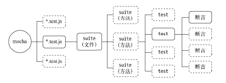

#### 测试

###### 单元测试
*单元测试的意义*
编写可测试代码有以下几个原则可以遵循：
- 单一职责。如果一段代码承担的职责越多，为其编写单元测试的时候就要构造更多的输入数据，然后推测它的输出
- 接口抽象。通过对程序代码进行接口抽象后，我们可以针对接口进行测试，而具体代码实现的变化不影响为接口编写的单元测试。
- 层次分离。层次分离实际上是单一职责的一种实现。在MVC结构的应用中，就是典型的层次分离模型，如果不分离各个层次，无法想象这个代码该如何切入测试。通过分层之后，可以逐层测试，逐层保证

*单元测试介绍*
单元测试主要包含断言、测试框架、测试用例、测试覆盖率、mock、持续集成等几个方面，由于Node的特殊性，它还会加入异步代码测试和私有方法的测试这两个部分

*断言*：断言就是单元测试中用来保证最小单元是否正常的检测方法
断言用于检查程序在运行时是否满足期望。JavaScript的断言规范最早来自于CommonJS的单元测试规范（详见http://wiki.commonjs.org/wiki/Unit_Testing/1.0），Node实现了规范中的断言部分。
```
var assert = require('assert'); 
assert.equal(Math.max(1, 100), 100); 
```
在断言规范中，定义了以下几种检测方法:
- ok()：判断结果是否为真。
- equal()：判断实际值与期望值是否相等。
- notEqual()：判断实际值与期望值是否不相等。
- deepEqual()：判断实际值与期望值是否深度相等（对象或数组的元素是否相等）。
- notDeepEqual()：判断实际值与期望值是否不深度相等。
- strictEqual()：判断实际值与期望值是否严格相等（相当于===）。
- notStrictEqual()：判断实际值与期望值是否不严格相等（相当于!==）。
- throws()：判断代码块是否抛出异常。
除此之外，Node的assert模块还扩充了如下两个断言方法。
- doesNotThrow()：判断代码块是否没有抛出异常。
- ifError()：判断实际值是否为一个假值（null、undefined、0、''、false），如果实际值为真值，将会抛出异常。

*测试框架*
测试框架用于为测试服务，它本身并不参与测试，主要用于管理测试用例和生成测试报告，提升测试用例的开发速度，提高测试用例的可维护性和可读性，以及一些周边性的工作

测试风格
测试用例的不同组织方式称为测试风格，现今流行的单元测试风格主要有TDD（测试驱动开发）和BDD（行为驱动开发）两种，它们的差别如下所示:
- 关注点不同。TDD关注所有功能是否被正确实现，每一个功能都具备对应的测试用例；BDD关注整体行为是否符合预期，适合自顶向下的设计方式。
- 表达方式不同。TDD的表述方式偏向于功能说明书的风格；BDD的表述方式更接近于自然语言的习惯

mocha的BDD风格示例
```
describe('Array', function(){ 
 before(function(){ 
 // ... 
 }); 
 describe('#indexOf()', function(){ 
 it('should return -1 when not present', function(){ 
 [1,2,3].indexOf(4).should.equal(-1); 
 }); 
 }); 
}); 
```
BDD对测试用例的组织主要采用describe和it进行组织。describe可以描述多层级的结构，具体到测试用例时，用it。另外，它还提供before、after、beforeEach和afterEach这4个钩子方法，用于协助describe中测试用例的准备、安装、卸载和回收等工作。before和after分别在进入和退出describe时触发执行，beforeEach和afterEach则分别在describe中每一个测试用例（it）执行前和执行后触发执行

mocha的TDD风格示例
```
suite('Array', function(){ 
 setup(function(){ 
 // ... 
 }); 
 suite('#indexOf()', function(){ 
 test('should return -1 when not present', function(){ 
 assert.equal(-1, [1,2,3].indexOf(4)); 
 }); 
 }); 
});
```
TDD对测试用例的组织主要采用suite和test完成。suite也可以实现多层级描述，测试用例用test。它提供的钩子函数仅包含setup和teardown，对应BDD中的before和after。


测试报告
mocha提供了相当丰富的报告格式，调用mocha --reporters即可查看所有的报告格式
默认的报告格式为dot，其他比较常用的格式有spec、json、html-cov等。执行mocha -R <reporter>命令即可采用这些报告。json报告因为其格式非常通用，多用于将结果传递给其他程序进行处理，而html-cov则用于可视化地观察代码覆盖率

测试用例
测试用例最少需要通过正向测试和反向测试来保证测试对功能的覆盖，这是最基本的测试用例。对于Node而言，不仅有这样简单的方法调用，还有异步代码和超时设置需要关注
- 异步测试
```
it('fs.readFile should be ok', function (done) { 
 fs.readFile('file_path', 'utf-8', function (err, data) { 
 should.not.exist(err); 
 done(); 
 }); 
}); 
```
测试用例方法it()接受两个参数；用例标题（title）和回调函数（fn）。通过检查这个回调函数的形参长度（fn.length）来判断这个用例是否是异步调用，如果是异步调用，在执行测试用例时，会将一个函数done()注入为实参，测试代码需要主动调用这个函数通知测试框架当前测试用例执行完成，然后测试框架才进行下一个测试用例的执行
- 超时设置
mocha给所有涉及异步的测试用例添加了超时限制，如果一个用例的执行时间超过了预期时间，将会记录下一个超时错误，然后执行下一个测试用例
```
it('async test', function (done) { 
 // 模拟一个要执行很久的异步方法
 setTimeout(done, 10000); 
}); 
```
mocha的默认超时时间为2000毫秒。一般情况下，通过mocha -t <ms>设置所有用例的超时时间。若需更细粒度地设置超时时间，可以在测试用例it中调用this.timeout(ms)实现对单个用例的特殊设置
```
it('should take less than 500ms', function (done) { 
 this.timeout(500); 
 setTimeout(done, 300); 
}); 
```
也可以在描述describe中调用this.timeout(ms)设置描述下当前层级的所有用例
```
describe('a suite of tests', function(){ 
 this.timeout(500); 
 it('should take less than 500ms', function (done) { 
 setTimeout(done, 300); 
 }); 
 it('should take less than 500ms as well', function (done) { 
 setTimeout(done, 200); 
 }); 
}); 
```

*测试覆盖率*
测试覆盖率是单元测试中的一个重要指标，它能够概括性地给出整体的覆盖度，也能明确地给出统计到行的覆盖情况

若要探知这个测试用例对源代码的覆盖率，需要一种工具来统计每一行代码是否执行，这里要介绍的相关工具是jscover模块。通过npm install jscover -g的方式可以安装该模块

jscover模块虽然已经够用，但是还有两个问题:
- 它的编译部分是通过Java实现的，这样环境依赖上就多出了Java。
- 它需要编译代码到一个额外的新目录，这个过程相对麻烦。
blanket模块解决了这两个问题，它由纯JavaScript实现，编译代码的过程也是隐式的，无须配置额外的目录，对于原模块项目没有额外的侵入

blanket与jscover的原理基本一致，在实现过程上有所不同，其差别在于blanket将编译的步骤注入在require中，而不是去额外编译成文件，执行测试时再去引用编译后的文件，它的技巧在require中

它的配置比jscover要简单，只需要在所有测试用例运行之前通过--require选项引入它即可：
mocha --require blanket -R html-cov > coverage.html 

另一个需要注意的是，在包描述文件中配置scripts节点。在scripts节点中，pattern属性用以匹配需要编译的文件：
```
"scripts": { 
 "blanket": { 
 "pattern": "eventproxy/lib" 
 } 
}, 
```
当在测试文件中通过require引入一个文件模块时，它将判断这个文件的实际路径，如果符合这个匹配规则，就对它进行编译

使用blanket之后，就无须配置环境变量了，也无须根据环境去判断引入哪种代码

*mock*
在测试领域里，模拟异常其实是一个不小的科目，它有着一个特殊的名词：mock。我们通过伪造被调用方来测试上层代码的健壮性等

由于mock的过程比较烦琐，这里推荐一个模块来解决此事——muk
```
var fs = require('fs'); 
var muk = require('muk'); 
before(function () { 
 muk(fs, 'readFileSync', function(path, encoding) { 
 throw new Error("mock readFileSync error"); 
 }); 
}); 
// it(); 
after(function () { 
 muk.restore(); 
}); 

var fs = require('fs'); 
var muk = require('muk'); 
beforeEach(function () { 
 muk(fs, 'readFileSync', function(path, encoding) { 
 throw new Error("mock readFileSync error"); 
 }); 
}); 
// it(); 
// it(); 
afterEach(function () { 
 muk.restore(); 
}); 
```
模拟时无须临时缓存正确引用，用例执行结束后调用muk.restore()恢复即可

值得注意的一点是，对于异步方法的模拟，需要十分小心是否将异步方法模拟为同步
```
fs.readFile = function (filename, encoding, callback) { 
 process.nextTick(function () { 
 callback(new Error("mock readFile error")); 
 }); 
};
```

*私有方法的测试*
除了将这些私有方法通过exports导出外。rewire模块提供了一种巧妙的方式实现对私有方法的访问。
rewire的调用方式与require十分类似。对于如下的私有方法，我们获取它并为其执行测试用例非常简单：
```
var limit = function (num) { 
 return num < 0 ? 0 : num; 
}; 

it('limit should return success', function () { 
 var lib = rewire('../lib/index.js'); 
 var litmit = lib.__get__('limit'); 
 litmit(10).should.be.equal(10); 
}); 
```
每一个被rewire引入的模块都有__set__()和__get__()方法。它巧妙地利用了闭包的诀窍，在eval()执行时，实现了对模块内部局部变量的访问，从而可以将局部变量导出给测试用例调用执行

###### 工程化与自动化
*工程化*
Node在*nix系统下可以很好地利用一些成熟工具，其中Makefile比较小巧灵活，适合用来构建工程

*持续集成*
travis-ci

###### 性能测试
单元测试主要用于检测代码的行为是否符合预期。在完成代码的行为检测后，还需要对已有代码的性能作出评估，检测已有功能是否能满足生产环境的性能要求，能否承担实际业务带来的压力。换句话说，性能也是功能。性能测试的范畴比较广泛，包括负载测试、压力测试和基准测试等

*基准测试*
基准测试要统计的就是在多少时间内执行了多少次某个方法。为了增强可比性，一般会以次数作为参照物，然后比较时间，以此来判别性能的差距

为了得到更规范和更好的输出结果，这里介绍benchmark这个模块是如何组织基准测试的
```
var Benchmark = require('benchmark'); 
var suite = new Benchmark.Suite(); 
var arr = [0, 1, 2, 3, 5, 6]; 
suite.add('nativeMap', function () { 
 return arr.map(callback); 
}).add('customMap', function () { 
 var ret = []; 
 for (var i = 0; i < arr.length; i++) { 
 ret.push(callback(arr[i])); 
 } 
 return ret; 
}).on('cycle', function (event) { 
 console.log(String(event.target)); 
}).on('complete', function() { 
 console.log('Fastest is ' + this.filter('fastest').pluck('name')); 
}).run(); 
```

###### 压力测试
对网络接口做压力测试需要考查的几个指标有吞吐率、响应时间和并发数，这些指标反映了服务器的并发处理能力

最常用的工具是ab、siege、http_load等，下面我们通过ab工具来构造压力测试
```
$ ab -c 10 -t 3 http://localhost:8001/ 
This is ApacheBench, Version 2.3 <$Revision: 655654 $> 
Copyright 1996 Adam Twiss, Zeus Technology Ltd, http://www.zeustech.net/ 
Licensed to The Apache Software Foundation, http://www.apache.org/ 
Benchmarking localhost (be patient) 
Completed 5000 requests 
Completed 10000 requests 
Finished 11573 requests 
Server Software: 
Server Hostname: localhost 
Server Port: 8001 
Document Path: / 
Document Length: 10240 bytes 
Concurrency Level: 10 
Time taken for tests: 3.000 seconds 
Complete requests: 11573 
Failed requests: 0 
Write errors: 0 
Total transferred: 119375495 bytes 
HTML transferred: 118507520 bytes 
Requests per second: 3857.60 [#/sec] (mean) 
Time per request: 2.592 [ms] (mean) 
Time per request: 0.259 [ms] (mean, across all concurrent requests) 
Transfer rate: 38858.59 [Kbytes/sec] received 
Connection Times (ms) 
 min mean[+/-sd] median max 
Connect: 0 0 0.3 0 31 
Processing: 1 2 1.9 2 35 
Waiting: 0 2 1.9 2 35 
Total: 1 3 2.0 2 35 
Percentage of the requests served within a certain time (ms) 
 50% 2
 66% 3 
 75% 3 
 80% 3 
 90% 3
 95% 3 
 98% 5 
 99% 6 
 100% 35 (longes % t request)
```

各个参数的含义:
- Document Path：表示文档的路径，此处为/。
- Document Length：表示文档的长度，就是报文的大小，这里有10KB。
- Concurrency Level：并发级别，就是我们在命令中传入的c，此处为10，即10个并发。
- Time taken for tests：表示完成所有测试所花费的时间，它与命令行中传入的t选项有细微出入。
- Complete requests：表示在这次测试中一共完成多少次请求。
- Failed requests：表示其中产生失败的请求数，这次测试中没有失败的请求。
- Write errors：表示在写入过程中出现的错误次数（连接断开导致的）。
- Total transferred：表示所有的报文大小。
- HTML transferred：表示仅HTTP报文的正文大小，它比上一个值小。
- Requests per second：这是我们重点关注的一个值，它表示服务器每秒能处理多少请求，是重点反映服务器并发能力的指标。这个值又称RPS或QPS。
- 两个Time per request值：第一个代表的是用户平均等待时间，第二个代表的是服务器平均请求处理事件，前者除以并发数得到后者。
- Transfer rate：表示传输率，等于传输的大小除以传输时间，这个值受网卡的带宽限制。
- Connection Times：连接时间，它包括客户端向服务器端建立连接、服务器端处理请求、等待报文响应的过程。

###### 基准测试驱动开发
简称也是BDD，全称为Benchmark Driven Development，即基准测试驱动开发，其中主要分为如下几步:
(1) 写基准测试。
(2) 写/改代码。
(3) 收集数据。
(4) 找出问题。
(5)回到第(2)步


#### 产 品 化
###### 项目工程化
所谓的工程化，可以理解为项目的组织能力。体现在文件上，就是文件的组织能力
- 目录结构
  - 主要的两类项目为Web应用和模块应用。普通的模块应用遵循CommonJS的模块和包规范即可
- 构建工具
在Node的应用中，主流的构建工具还是老牌的make，但它的缺点是只在*nix操作系统下有效。为了实现跨平台，Grunt应运而生。Grunt通过Node写成，借助Node的跨平台能力，实现了很好的平台兼容性。
Makefile
  - Makefile文件是*nix系统下经典的构建工具。除了Windows系统外，其他系统几乎都能使用它。受Makefile影响的还有Ruby的Rakefile和Gemfile等。Makefile文件通常用来管理一些编译相关
Grunt
  - Makefile唯一的缺陷也许就是跨平台问题了，为此才有ant、rake等工具的出现。在Node生态系统中，也有一款构建工具解决了Makefile无法跨平台的问题——Grunt。
  - Grunt用Node写成，能够同时在Windows和*nix平台下运行。
  - Grunt结合NPM的包依赖管理，完全可以媲美Java世界的Maven工具，同时它又如Makefile一样，能够用来构建完善的自动化任务工具。
  - 它的设计理念与Makefile并不相同：Makefile依托强大的bash编程，Grunt则依托它丰富的插件，它自身提供通用接口用于插件的接入，具体的任务则由插件完成。
  - Grunt的核心插件以grunt-contrib-开头，在NPM包管理平台上可以找到和查看。Grunt提供了3个模块分别用于运行时、初始化和命令行：grunt、grunt-init、grunt-cli。后面两个模块都可以作为命令行工具使用，安装时带-g即可

- 编码规范
编码规范的统一一般有几种实现方式，一种是文档式的约定，一种是代码提交时的强制检查。前者靠自觉，后者靠工具

- 代码审查
代码审查主要在请求合并的过程中完成，需要审查的点有功能是否正确完成、编码风格是否符合规范、单元测试是否有同步添加等

###### 部署流程
*部署环境*
普通测试环境称为stage环境，预发布环境称为pre-release环境，实际的生产环境称为product环境

*部署操作*
为了能让进程持续执行，我们可能会用到nohup和&以不挂断进程的方式执行：nohup node app.js &

###### 性能
对于Web应用而言，最直接有效的莫过于动静分离、多进程架构、分布式，其中涉及的几个拆分原则如下所示。
- 做专一的事。
- 让擅长的工具做擅长的事情。
- 将模型简化。
- 将风险分离

*动静分离*
将图片、脚本、样式表和多媒体等静态文件都引导到专业的静态文件服务器上，让Node只处理动态请求即可。这个过程可以用Nginx或者专业的CDN来处理


*启用缓存*
提升性能其实差不多只有两个途经，一是提升服务的速度，二是避免不必要的计算。前者提升的性能在海量流量面前终有瓶颈，但后者却能够在访问量越大时收益越多。避免不必要的计算，应用场景最多的就是缓存

*多进程架构*
*读写分离*

###### 日志
*访问日志*
访问日志一般用来记录每个客户端对应用的访问。在Web应用中，主要记录HTTP请求中的关键数据。
中间件框架Connect在其众多中间件中提供了一个日志中间件，通过它可以将关键数据按一定格式输出到日志文件中。
```
var app = connect(); 
// 记录访问日志
connect.logger.format('home', ':remote-addr :response-time - [:date] ":method :url 
HTTP/:http-version" :status :res[content-length] ":referrer" ":user-agent" :res[content-length]'); 
app.use(connect.logger({ 
 format: 'home', 
 stream: fs.createWriteStream(__dirname + '/logs/access.log') 
}));
```

*异常日志*
异常日志通常用来记录那些意外产生的异常错误。通过日志的记录，开发者可以根据异常信息去定位bug出现的具体位置，以快速修复问题。
异常日志通常有完善的分级，Node中提供的console对象就简单地实现了这几种划分，具体如下所示:
- console.log：普通日志。
- console.info：普通信息。
- console.warn：警告信息。
- console.error：错误信息。
console模块在具体实现时，log与info方法都将信息输出给标准输出process.stdout，warn与error方法则将信息输出到标准错误process.stderr，而info和error分别是log和warn的别名。

console对象上具有一个Console属性，它是console对象的构造函数。借助这个构造函数，我们可以实现自己的日志对象
```
var info = fs.createWriteStream(logdir + '/info.log', {flags: 'a', mode: '0666'}); 
var error = fs.createWriteStream(logdir + '/error.log', {flags: 'a', mode: '0666'}); 
var logger = new console.Console(info, error); 
logger.log('Hello world!'); 
logger.error('segment fault');
```
对于未捕获的异常，Node提供了机制以免进程直接退出，但是发生未捕获异常的进程也不能继续在线上进行服务了，因为可能有内存泄漏的风险产生

###### 日志与数据库
将日志分析和日志记录这两个步骤分离开来是较好的选择。日志记录可以在线写，日志分析则可以借助一些工具同步到数据库中，通过离线分析的方式反馈出来

分割日志
日志的写入一般都是依托在可写流上的。对于Console对象，它的内部属性_stdout和_stderr就是指向我们传入的两个输入流对象的

###### 监控报警

*监控*
监控的主要目的是为了将一些重要指标采样记录下来，一旦这些指标发生较大变化，可以配合报警系统将问题反馈到负责人那
- 日志监控
业务逻辑型的监控主要体现在日志上,除了异常日志的监控外，对于访问日志的监控也能体现出实际的业务QPS值。观察QPS的表现能够检查业务在时间上的分布
- 响应时间
响应时间也是一个需要监控的点。一旦系统的某个子系统出现异常或者性能瓶颈，将会导致系统的响应时间变长
健康的系统响应时间应该是波动较小的、持续均衡的
- 进程监控
监控进程一般是检查操作系统中运行的应用进程数，比如对于采用多进程架构的Web应用，就需要检查工作进程的数量，如果低于预估值，就应当发出报警声。
- 磁盘监控
磁盘监控主要是监控磁盘的用量。
给磁盘的使用量设置一个上限，一旦磁盘用量超过警戒值，服务器的管理者就应该整理日志或清理磁盘了
- 内存监控
如果内存只升不降，那么铁定存在内存泄漏问题。健康的内存使用应当是有升有降，在访问量大的时候上升，在访问量回落的时候，占用量也随之回落
如果进程中存在内存泄漏，又一时没有排查解决，有一种方案可以解决这种状况。这种方案应用于多进程架构的服务集群，让每个工作进程指定服务多少次请求，达到请求数之后进程就不再服务新的连接，主进程启动新的工作进程来服务客户，旧的进程等所有连接断开后就退出。这样即使存在内存泄漏的风险，也能有效地规避内存泄漏带来的影响
- CPU占用监控
服务器的CPU占用监控也是必不可少的项，CPU的使用分为用户态、内核态、IOWait等
CPU的使用率中，用户态小于70%、内核态小于35%且整体小于70%时，处于健康状态
- CPU load监控
CPU load又称CPU平均负载，它用来描述操作系统当前的繁忙程度，可以简单地理解为CPU在单位时间内正在使用和等待使用CPU的平均任务数。它有3个指标，即1分钟的平均负载、5分钟的平均负载、15分钟的平均负载
- I/O负载
I/O负载指的主要是磁盘I/O。反应的是磁盘上的读写情况，对于Node编写的应用，主要是面向网络服务，是故不太可能出现I/O负载过高的情况，大多数的I/O压力来自于数据库
- 网络监控
网络流量监控的两个主要指标是流入流量和流出流量
- 应用状态监控
除了这些硬性需要检测的指标外，应用还应当提供一种机制来反馈其自身的状态信息，外部监控将会持续性地调用应用的反馈接口来检查它的健康状态
- DNS监控
DNS是网络应用的基础，在实际的对外服务产品中，多数都对域名有依赖。DNS故障导致产品出现大面积影响的事件并不少见。由于DNS服务通常是稳定的，容易让人忽略，但一旦出现故障，就可能是史无前例的故障。对于产品的稳定性，域名DNS状态也需要加入监控

*报警的实现*
搭配监控系统的则是报警系统，空有监控而没有通知功能，故障也是无法及时反馈给开发者的。如今的报警已经能够多样化，- 邮件报警、IM报警适合在线工作状态
- 短信或电话报警适合非在线状态

邮件报警: 如果报警系统由Node编写，可以调用nodemailer模块来实现邮件的发送
```
var nodemailer = require("nodemailer"); 
// 建立一个SMTP传输连接
var smtpTransport = nodemailer.createTransport("SMTP", { 
 service: "Gmail", 
 auth: { 
 user: "gmail.user@gmail.com", 
 pass: "userpass" 
 } 
}); 
// 邮件选项
var mailOptions = { 
 from: "Fred Foo ✔ <foo@bar.com>", // 发件人邮件地址
 to: "bar@bar.com, baz@bar.com", // 收件人邮件地址列表
 subject: "Hello ✔", // 标题
 text: "Hello world ✔", // 纯文本内容
 html: "<b>Hello world ✔</b>" // HTML内容
} 
// 发送邮件
smtpTransport.sendMail(mailOptions, function (err, response) { 
 if (err) { 
 console.log(err); 
 } else { 
 console.log("Message sent: " + response.message); 
 } 
});
```

短信或电话报警。一些短信服务平台提供短信接入服务，可以在监控系统中接入此类服务时，一旦线上出现到达阈值的异常时，就将信息发送给应用相关的责任人。

###### 稳定性
- 多机器：多机器部署应用带来的好处是能利用更多的硬件资源，为更多的请求服务。同时能够在有故障时，继续服务用户请求，保证整体系统的高可用性。但是一旦出现分布式，就需要考虑负载均衡、状态共享和数据一致性等问题。

- 多机房：多机房部署是比多机器部署更高层次的部署，目的是为了解决地理位置给用户访问带来的延迟等问题。在容灾方面，机房与机房之间可以互为备份
- 容灾备份：在多机房和多机器的部署结构下，十分容易通过备份的方式进行容灾，任何一台机器或者一个机房停止了服务，都能有其余的服务器来接替新的任务