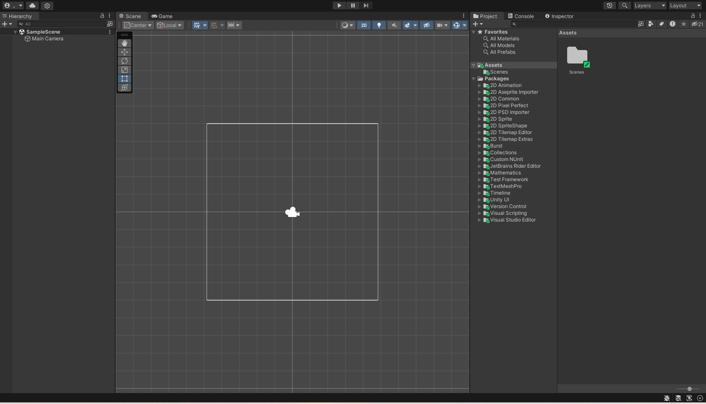

#### 安装Unity Editor

1. 使用Hub安装
教程：https://docs.unity.cn/hub/manual/InstallHub.html

2. 使用命令行安装
教程：https://docs.unity.cn/cn/current/Manual/InstallingUnity.html

3. 离线安装
教程：https://docs.unity.cn/cn/current/Manual/DeployingUnityOffline.html

#### Unity界面

###### 场景拾取控件
要切换场景可拾取性，请执行以下操作：
- 单击 Hierarchy 窗口中游戏对象的可拾取性图标，在启用和禁用游戏对象及其子项的拾取之间进行切换。
注意：切换游戏对象及其子项的可拾取性会影响所有子游戏对象（从“目标”游戏对象一直到层级视图的底部）。
- 按住 Alt 并单击 Hierarchy 窗口中游戏对象的可拾取性图标，在仅启用和禁用这个游戏对象的拾取之间进行切换。
注意：切换单个游戏对象的可拾取性不会影响其子项。这些子项会保留以前具有的任何可拾取性状态。

###### 资源工作流程
资源表示 Unity 项目中用来创建游戏或应用的任何项。资源可以代表项目中的视觉或音频元素，例如 3D 模型、纹理、精灵、音效或音乐。资源还可以表示更抽象的项目，例如任何用途的颜色渐变、动画遮罩或任意文本或数字数据。
流程：导入、创建、构建、分发、加载，具体如下：
将资源导入 Unity 编辑器
使用 Unity 编辑器通过这些资源创建内容。
构建您的应用或游戏文件，以及可选的随附内容包
分发构建的文件，以便您的用户可以通过发布者或应用程序商店访问
根据您用户的行为以及您对内容进行分组和捆绑的方式，在运行时根据需要加载进一步更新。

- 工作流程考虑事项
如果您使用大量作为单独包发布的资源，可能会发现将部分资源组分离为单独的项目很有帮助，这样您的团队成员就不需要一次性加载大型项目来使用这些资源包。
- 平台注意事项
用户对平台的期望也是一个重要的考虑因素。例如，在移动平台上，漫长的初始下载和安装过程可能会导致玩家尚未尝试就放弃了您的应用。出于这个原因，移动应用通常在初始构建中只包含最少的资源集，并在用户第一次运行您的应用时从远程服务器下载剩余的资源。

- 常用的资源类型
3D 模型文件
图像文件
音频文件||Text、HTML、XML、JSON

- 内置导入器
unity有自己的内置导入期，具体可查看：[内置导入器](https://docs.unity.cn/cn/current/Manual/BuiltInImporters.html)

- 脚本化导入器 (Scripted Importer)
Scripted Importer 是 Unity Scripting API 的一部分。您可以使用 Scripted Importer 使用 C# 为 Unity 本身不支持的文件格式编写自定义资源导入器，从而添加支持。
*注意：Scripted Importer 无法处理已由 Unity 本身处理的文件扩展名。*
[脚本化导入器](https://docs.unity.cn/cn/current/Manual/ScriptedImporters.html)

- 导入器一致性
资源导入器，包括您编写的任何脚本化导入器，应产生一致（确定性）的结果。这意味着它们应始终从相同的输入和依赖集产生相同的输出。
检查一致性的两种方法是：
在编辑器中手动重新导入一项或多项资源
使用 -consistencyCheck 命令行参数打开编辑器。

- Text assets
__文本资源__是导入的文本文件的格式。将文本文件拖放到 Project 文件夹中时，它将转换为文本资源。支持的文本格式如下：
.txt
.html
.htm
.xml
.bytes
.json
.csv
.yaml
.fnt

注意：
文本资源与所有其他资源一样会在构建中经过序列化。发布游戏时并不包含物理文本文件。
文本资源不适用于在运行时生成文本文件。(https://docs.unity.cn/cn/current/Manual/class-TextAsset.html)

- 资源元数据
Unity 为资源分配唯一 ID。（ID 通常在编辑器中不可见）
Unity 创建一个伴随资源文件的 .meta 文件。
Unity 对资源进行处理。

Unity 针对空文件夹采用以下特定方式：
如果 Unity 检测到一个空文件夹不再含有相应的元文件，如果该文件夹以前有元文件，Unity 会假设元文件被另一个用户通过在 VCS 中删除该文件夹时删除，并在本地删除该空文件夹。
如果 Unity 检测到文件夹有一个新的元文件，但该文件夹在本地不存在，则 Unity 会假设新元文件是被另一个用户通过在 VCS 中添加文件夹而创建，并在本地创建相应的空文件夹。

- Unity中常见的资源类型
1、原始资源文件（从外部创建并导入Unity，每一个类型都对应一个AssetImporter）：
Texture、Model、AudioClip、VideoClip、TextAsset、Font、其他。

2、代码文件：
C#脚本文件、代码库文件、shader文件 等。导入时Unity会进行一次编译 

3、序列化文件（可在Unity中创建、编辑，能够被Unity运行时反序列化的文件）
Sprite、SpriteAtlas、Prefab、Scene、Script、Shader、Materrial、AnimationClip、RenderTexture、CustomRenderTexture、AudioMixer、CustomFont、GUISkin、PhysicMaterial、ComputeShader、AnimatorController、AnimatorOverrideController、AvatarMask、Brush、Cubemap、LightmapParameters、Timeline、Signal、TerrainLayer、AssemblyDefinition、AssemblyDefinitionReference、Asset(ScriptableObject)文件、其他。

4、文本文档（Unity 识别为 TextAsset，无 ImportSetting）
txt、xml、json、二进制文件、其他。

5、非序列化文件（Unity无法识别的文件，如文件夹）

6、Meta文件
*可能会依赖其他资源的资源*：
Model、SpriteAtlas、Prefab、Scene、Materrial、CustomFont、GUISkin、AnimatorController、AnimatorOverrideController、AvatarMask、Brush、Cubemap、Timeline、TerrainLayer、其他。

- 特定资源文件夹
Unity会将许多文件夹名解释为一条指令，说明文件夹中的内容应该以一种特殊的方式处理。

1、Assets: Unity项目资源主文件夹。除了部分函数需要将Assets文件夹包含在资源路径名中(例如，AssetDatabase类中的某些函数)， 其他大部分都不用。

2、Editor: 放在Editor文件夹中的脚本被视为Editor脚本而不是运行时脚本，这些脚本在开发期间向Editor添加功能，并在运行时的构建中不可用。
可在Assets文件夹中的任何位置添加多个Editor文件夹。应将Editor脚本放在Editor文件夹内或其子文件夹内。

3、Editor Default Resources：Editor脚本可以通过 EditorGUIUtility.Load 函数按需加载资源文件，此函数将在 Editor Default Resources 文件夹中查找资源文件（也可放在Editor/Resources下）。
只能有一个 Editor Default Resources 文件夹，且必须放在项目的根目录（直接位于Assets文件夹中）。资源可放在其子文件夹，加载时需拼上路径。

4、Gizmos：此文件夹允许将图形添加到Scene视图，以帮助可视化不可见的设计细节。Gizmos.DrawIcon 函数在场景中放置一个图标，作为特殊对象或位置标记。必须将图像放在Gizmos文件夹中，才能被DrawIcon函数找到。
只能有一个Gizmos 文件夹，且必须放在项目的根目录（直接位于Assets文件夹中）。资源可放在其子文件夹，加载时需拼上路径。
    
5、Plugins：可为项目添加插件来扩展Unity的功能。插件通常是用C/C++编写的本地DLL。这些插件可以访问第三方代码库、系统调用和其他Unity内置功能。请始终将插件放在 名为 Plugins 的文件夹中，才能被Unity检测到。
只能有一个Plugins 文件夹，且必须放在项目的根目录（直接位于Assets文件夹中）。

6、Resources: 可从脚本中按需加载资源。应将资源放在名为 Resources的文件夹中，使用 Resources.Load函数加载。
可在Assets文件夹中的任何位置添加多个Resources文件夹。资源可放在其子文件夹，加载时需拼上路径。
注意，如果Resources是Ediotr的子文件夹，则其中的资源可通过Editor脚本加载，但会从构建中剥离。

7、Standard Assets: 标准资源导入后的文件夹。
只能有一个Standard Assets文件夹，且必须放在项目的根目录（直接位于Assets文件夹中）。资源可放在其子文件夹。

8、StreamingAssets: 希望资源以其原始格式作为单独的文件使用。例如文件系统访问视频文件。StreamingAssets中的文件可以按原样复制到目标计算机，然后就能从特定文件夹中访问该文件。
只能有一个StreamingAssets文件夹，且必须放在项目的根目录（直接位于Assets文件夹中）。资源可放在其子文件夹，加载时需拼上路径。

9、隐藏的资源：为防止导入由操作系统或其他应用程序创建的特殊文件和临时文件，Unity会忽略Assets文件夹中的以下文件：隐藏的文件夹、以**.**开头的文件和文件夹、以**~**结尾的文件和文件夹、名为cvs的文件和文件夹、扩展名为.tmp的文件。

- 系统资源路径
1、Application.dataPath：包含游戏数据文件夹的路径（只读）。
和平台相关：
Unity Editor: <path to project folder>/Assets
iOS: <path to player app bundle>/<AppName.app>/Data（只读文件夹，可使用Application.persistentDataPath保存）
Android: 通常它会直接指向APK。但如果正在运行拆分的二进制构建，它将指向OBB（Opaque Binary Blob ）
Mac player: <path to player app bundle>/Contents
Win/Linux player: <path to executablename_Data folder>（请注意，大多数Linux安装都区分大小写！）
WebGL: 播放器数据文件目录的绝对url(不含实际的数据文件名)
Windows Store Apps: 播放器数据文件目录的绝对url（只读文件夹，可使用Application.persistentDataPath保存）

2、Application.persistentDataPath：包含持久数据目录的路径（可读可写）。
该值是一个目录路径，其中可以存储需要在运行之间保留的数据。在 iOS 和 Android 上发布时，persistentDataPath 将指向设备上的公共目录。每次更新应用程序时，不会擦除此位置中的文件。但用户可以直接删除这些文件。

*请注意*，在构建应用程序时，将基于 Bundle ID 生成 GUID，并且此 GUID 将成为 persistentDataPath 的一部分。如果您在将来的版本中保留相同的 Bundle ID，那么应用程序将在每次更新时继续访问相同的位置。
Windows Store Apps: 指向 %userprofile%\AppData\Local\Packages\<productname>\LocalState.
iOS: 指向 /var/mobile/Containers/Data/Application/<guid>/Documents.
Android: 通常指向 /storage/emulated/0/Android/data/<packagename>/files  (一些旧手机可能会指向SD卡上的位置), 可使用 android.content.Context.getExternalFilesDir 解析路径。

3、Application.streamingAssetsPath：StreamingAssets文件夹的路径(只读)。
在运行时，Application.streamingAssetsPath 提供文件夹的路径。如果将资产添加到 StreamingAssets文件夹。构建的应用程序就可以在这个地址加载资产。
在WebGL和Android平台上不能访问StreamingAssets文件夹。因为 WebGL上没有可用的文件访问；而Android使用一个压缩的 .apk 文件，文件会被包含在压缩在 .jar文件（其格式与标准的zip压缩文件基本相同）中。这些平台返回一个URL，可以使用UnityWebRequest类访问URL来获得资产。
Windows/MacOS:  Application.dataPath + "/StreamingAssets".
    iOS: Application.dataPath + "/RAW".
    Android: "jar://file://" + Application.dataPath + "!/assets/".
    注意：位于 StreamingAssets 文件夹中的 .dll 文件不参与编译。
4、Application.temporaryCachePath：包含临时数据/缓存目录的路径（只读）。
    该值是可以存储临时数据的目录路径。

- 资源数据库
对于大多数类型的资源，Unity 需要将资源的源文件中的数据转换为可用于游戏或实时应用程序的格式。这些转换后的文件及其关联的数据会存储在资源数据库 (Asset Database) 中。

*资源导入依赖项*
资源数据库可以跟踪每个资源的所有依赖项，并保留导入版本的所有资源的缓存。
资源的导入依赖项包括可能影响所导入数据的全部数据。例如，一个资源的源文件是一个依赖项以及资源的导入设置（例如纹理的压缩类型）或项目的目标平台（例如，PS4 硬件要求的数据格式与 Android 硬件不同）。如果修改其中任意一个依赖项，则缓存版本的已导入资源都将变为无效状态，并且 Unity 必须将其重新导入才能反映所做的更改。

*资源缓存*
资源缓存是 Unity 存储导入版本的资源的位置。默认情况下，Unity 使用本地缓存，这意味着导入版本的资源将缓存在本地计算机上项目文件夹的 Library 文件夹中。应该使用 ignore file 从版本控制中排除此文件夹。类似Git。
团队成员并且使用版本控制系统，最好使用 [Unity Accelerator](https://docs.unity.cn/cn/current/Manual/UnityAccelerator.html)，它可以跨 LAN 共享资源缓存。

*源资源和 Artifact*
Unity 在 Library 文件夹中保留两个数据库文件，它们统称为资源数据库。这两个数据库可以跟踪有关源资源文件和 Artifact（这是有关导入结果的信息）的信息。
数据库文件位于项目的 Library 文件夹中，因此应从版本控制系统中将这些文件排除。可以在以下位置找到它们：
(1).源资源数据库：Library\SourceAssetDB
(2).Artifact 数据库：Library\ArtifactDB

- 特殊文件夹名称
Assets: Assets 文件夹是包含 Unity 项目使用的资源的主文件夹。
Editor: Editor脚本在开发过程中为Unity添加功能，Editor文件夹中的脚本作为Editor脚本运行，而不是运行时脚本。
Editor Default Resources：Editor 脚本可以使用通过 EditorGUIUtility.Load 函数按需加载的资源文件。此函数在名为 Editor Default Resources 的文件夹中查找资源文件。
Gizmos：Gizmos 允许将图形添加到 Scene 视图，以帮助可视化不可见的设计细节。Gizmos.DrawIcon 函数在场景中放置一个图标，作为特殊对象或位置的标记。必须将用于绘制此图标的图像文件放在名为 Gizmos 的文件夹中，这样才能被 DrawIcon 函数找到。
Resources：可从脚本中按需加载资源，而不必在场景中创建资源实例以用于游戏。为此，应将资源放在一个名为 Resources 的文件夹中。通过使用 Resources.Load 函数即可加载这些资源。
Standard Assets
StreamingAssets：流媒体文件
Android Asset Packs：以.androidpack结尾的文件夹
Android 库项目：以.androidlib结尾的文件夹

隐藏的资源
在导入过程中，Unity 忽略 Assets 文件夹（或其子文件夹）中的以下文件和文件夹：
隐藏的文件夹。
以“.”开头的文件和文件夹。
以“~”结尾的文件和文件夹。
名为 cvs 的文件和文件夹。
扩展名为 .tmp 的文件。

四、发布时会被打入包内的资源：
1、Assets下所有非编辑器脚本文件。
2、Assets下所有 参与构建的Scene文件（BuildSettings Scenes In Build 处设置）。
3、Assets下直接或间接被 “参与构建的Scene文件” 所依赖的文件。
4、Resources下的所有文件。
5、Assets下直接或间接被 “Resources下的文件” 所依赖的文件。
6、StreamingAssets下的所有文件（会被逐字拷入目标平台的特定文件夹）。
7、Assets下所有 参与构建的Shader文件（ProjectSetting Built-in Shader Setting处设置）。
8、Plugins下的对应平台下的文件。

文本资源不适用于在运行时生成文本文件？？？？
VCS: version control system (版本控制系统)
unity的开发保存在哪里？本地？线上？
不可序列化变量??? (https://docs.unity.cn/cn/current/Manual/AssetDatabaseRefreshing.html)