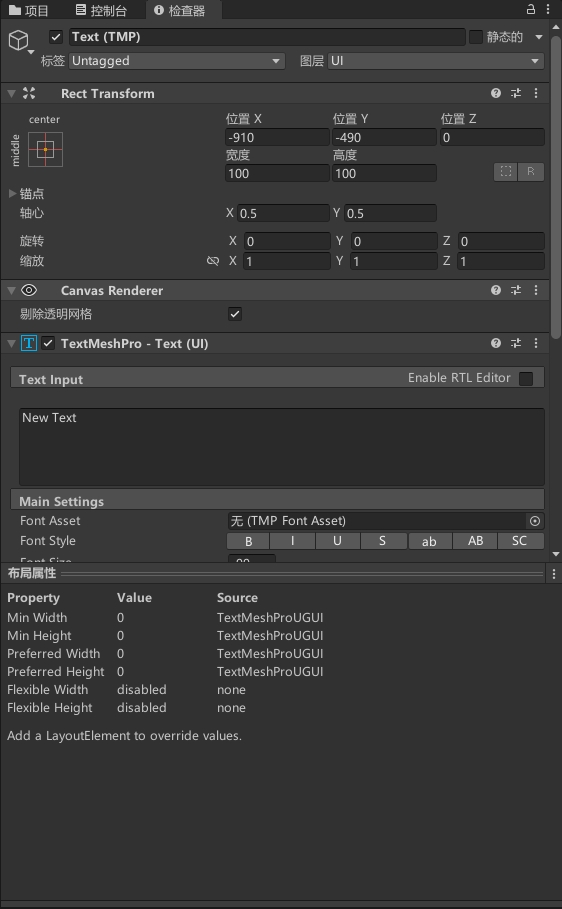

## 组件

#### UI组件
*Text*
用于在UI界面中显示文本。它可以用于在UI界面中显示标题、说明、按钮标签等文本信息。
在Unity中，UI界面是一个非常重要的元素，用于展示游戏的各种信息。为了在UI界面中显示文本信息，需要使用Text组件。Text组件可以设置文本的字体、大小、颜色、对齐方式等属性，用于调整文本的显示效果。
Text组件还支持多种不同的文本排版方式，例如水平排版、垂直排版等，以满足不同的UI设计需求。它还支持自动换行、富文本等功能，以实现更加丰富和自然的文本显示效果。
使用Text组件可以在UI界面中显示各种文本信息，以实现游戏的交互性和信息传递效果。它可以用于各种UI界面，例如主菜单、设置界面、商店界面等，让游戏更加友好和易用。

*TextMeshPro-Text（UI）*
高级UI元素组件，用于在UI界面中显示高质量的文本。它是Unity Text组件的升级版，具有更高的分辨率、更好的字体渲染效果和更多的文本控制功能。
TextMeshPro-Text（UI）可以使用TrueType字体文件，支持丰富的字体特效和文本排版样式。它可以调整文本的字体、大小、颜色、对齐方式等属性，支持自动换行、富文本等功能，以实现更加丰富和自然的文本显示效果。
TextMeshPro-Text（UI）还支持不同的文本渲染模式，例如Distance Field模式、Bitmap模式等，以满足不同的UI设计需求。它还支持文本动画、曲线文本、3D文本等高级文本控制功能，以实现更加生动和多样化的文本效果。

*Input Field*
用于在UI界面中显示可编辑的文本框。它可以用于让用户在UI界面中输入文本信息，例如用户名、密码、搜索关键字等。
在Unity中，UI界面是一个非常重要的元素，用于展示游戏的各种信息。为了让用户在UI界面中输入文本信息，需要使用Input Field组件。Input Field组件可以设置文本框的大小、字体、颜色、对齐方式等属性，用于调整文本框的显示效果。
Input Field组件还支持多种不同的输入方式，例如键盘输入、触摸输入等，以实现不同平台的输入控制。它还支持输入验证、密码遮罩、自动补全等功能，以提高输入的准确性和效率。
使用Input Field组件可以在UI界面中实现文本输入功能，以实现游戏的交互性和信息传递效果。它可以用于各种UI界面，例如登录界面、注册界面、搜索界面等，让游戏更加友好和易用。

*Dropdown*
用于在UI界面中显示下拉列表框。它可以用于让用户在UI界面中选择一个特定的选项，例如选择游戏难度、选择语言等。
Dropdown组件可以设置下拉列表框的大小、字体、颜色、对齐方式等属性，用于调整下拉列表框的显示效果。它还可以设置列表中的选项，通过代码或Inspector面板添加、删除、修改选项。
Dropdown组件还支持多种不同的选择方式，例如鼠标点击、键盘选择等，以实现不同平台的选择控制。它还支持选择事件、滚动条、下拉列表框的展开和收缩等功能，以提高选择的准确性和效率。

*Slider*
用于在UI界面中显示滑动条。它可以用于让用户在UI界面中选择一个特定的数值范围，例如调整音量、调整游戏难度等。
Slider组件可以设置滑动条的大小、颜色、对齐方式等属性，用于调整滑动条的显示效果。它还可以设置滑动条的最小值、最大值、当前值等参数，通过代码或Inspector面板修改数值范围和当前值。
Slider组件还支持多种不同的滑动方式，例如鼠标拖动、键盘控制等，以实现不同平台的操作控制。它还支持数值变化事件、滑块的拖动范围、滑动方向等功能，以提高操作的准确性和效率。

*Scrollbar*
用于在UI界面中显示滚动条。它可以用于让用户在UI界面中滚动内容，例如滚动文本、滚动图片等。
Scrollbar组件可以设置滚动条的大小、颜色、对齐方式等属性，用于调整滚动条的显示效果。它还可以设置滚动条的当前值、最大值等参数，通过代码或Inspector面板修改数值范围和当前值。
Scrollbar组件还支持多种不同的滚动方式，例如鼠标滚轮、拖动等，以实现不同平台的操作控制。它还支持数值变化事件、滑块的拖动范围、滚动方向等功能，以提高操作的准确性和效率。

*Button*
用于在UI界面中显示可点击的按钮。它可以用于让用户在UI界面中进行各种操作，例如打开菜单、选择关卡等。

*Selectable*
用于在UI界面中显示可选中的元素。它可以用于让用户在UI界面中选择和操作各种元素，例如选择角色、选中物品等。

*Image*
用于在UI界面中显示图片。它可以用于在UI界面中显示2D图像、背景、按钮等。

*Shadow*
用于在UI界面中为其他UI元素添加阴影效果。它可以用于为文本、图像、按钮等UI元素添加阴影效果，以提高视觉效果和可读性。
Shadow组件可以设置阴影的颜色、偏移、模糊半径等属性，用于调整阴影效果的强度和样式。它还可以设置阴影的形状、角度、距离等属性，以实现不同的阴影效果。
Shadow组件还支持多种不同的阴影类型，例如内阴影、外阴影、双向阴影等，以满足不同的视觉需求。它还可以设置阴影的交互状态、禁用状态等功能，以提高操作的准确性和效率。
使用Shadow组件可以为UI界面中的其他UI元素添加阴影效果，以提高视觉效果和可读性。它可以用于各种UI界面，例如按钮、文本、图像等，让游戏更加美观和易用。

*Mask*
Rect Mask 2D和Mask都是Unity中用于实现UI遮罩效果的组件，它们的作用相似但是有一些区别。
Rect Mask 2D是一种特殊的Mask，在UI界面中可用于实现矩形遮罩效果。它可以用于隐藏UI元素的一部分内容，以实现滚动列表、面板、弹出菜单等功能。与普通的Mask相比，Rect Mask 2D更加灵活，可以实现更多类型的遮罩效果。
而Mask组件是一种通用的遮罩组件，可以用于实现各种形状的遮罩效果，包括矩形、圆形、自定义形状等。Mask组件可以将遮罩应用到UI元素的子元素中，以实现只遮罩该子元素的效果。它的灵活性较高，但是相比于Rect Mask 2D，其实现方式更加复杂。
因此，如果需要实现矩形遮罩效果，建议使用Rect Mask 2D组件；如果需要实现其他形状的遮罩效果，建议使用Mask组件。

#### LAYOUT组件

*Rect Transform*
用于控制UI元素的位置、大小和旋转。它是基于屏幕坐标系而不是世界坐标系来控制UI元素的位置和大小的。
RectTransform组件可以让UI元素相对于父级容器进行缩放、旋转和平移，这使得UI设计师可以更方便地创建自适应的UI布局。

*Canvas*
用于呈现2D的UI元素。它是一个容器，可以包含其他UI元素，如文本、按钮、图像、滚动视图等。Canvas可以在场景中放置，并且可以在屏幕上显示出来。
Canvas有两种渲染模式：Screen Space和World Space。Screen Space模式下，Canvas的大小和位置是基于屏幕的，UI元素的位置和大小也是相对于屏幕的。World Space模式下，Canvas的大小和位置基于游戏世界的坐标系，UI元素的位置和大小也是相对于游戏世界的。

*Vertical Layout Group*
用于在Canvas中垂直排列子元素，方便开发者快速创建垂直布局的UI界面。
Vertical Layout Group可以设置子元素之间的间距、子元素的大小、子元素的对齐方式等参数，还可以自动调整子元素的位置和大小，以适应不同的屏幕尺寸和分辨率。
使用Vertical Layout Group可以快速创建垂直滚动列表、垂直菜单等UI界面，节省开发时间和精力。

*Layout Element*
用于控制UI元素的最小、首选和最大尺寸。它可以帮助开发人员在Canvas中创建灵活的UI布局，以适应不同的屏幕尺寸和分辨率。
Layout Element可以设置最小、首选和最大尺寸的宽度和高度，还可以设置UI元素的最小和最大宽高比。它也可以设置是否强制将UI元素的尺寸限制在最小和最大值之间。
使用Layout Element可以控制UI元素的大小和比例，使其在不同的屏幕尺寸和分辨率下具有一致的外观和布局。它可以与其他UI组件如Layout Group和Content Size Fitter结合使用，创建更加复杂和灵活的UI布局。

*Content Size Fitter*
用于根据UI元素的内容自动调整UI元素的大小。它可以帮助开发人员在Canvas中创建自适应的UI布局，以适应不同的屏幕尺寸和分辨率。
Content Size Fitter可以设置UI元素的最小和最大尺寸，还可以设置UI元素的宽度和高度是否应该根据其内容自动调整。它可以根据UI元素的内容自动调整UI元素的大小，使其适应不同的屏幕尺寸和分辨率。
使用Content Size Fitter可以创建自适应的UI布局，使UI元素的大小根据其内容自动调整，以避免内容被裁剪或空白区域过多。它可以与其他UI组件如Layout Group和Layout Element结合使用，创建更加灵活和自适应的UI布局。

*Aspect Ratio Fitter*
用于根据UI元素的纵横比例自动调整UI元素的大小。它可以帮助开发人员在Canvas中创建具有一致纵横比例的UI布局，以适应不同的屏幕尺寸和分辨率。
Aspect Ratio Fitter可以设置UI元素的纵横比例，还可以设置UI元素是否应该根据其父级容器的大小自动调整大小。它可以根据UI元素的纵横比例自动调整UI元素的大小，保持其与其他UI元素的纵横比例一致。
使用Aspect Ratio Fitter可以创建具有一致纵横比例的UI布局，使UI元素的纵横比例始终保持一致，无论屏幕尺寸和分辨率如何变化。它可以与其他UI组件如Layout Group和Layout Element结合使用，创建更加灵活和自适应的UI布局。

#### 动画组件

*Playable Director*
用于控制Unity中的时间线（Timeline）。它可以帮助开发人员创建复杂的场景、剧情、动画和游戏流程，并在运行时播放和控制它们。
Playable Director可以设置时间线的播放速度、循环方式、暂停和播放状态等，并可以在运行时通过代码控制时间线的播放。它还可以与其他Unity组件如Animator、Audio Source、Particle System等结合使用，创建更加复杂和有趣的游戏场景和剧情。
使用Playable Director可以在Unity中创建复杂的时间线动画、剧情和流程，并在运行时进行控制和调整。它可以帮助开发人员节省时间和精力，快速创建具有高度互动性和可玩性的游戏。

*Animator*
用于控制游戏对象的动画。它可以帮助开发人员创建复杂的动画并控制游戏对象的运动和行为。
Animator可以设置游戏对象的动画状态机，并通过状态机控制游戏对象的动画行为。它可以将多个动画片段组合成动画状态，并设置动画状态之间的转换条件和权重。它还可以通过代码控制动画状态的触发和转换，控制游戏对象的动画行为。
使用Animator可以创建各种动画效果，如行走、跑步、跳跃、攻击等，增强游戏的视觉效果和互动性。它可以帮助开发人员创建更加复杂和有趣的游戏，让玩家更加享受游戏。

*Animation*
遗留系统用于控制游戏对象的动画。它可以帮助开发人员创建简单的动画，并控制游戏对象的运动和行为。
Animation可以将多个动画片段组合成动画剪辑，并控制动画剪辑的播放速度、循环方式和动画帧率。它还可以通过代码控制动画剪辑的播放和停止，控制游戏对象的动画行为。

#### 视频组件
*Video Player*
用于在Unity中播放视频。它可以帮助开发人员在游戏中添加视频作为背景、剧情、介绍、广告等，增强游戏的视觉效果和交互性。
Video Player可以播放本地视频和网络视频，并支持各种视频格式，如MP4、AVI、MOV等。它可以设置视频的播放速度、音量、循环方式、全屏模式等，并可以通过代码控制视频的播放和暂停。
使用Video Player可以在Unity中添加各种视频素材，如游戏介绍、剧情、广告等，增加游戏的视觉效果和互动性。它可以帮助开发人员提高游戏的质量和吸引力，让玩家更加享受游戏。

