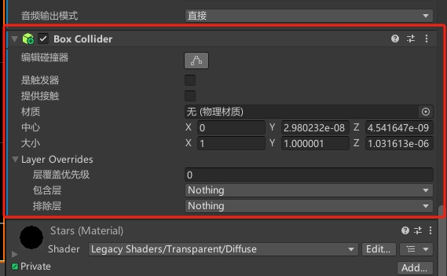
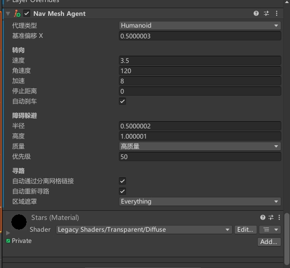
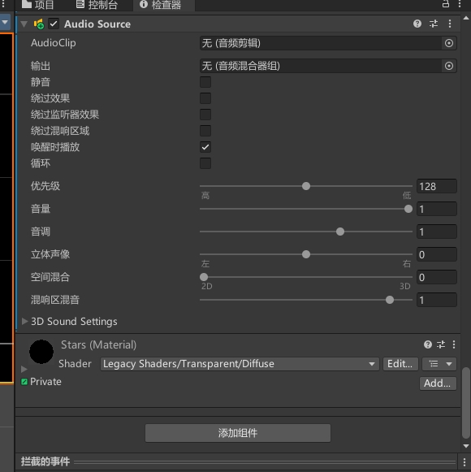

#### 其他组件

*Transform*
用于控制游戏对象的位置、旋转和缩放等变换操作。它是所有游戏对象的基础组件之一，可以实现游戏对象的移动、旋转和缩放等操作。
Transform 可以控制游戏对象的位置、旋转和缩放等变换操作。它是游戏对象的基础组件之一，可以通过修改其属性来实现游戏对象的移动、旋转和缩放等操作。其中，位置属性控制游戏对象的世界坐标，旋转属性控制游戏对象的旋转角度，缩放属性控制游戏对象的缩放比例。
Transform 还支持父子关系，即一个游戏对象可以成为另一个游戏对象的子对象，这样当父对象移动、旋转或缩放时，其子对象也会相应地进行变换操作。此外，Transform 还提供了一些方法，例如 LookAt()、Rotate()、Translate() 等，可以实现更加灵活的变换操作。
总之，Transform 是 Unity 中控制游戏对象变换的基础组件之一，可以实现游戏对象的移动、旋转和缩放等操作。它是游戏开发中不可或缺的工具，可以提高游戏的可玩性和视觉效果。

*Mesh Filter*
用于将网格数据应用到 3D 模型上。它是实现 3D 模型的重要组成部分之一，可以定义模型的形状和结构。

*Mesh Renderer*
用于将 3D 模型渲染到屏幕上。它是游戏中 3D 模型的重要组成部分之一，可以让游戏中的角色、场景和物品等立体化呈现。

#### 碰撞器组件

*Capsule Collider*
用于将游戏对象转换为一个胶囊形状的物理碰撞体。Capsule Collider 可以与刚体组件一起使用，以便让游戏对象能够受到外力的作用，并且可以与其他类型的碰撞体进行碰撞检测。
Capsule Collider 可以被用于表示一些通常比较难以用简单几何体表示的物体，例如人物角色、动物等。Capsule Collider 的形状类似于一个胶囊，即上下两个半球面之间连接着一根圆柱体。这种形状能够很好地适应许多物体的形状，同时也能够提供更加准确的碰撞检测。
Capsule Collider 组件提供了许多属性，例如半径、高度、方向等，可以用来调整碰撞体的形状和大小，以便更好地适应不同类型的物体。通过调整这些属性，可以实现更加准确的碰撞检测，从而提高游戏的真实感和可玩性。

*Mesh Collider*
用于将游戏对象的 Mesh 网格转换为物理碰撞体，以便在游戏中进行物理交互。Mesh Collider 可以与刚体组件一起使用，以便让游戏对象能够受到外力的作用，并且可以与其他 Mesh Collider 或其他类型的碰撞体进行碰撞检测。

*Terrain Collider*
用于在场景中的地形（Terrain）上添加碰撞检测功能。当一个物体与Terrain Collider发生接触时，就会触发碰撞事件，从而可以实现各种游戏场景的交互效果。
Terrain Collider可以在Unity中的地形编辑器中自动生成，也可以手动添加到地形游戏对象上。它基于地形的高度图和纹理信息，自动生成一个准确的碰撞器，从而实现真实的碰撞检测效果。

*Wheel Collider*
用于模拟车辆的轮胎碰撞效果。它可以将车辆的轮胎与地面进行真实的碰撞检测，从而实现车辆的运动效果。
当一个车辆游戏对象上添加了Wheel Collider组件后，该组件会自动根据车轮的位置和半径生成一个碰撞器。车辆在运动过程中，Wheel Collider会根据车轮的旋转情况和与地面的接触情况，计算出车轮的运动状态，包括速度、加速度、阻力等，并将这些信息反馈给车辆游戏对象，从而实现真实的车辆运动效果。

#### 物理组件

*Fixed Joint*
用于将两个游戏对象固定在一起，从而实现刚体之间的约束。它可以模拟物理学中的刚体连接效果，使得两个游戏对象的运动状态相互影响。
Fixed Joint通常用于模拟各种机械装置、建筑物结构等，例如门、桥梁、吊车等。当两个游戏对象之间添加了Fixed Joint组件后，它们就会被连接在一起，从而形成一个整体。在运动过程中，它们的位置和旋转状态会相互影响，从而实现真实的物理效果。
除了基本的连接功能外，Fixed Joint还支持多种参数设置，例如连接的刚体、连接的点、最大力矩等。开发者可以根据游戏需求调整这些参数，以实现更加精确的连接效果。
总的来说，Fixed Joint是实现游戏物理效果的一个非常有用的组件，可以让开发者轻松地模拟刚体之间的连接效果，从而实现各种有趣的游戏场景。

*Spring Joint 2D*
用于模拟弹簧的力学效应，使得两个游戏对象之间产生弹簧效果。它可以模拟物理学中的弹簧连接效果，使得两个游戏对象之间产生拉扯的力量。
Spring Joint 2D通常用于模拟各种弹簧装置、弹性物体等，例如弹簧床、绳索、弹性球等。当两个游戏对象之间添加了Spring Joint 2D组件后，它们就会被连接在一起，从而形成一个弹簧。在运动过程中，它们之间的距离和速度会相互影响，从而产生弹簧效果。

*Friction Joint 2D*
用于模拟两个游戏对象之间的摩擦力效果，使得它们之间的运动产生摩擦力。它可以模拟物理学中的摩擦效应，使得两个游戏对象之间的运动更加真实。
Friction Joint 2D通常用于模拟各种摩擦装置、滑动物体等，例如滑动门、滑动箱子等。当两个游戏对象之间添加了Friction Joint 2D组件后，它们就会产生摩擦力，从而影响它们之间的运动。在运动过程中，它们之间的摩擦力会随着运动速度的变化而改变，从而实现真实的摩擦效应。

*Distance Joint 2D*
用于模拟两个游戏对象之间的距离约束，使得它们之间的距离保持不变。它可以模拟物理学中的距离效应，使得两个游戏对象之间的运动产生约束。
Distance Joint 2D通常用于模拟各种物体的连接、绳索等，例如吊车、绳索桥等。当两个游戏对象之间添加了Distance Joint 2D组件后，它们就会被连接在一起，从而形成一个约束。在运动过程中，它们之间的距离会保持不变，从而实现真实的距离效应。

*Target Joint 2D*
用于模拟物体的跟踪效果，使得一个游戏对象能够跟随另一个游戏对象的运动轨迹。它可以模拟物理学中的跟踪效应，使得游戏对象之间的运动更加真实。
Target Joint 2D通常用于模拟各种追踪效果、跟踪导弹等，例如追踪摄像机、跟踪器等。当一个游戏对象添加了Target Joint 2D组件后，它就会跟随另一个游戏对象，从而实现跟踪效果。在运动过程中，它们之间的距离和速度会相互影响，从而产生真实的跟踪效果。

*Hinge Joint 2D*
用于模拟物体的旋转效果，使得两个游戏对象之间产生旋转约束。它可以模拟物理学中的旋转效应，使得两个游戏对象之间的运动更加真实。
Hinge Joint 2D通常用于模拟各种旋转装置、旋转门等，例如旋转门、旋转关节等。当两个游戏对象之间添加了Hinge Joint 2D组件后，它们就会被连接在一起，从而形成一个旋转约束。在运动过程中，它们之间的旋转约束会随着运动角度的变化而改变，从而实现真实的旋转效应。

#### 导航组件

*Nav Mehs Agent*
用于实现游戏对象的导航功能。Nav Mesh Agent通常用于模拟各种导航效果，例如角色移动、AI行为等。
Nav Mesh Agent可以将一个游戏对象移动到指定位置，并且可以自动避免障碍物。例如，当玩家指定一个位置时，Nav Mesh Agent会自动计算最短路径，并且在移动时避免障碍物，从而实现自动导航的效果。
Nav Mesh Agent还支持多种参数设置，例如移动速度、加速度、角色半径等。开发者可以根据需求调整这些参数，以实现更加精确的导航效果。
总的来说，Nav Mesh Agent是Unity中实现导航功能的一个非常有用的组件，可以让开发者轻松地实现各种导航效果，从而实现各种有趣的游戏场景。

*Nav Mesh Obstacle*
用于在场景中创建动态障碍物，以影响Nav Mesh Agent的自动导航行为。Nav Mesh Obstacle可以让开发者在运行时添加或移除障碍物，从而实现更加灵活的导航功能。
Nav Mesh Obstacle可以被添加到任何游戏对象上，它会在导航网格中创建一个障碍物区域，阻止Nav Mesh Agent在该区域内移动。在设置Nav Mesh Obstacle时，开发者需要指定障碍物的形状、大小、旋转等属性，以及障碍物的类型（例如，墙壁、栅栏、桌子等）。

*Off Mesh Link*
用于在导航网格上创建离散的连接点，以实现Nav Mesh Agent之间跨越障碍物或空隙的导航。通常，在场景中出现的一些特殊情况，例如悬崖、吊桥、绳索等，需要Nav Mesh Agent能够跨越障碍物进行导航，这时就需要用到Off Mesh Link。

#### 音频组件

*Audio Source*
用于在场景中播放音频。开发者可以将Audio Source组件添加到游戏对象上，并将音频文件添加到Audio Source组件中进行播放。
在设置Audio Source时，开发者可以指定音频文件、音量、音调、循环播放等属性。Audio Source还支持3D音效，可以让音效在空间中产生方向和距离的变化，从而增强游戏的真实感和沉浸感。
除了播放音频，Audio Source还可以用于检测碰撞事件。开发者可以在Audio Source组件中设置碰撞器，当其他游戏对象与碰撞器发生碰撞时，Audio Source会自动播放指定的音频文件，从而实现碰撞音效的效果。
Audio Source还支持动态更新，可以在运行时更改音频文件、音量、音调等属性。这使得开发者可以根据游戏的需求实时调整音效，以增强游戏的体验效果。
总的来说，Audio Source是实现游戏音效的一个非常有用的组件，可以让开发者轻松地实现各种类型的音频播放和碰撞音效效果。

*Audio Listener*
用于监听场景中的音频，并将其转换为可听的声音。每个场景中只能有一个Audio Listener，它通常被添加到主摄像机上，以便根据摄像机位置和方向来监听音频。
当Audio Listener接收到音频时，它会根据音频源的位置、方向和距离等信息，将音频转换为可听的声音，并将其输出到扬声器或耳机中。Audio Listener还支持3D音效，可以根据音频源的位置和距离等信息，产生方向和距离的变化，从而增强游戏的真实感和沉浸感。

*Audio Reverb Zone*
用于模拟音频的混响效果。它可以将场景中的音频信号经过处理，产生类似于在一个封闭空间中听到声音的效果。在游戏中，Audio Reverb Zone通常被用于模拟不同环境下的声音效果，例如室内、室外、山洞等。
当Audio Reverb Zone被添加到游戏对象上时，它会创建一个虚拟的混响空间，在这个空间中播放的音频会受到混响效果的影响。开发者可以在Audio Reverb Zone组件中设置混响的属性，例如混响时间、混响强度、混响预设等。这些属性可以影响混响效果的强度和表现形式。

*Audio Low Pass Filter*
用于控制音频的低频信号。它可以通过降低音频的低频信号来模拟不同的音效，使得音频更加真实。
Audio Low Pass Filter通常用于模拟各种音效，例如低沉的嗓音、远处的声音等。当一个音频源添加了Audio Low Pass Filter组件后，它就会对音频进行低频信号过滤，从而模拟不同的音效。

*Audio Hight Pass Filter*
用于控制音频的高频信号。它可以通过降低音频的高频信号来模拟不同的音效，使得音频更加真实。
Audio High Pass Filter通常用于模拟各种音效，例如尖锐的声音、近处的声音等。当一个音频源添加了Audio High Pass Filter组件后，它就会对音频进行高频信号过滤，从而模拟不同的音效。

*Audio Echo Filter*
用于在音频中加入回声效果。它可以模拟不同的回声效果，使得音频更加真实。
Audio Echo Filter通常用于模拟各种音效，例如在山洞或大厅中的声音回声。当一个音频源添加了Audio Echo Filter组件后，它就会对音频进行回声处理，从而模拟不同的回声效果。

*Audio Distortion Filter*
用于在音频中加入失真效果。它可以模拟各种失真效果，使得音频更加独特。
Audio Distortion Filter通常用于模拟各种音效，例如吉他失真效果、电子音乐等。当一个音频源添加了Audio Distortion Filter组件后，它就会对音频进行失真处理，从而模拟不同的失真效果。

*Audio Chorus Filter*
用于在音频中添加合唱效果。合唱效果是指将多个声音混合在一起，产生更加丰富、立体的音效。
Audio Chorus Filter通过改变音频的时间和频率，来模拟多个声音同时发生的效果。它包含多个参数，例如混响、延迟、振幅等，可以用来调整合唱效果的强度、深度和速度等。
